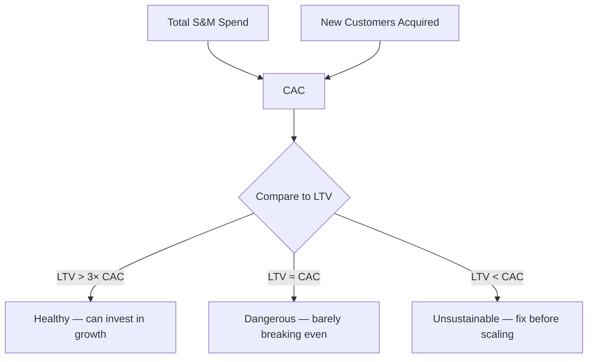

# 47. CAC (Customer Acquisition Cost)

> **Think:** *"What does it cost to get a customer?"*

---

## The 4 Questions

| Question | Answer |
|----------|--------|
| **What problem does it solve?** | Blind spending — you can't tell if marketing and sales are profitable or burning cash. CAC puts a price tag on every new customer. |
| **What happens if I ignore it?** | You celebrate "10,000 new signups" while losing money on each one. Growth becomes a faster path to bankruptcy. |
| **Where would I use it?** | Marketing budget allocation, channel comparison, pricing decisions, fundraising decks, unit economics reviews. |
| **What companies use it?** | Every venture-backed startup, Amazon (channel-level CAC by category), Nykaa (beauty vs fashion acquisition costs), MakeMyTrip/Booking.com (paid search vs organic). |

---

## Mental Movie (60 seconds)

Your travel platform runs Google Ads, Instagram campaigns, and affiliate partnerships. Last month you spent **₹50 lakh** on marketing and sales. You acquired **5,000 new paying customers**.

**CAC = ₹50,00,000 ÷ 5,000 = ₹1,000 per customer.**

That number alone means nothing. But if each customer only ever pays you ₹800 total, you're **losing ₹200 on every acquisition** — and scaling makes it worse, not better.

CAC is the admission price. LTV (Topic 48) is the prize. You need to know both.

---

## How It Works

**Basic formula:**

```
CAC = Total Sales & Marketing Spend ÷ Number of New Customers Acquired
```

**What counts in "spend":**
- Paid ads (Google, Meta, influencers)
- Marketing team salaries and tools
- Sales team commissions and salaries
- Agency fees, creative production
- Referral bonuses and signup incentives

**What counts as "new customer":**
- Be consistent — usually first-time *paying* customers, not free signups
- Define the time window (monthly, quarterly)



### CAC by Channel

Don't calculate one blended CAC and stop. Break it down:

| Channel | Spend | Customers | CAC |
|---------|-------|-----------|-----|
| Google Ads | ₹20L | 2,000 | ₹1,000 |
| Instagram | ₹15L | 1,500 | ₹1,000 |
| Affiliates | ₹10L | 2,000 | ₹500 |
| Organic/SEO | ₹5L | 500 | ₹1,000 |

Affiliates look cheapest here — but check *quality* (retention, LTV) before shifting budget.

### Payback Period

How long until a customer recovers their CAC?

```
Payback Period = CAC ÷ Monthly Revenue per Customer
```

If CAC is ₹1,000 and a customer generates ₹200/month in gross margin, payback = 5 months. Investors often want payback under 12 months for SaaS; ecommerce tolerates longer if LTV is strong.

---

## Real-World Examples

### Your Travel Platform

**Scenario:** Diwali campaign — ₹80 lakh across Google, YouTube, and travel bloggers. Result: 8,000 first-time bookers.

```
CAC = ₹80,00,000 ÷ 8,000 = ₹1,000
```

But your funnel leaks: 40% of ad clicks bounce before search. CAC for *completed bookings* is really ₹1,667 if you only count 4,800 who actually booked.

**Architect insight:** Track CAC at each funnel stage (Topic 46). A "cheap" click that never converts is infinitely expensive.

### Nykaa

**Scenario:** Nykaa runs heavy influencer and performance marketing, especially during sale events.

Nykaa tracks CAC separately for:
- First-time beauty buyers (often high CAC, driven by discounts)
- Fashion cross-sell customers (lower CAC if acquired via app)
- Nykaa Pink Box / loyalty members (CAC amortized over repeat purchases)

A ₹500 CAC on a customer who buys ₹3,000 once is fine. A ₹500 CAC on someone who only uses a ₹100 welcome coupon and never returns is a loss.

### Amazon

**Scenario:** Amazon's "customer acquisition" is category-specific.

Prime membership is a CAC vehicle — Amazon spends billions on shipping perks, content, and deals knowing Prime members spend 2–3× more per year. Their effective CAC for a Prime member is high upfront but amortized over years of purchases.

For marketplace sellers, Amazon's CAC is your problem — but Amazon itself tracks cost per new *buyer* across channels (search ads, TV, app installs) obsessively.

---

## When To Use It

| Use CAC when... | Example |
|-----------------|---------|
| Comparing marketing channels | Shift budget from ₹2,000 CAC channel to ₹800 CAC channel |
| Deciding if you can afford to grow | "Can we 3× ad spend and stay profitable?" |
| Pitching investors | Show unit economics and path to efficiency |
| Setting sales team quotas | Commission structure must leave room for CAC |
| Evaluating partnerships | Affiliate deal at ₹600 CAC vs in-house at ₹1,000 |

## When NOT To Use It

| Skip or defer CAC when... | Why |
|---------------------------|-----|
| Pre-PMF with <100 users | Numbers are too noisy; focus on learning, not optimizing |
| Organic-only growth with no spend | CAC is effectively ₹0 — but track *time* cost instead |
| Brand campaigns with 12-month lag | Attribution is fuzzy; don't over-optimize monthly CAC |
| You're counting signups, not payers | Free users inflate denominators and lie about economics |
| Single blended CAC hides channel quality | A "good" average CAC can mask a terrible channel |

---

## CAC vs Related Concepts

| Concept | Difference |
|---------|-----------|
| **LTV** | CAC is cost *in*; LTV is revenue *out*. Always pair them. |
| **Conversion Funnel** | Funnel shows *where* users drop; CAC quantifies *cost* of survivors. |
| **CPA (Cost Per Acquisition)** | Often used interchangeably; CPA sometimes means cost per *action* (signup, lead), not paying customer |
| **ROAS (Return on Ad Spend)** | Revenue ÷ ad spend in a period — useful but doesn't account for full S&M costs |

**Rule of thumb:** If you know CAC but not LTV, you're flying blind. If you know both, you know whether to hit the gas or fix the engine.

---

## Implementation Checklist

- [ ] Define "new customer" consistently (first payment? first booking? activation event?)
- [ ] Include *all* S&M costs, not just ad spend
- [ ] Calculate CAC monthly and by channel
- [ ] Track CAC alongside conversion rates from your funnel
- [ ] Set a target LTV:CAC ratio before scaling spend (see Topic 48)
- [ ] Monitor payback period, not just CAC in isolation

---

## Problem Simulation

**Situation:** Your travel platform's Q2 numbers:

| Item | Value |
|------|-------|
| Google Ads spend | ₹30,00,000 |
| Influencer campaigns | ₹10,00,000 |
| Marketing team salaries | ₹15,00,000 |
| Referral bonuses paid | ₹5,00,000 |
| New paying customers | 10,000 |

A board member says: *"Our CAC is ₹300 — we spent ₹30 lakh on Google and got 10,000 customers. We should 5× the Google budget."*

**Questions:**
1. What is the actual CAC if you include all S&M costs?
2. Why is the board member's CAC calculation wrong?
3. What else do you need before approving 5× Google spend?

<details>
<summary>Answers</summary>

1. **Actual CAC = ₹60,00,000 ÷ 10,000 = ₹600** — salaries and referral bonuses count.
2. They only counted Google Ads (₹30L ÷ 10K = ₹300) and attributed *all* customers to Google. Influencers, referrals, and organic may have contributed. Last-click attribution inflates channel ROI.
3. **LTV** (Topic 48) — is ₹600 CAC profitable? **Channel-level CAC** — what's Google-only CAC vs blended? **Payback period** — how fast do customers return their acquisition cost? **Churn** (Topic 49) — do Google-acquired customers stay or leave faster?

</details>

---

## Key Takeaway

CAC answers: *"What did we pay to win this customer?"* Without it, growth is vanity. With it — paired with LTV — you know whether every new customer is an asset or a liability.

**Previous:** [46 — Conversion Funnel](../module-07-product-thinking/46-conversion-funnel.md) — where users drop before they become customers.

**Next:** [48 — LTV](./48-ltv.md) — how much is that customer actually worth?
