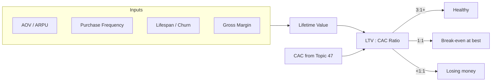

# 48. LTV (Lifetime Value)

> **Think:** *"How much is a customer worth?"*

---

## The 4 Questions

| Question | Answer |
|----------|--------|
| **What problem does it solve?** | Short-term thinking — a "cheap" customer who never returns is worthless; an "expensive" customer who books yearly for a decade is gold. LTV captures total relationship value. |
| **What happens if I ignore it?** | You optimize for first purchase and under-invest in retention. You cap marketing spend too low (missing good customers) or too high (buying unprofitable ones). |
| **Where would I use it?** | Marketing budget caps, pricing strategy, loyalty program ROI, customer segmentation, investor metrics. |
| **What companies use it?** | Amazon Prime (LTV drives massive acquisition spend), Nykaa (tiered loyalty based on predicted LTV), SaaS companies (LTV:CAC ratio is the north star metric). |

---

## Mental Movie (60 seconds)

You spent ₹1,000 to acquire a customer (CAC from Topic 47). Bad news? Not necessarily.

**Customer A:** Books one ₹5,000 trip, never returns. LTV ≈ ₹5,000. You made money once.

**Customer B:** Books ₹8,000/year in trips for 5 years, refers 2 friends. LTV ≈ ₹40,000+. That ₹1,000 CAC was a steal.

LTV is the reason Amazon can spend aggressively to acquire Prime members. They're not buying a transaction — they're buying a *relationship*.

---

## How It Works

**Simple formula (ecommerce / transactional):**

```
LTV = Average Order Value × Purchase Frequency × Customer Lifespan
```

**SaaS / subscription formula:**

```
LTV = ARPU × Gross Margin % ÷ Monthly Churn Rate
```

Or equivalently:

```
LTV = ARPU × Gross Margin % × Average Customer Lifetime (months)
```



### The LTV:CAC Ratio

| Ratio | Interpretation |
|-------|----------------|
| **< 1:1** | Losing money on every customer — stop scaling |
| **1:1 – 2:1** | Surviving, not thriving — improve retention or cut CAC |
| **3:1+** | Healthy — room to invest in growth |
| **5:1+** | Very efficient — often under-investing in acquisition |

### Gross Margin Matters

LTV must use **gross margin**, not revenue:

```
LTV = (Revenue − COGS) × Lifespan metrics
```

For your travel platform, COGS includes supplier costs, payment fees, and support — not office rent or engineering salaries.

**Example:**
- Average booking: ₹10,000 revenue, ₹7,500 supplier cost → ₹2,500 gross margin
- 2 bookings/year × 4 years = **LTV = ₹20,000** (not ₹80,000 revenue)

---

## Real-World Examples

### Your Travel Platform

**Scenario:** Segment your customers by LTV after 12 months of data.

| Segment | Avg bookings/year | Lifespan | Gross margin/booking | LTV |
|---------|-------------------|----------|----------------------|-----|
| Budget backpackers | 1 | 1.5 years | ₹1,500 | ₹2,250 |
| Family vacationers | 2 | 5 years | ₹3,000 | ₹30,000 |
| Business travelers | 8 | 6 years | ₹2,000 | ₹96,000 |

With CAC of ₹1,000:
- Backpackers: LTV:CAC = 2.25:1 — marginal
- Families: 30:1 — invest heavily
- Business: 96:1 — white-glove onboarding worth it

**Architect insight:** Build features for high-LTV segments first. A "corporate travel dashboard" pays for itself faster than a "budget hostel filter."

### Nykaa

**Scenario:** Nykaa Pink Box / loyalty tiers.

Nykaa estimates LTV by cohort:
- Beauty-only buyers: lower frequency, moderate LTV
- Cross-category buyers (beauty + fashion): 3–4× LTV
- Loyalty tier members: highest LTV due to repeat purchases and reduced CAC on subsequent orders

Nykaa can afford higher CAC on customers predicted to cross-shop because predicted LTV is higher.

### Amazon

**Scenario:** Prime membership transforms LTV.

A non-Prime Amazon customer might spend ₹5,000/year. A Prime member spends ₹15,000–25,000/year across categories. Amazon's "LTV" calculation for Prime includes:
- Subscription fees (₹1,499/year)
- Incremental purchase frequency
- Cross-category expansion (groceries, electronics, streaming)

This is why Amazon can spend ₹3,000+ effective CAC on Prime acquisition through shipping subsidies and content bundles.

---

## When To Use It

| Use LTV when... | Example |
|-----------------|---------|
| Setting marketing spend caps | "We can spend up to LTV ÷ 3 on CAC" |
| Prioritizing product roadmap | Retention features for high-LTV cohorts |
| Designing loyalty programs | Program cost must be < incremental LTV lift |
| Segmenting customers | CRM tiers based on predicted LTV |
| Fundraising | Show investors sustainable unit economics |

## When NOT To Use It

| Skip or defer LTV when... | Why |
|---------------------------|-----|
| Business is <12 months old | Not enough lifespan data — use early proxies (30/60/90-day retention) |
| One-time purchase only | Lifespan ≈ 1 transaction; just use AOV × margin |
| You use revenue instead of margin | Inflated LTV leads to over-spending on CAC |
| Cohorts are wildly different | Blended LTV hides that one channel brings low-value customers |
| Churn is ignored | LTV is only as good as your lifespan estimate (Topic 49) |

---

## LTV vs Related Concepts

| Concept | Difference |
|---------|-----------|
| **CAC** | CAC is the cost to acquire; LTV is the return. Inseparable pair. |
| **ARPU** | Average revenue per user per period — one input to LTV, not the whole picture |
| **Churn** | Directly shrinks lifespan — the biggest lever on LTV for subscriptions |
| **North Star Metric** | Measures product value delivery; LTV measures business value capture |

**Rule of thumb:** Increase LTV through retention (lower churn), higher frequency, and higher margin — not by raising prices alone.

---

## Implementation Checklist

- [ ] Calculate LTV using **gross margin**, not revenue
- [ ] Segment LTV by acquisition channel and customer type
- [ ] Track cohort-based LTV (Jan 2025 customers vs Jul 2025 customers)
- [ ] Compute LTV:CAC ratio monthly
- [ ] Use predicted LTV (ML/rules) for new customers when historical data is thin
- [ ] Revisit assumptions when churn spikes (Topic 49)

---

## Problem Simulation

**Situation:** Your travel platform reports:

| Metric | Value |
|--------|-------|
| CAC | ₹1,200 |
| Average booking revenue | ₹12,000 |
| Supplier + payment COGS | 75% of revenue |
| Average bookings per customer per year | 1.5 |
| Average customer lifespan | 3 years |

The CEO says: *"LTV is ₹54,000 — that's 45× our CAC! Let's triple marketing spend."*

**Questions:**
1. What is the correct gross-margin LTV?
2. Is the 45× ratio real?
3. What single metric could destroy this LTV overnight?

<details>
<summary>Answers</summary>

1. **Gross margin per booking = ₹12,000 × 25% = ₹3,000.** LTV = ₹3,000 × 1.5 bookings/year × 3 years = **₹13,500**.
2. **No.** Real LTV:CAC = ₹13,500 ÷ ₹1,200 = **11.25:1** — still healthy, but the CEO used revenue (₹54,000), not margin. This is a classic mistake that leads to catastrophic overspending.
3. **Churn** (Topic 49). If monthly churn doubles, average lifespan drops from 3 years to ~1.5 years, cutting LTV in half. A product bug, competitor launch, or bad support quarter can do this silently.

</details>

---

## Key Takeaway

LTV answers: *"What is this customer relationship worth over time?"* Pair it with CAC and you have the fundamental equation of a business — every other metric is a lever on one of these two numbers.

**Previous:** [47 — CAC](./47-cac.md) — what you paid to get them.

**Next:** [49 — Churn](./49-churn.md) — why they leave and take your LTV with them.
