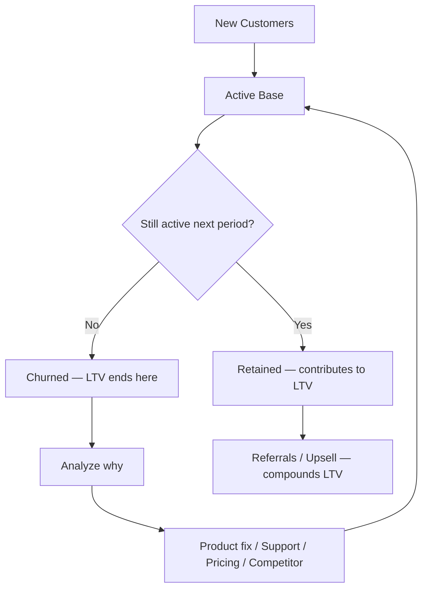

# 49. Churn

> **Think:** *"Why are customers leaving?"*

---

## The 4 Questions

| Question | Answer |
|----------|--------|
| **What problem does it solve?** | Leaky bucket growth — you can pour money into acquisition (CAC) but if customers leave faster than you replace them, LTV collapses and the business stalls. |
| **What happens if I ignore it?** | Revenue flatlines despite growing signups. CAC looks fine while LTV quietly shrinks. You rebuild your customer base from scratch every year. |
| **Where would I use it?** | Subscription renewals, repeat purchase rates, loyalty program health, cohort analysis, retention product investments. |
| **What companies use it?** | Netflix (churn is existential), Spotify (monthly churn dashboards), Nykaa (repeat purchase rate), Amazon Prime (renewal rate as a KPI). |

---

## Mental Movie (60 seconds)

You acquire 1,000 customers per month. CAC is ₹1,000. LTV looked healthy at ₹15,000.

But **8% churn monthly** means you lose half your customer base every 8 months. Your "3-year lifespan" assumption was wrong — actual lifespan is closer to 12 months. Real LTV drops to ₹5,000. Suddenly your ₹1,000 CAC isn't a bargain — it's a slow bleed.

Churn is the silent killer because acquisition is loud (campaigns, launches, press) and departure is quiet (no renewal email opened, app deleted, competitor booked).

---

## How It Works

**Subscription churn rate:**

```
Monthly Churn = Customers Lost This Month ÷ Customers at Start of Month
```

**Ecommerce / transactional "churn":**

```
Repeat Purchase Churn = % of customers who don't return within X months
```

**Customer lifespan from churn:**

```
Average Lifespan (months) = 1 ÷ Monthly Churn Rate
```

| Monthly Churn | Avg Lifespan | What it means |
|---------------|--------------|---------------|
| 2% | 50 months | Excellent retention |
| 5% | 20 months | Decent for many businesses |
| 8% | 12.5 months | Leaky — LTV assumptions break |
| 10% | 10 months | Crisis territory for subscriptions |



### Revenue Churn vs Customer Churn

**Customer churn:** % of accounts that leave.

**Revenue churn (critical for B2B / tiered pricing):**

```
Revenue Churn = MRR Lost from Churned + Downgraded Customers ÷ Starting MRR
```

You can have low customer churn but high revenue churn if your biggest accounts leave.

### Negative Churn

When expansion revenue (upsells, cross-sells) from existing customers exceeds revenue lost to churn. The holy grail of SaaS — your base grows even with zero new customers.

---

## Real-World Examples

### Your Travel Platform

**Scenario:** Track churn as "no booking in 12 months" for previously active users.

| Cohort | Acquired via | 12-month repeat rate | Effective churn |
|--------|--------------|----------------------|-----------------|
| Google Ads | Performance ads | 22% | 78% one-and-done |
| Organic SEO | Content / search | 45% | 55% churn |
| Referral | Friend invite | 60% | 40% churn |

Google has your lowest CAC (Topic 47) but highest churn — those customers have the worst LTV (Topic 48). You're optimizing the wrong channel.

**Fix levers:**
- Post-trip email with personalized deals (reduce churn)
- Loyalty points expiring in 90 days (create urgency)
- "Rebook your last trip" one-click flow (reduce friction)

### Nykaa

**Scenario:** Beauty purchases are habitual — until they're not.

Nykaa tracks:
- **90-day repurchase rate** by category (skincare vs fragrance)
- **Churn from loyalty tier** — Pink Box members who stop engaging
- **Cohort decay** — Jan sale buyers who never return at full price

A customer acquired during a 70%-off sale has higher churn than a full-price organic buyer. Nykaa's challenge: convert sale shoppers into habitual buyers before they churn to competitors.

### Amazon

**Scenario:** Prime renewal is Amazon's churn battleground.

Prime members who don't renew are high-value churned customers. Amazon fights this with:
- Annual renewal reminders showing "you saved ₹X in shipping"
- Bundled value (Prime Video, Music) to increase switching cost
- Proactive service recovery (refunds without returns) to prevent anger-driven churn

Amazon also tracks **category churn** — a customer who only bought books and stopped is different from one who expanded to groceries and electronics.

---

## When To Use It

| Use churn analysis when... | Example |
|----------------------------|---------|
| LTV assumptions feel optimistic | Validate lifespan with real cohort data |
| Comparing acquisition channels | Cheap CAC + high churn = bad economics |
| Prioritizing retention features | Fix onboarding if 50% churn in month 1 |
| Evaluating pricing changes | Did the price hike spike churn? |
| Board / investor reporting | Net revenue retention, cohort curves |

## When NOT To Use It

| Skip or misapply churn when... | Why |
|--------------------------------|-----|
| Product is inherently one-time | Weddings, funeral services — measure referrals instead |
| User base is too small | 5 churned users out of 50 = noisy 10% |
| You only track logins, not value | Inactive ≠ churned for ecommerce |
| Seasonal business without cohort adjustment | Travel churn spikes post-summer — compare year-over-year cohorts |
| You panic over gross churn without net churn | Expansion revenue may offset losses |

---

## Churn vs Related Concepts

| Concept | Difference |
|---------|-----------|
| **LTV** | Churn determines lifespan — the key input to LTV |
| **CAC** | High churn means you re-pay CAC constantly for the same revenue slot |
| **Conversion Funnel** | Funnel optimizes *getting in*; churn measures *staying* |
| **NPS / CSAT** | Leading indicators of churn — satisfaction predicts departure |

**Rule of thumb:** Acquiring a new customer costs 5–7× more than retaining an existing one. Fix the leak before widening the funnel.

---

## Implementation Checklist

- [ ] Define churn consistently (subscription cancel? no purchase in 90 days?)
- [ ] Track churn by cohort (acquisition month) and channel
- [ ] Separate customer churn from revenue churn
- [ ] Build exit surveys / cancellation flows to capture *why*
- [ ] Monitor leading indicators (engagement drop, support tickets, NPS)
- [ ] Calculate impact on LTV when churn moves ±1%

---

## Problem Simulation

**Situation:** Your travel platform's subscription plan "Travel Pass" (₹999/month for booking fee waivers):

| Month | Starting subscribers | Cancelled | New subs |
|-------|---------------------|-----------|----------|
| January | 10,000 | 600 | 2,000 |
| February | 11,400 | 800 | 2,500 |
| March | 13,100 | 1,050 | 3,000 |

Leadership celebrates: *"We grew from 10K to 13K subscribers! Churn is only 6–8%. Keep spending on acquisition."*

Cancellation survey results:
- 40% — "Didn't book enough to justify ₹999/month"
- 30% — "Found cheaper deals on competitor app"
- 20% — "One-time trip, don't need subscription"
- 10% — "Payment failed / forgot to cancel"

**Questions:**
1. What is the March monthly churn rate?
2. Is subscriber growth healthy or misleading?
3. What are two product changes that attack the top churn reasons?

<details>
<summary>Answers</summary>

1. **March churn = 1,050 ÷ 13,100 = 8.0%** — average lifespan ≈ 12.5 months. At ₹999/month with ~70% gross margin, LTV ≈ ₹8,700 before accounting for booking fee savings usage.
2. **Misleading.** New subs (+3,000) barely outpace churn (+1,050 net from cancellations alone). You're on a treadmill — paying CAC for subscribers who leave within a year. February churn *accelerated* (600 → 800 → 1,050) while the base grew — churn rate is worsening.
3. **Product fixes:** (a) **Usage-based tier** — fee waiver only activates after 1 booking, or pay-per-use model for occasional travelers (addresses 40% + 20%). (b) **Price-match or loyalty lock** — guarantee best price for Pass members (addresses 30%). (c) **Annual plan with pause** — "freeze" membership between trips instead of cancel (addresses 20%).

</details>

---

## Key Takeaway

Churn answers: *"Why are customers leaving — and how fast?"* It's the drain on everything you built with CAC and LTV. Retention is not a marketing problem; it's a product promise problem.

**Previous:** [48 — LTV](./48-ltv.md) — what they're worth while they stay.

**Next:** [50 — Network Effects](./50-network-effects.md) — when growth itself makes the product harder to leave.
