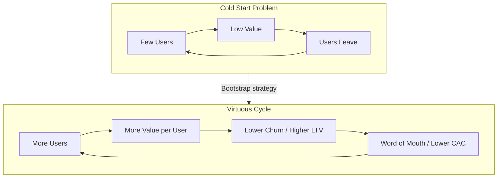

# 50. Network Effects

> **Think:** *"Does the product become better when more users join?"*

---

## The 4 Questions

| Question | Answer |
|----------|--------|
| **What problem does it solve?** | Commoditization — without a moat, competitors can copy features and undercut on price. Network effects make the product itself harder to replicate as it grows. |
| **What happens if I ignore it?** | You win on execution alone in a race with no finish line. CAC stays high, churn stays high, and a well-funded clone can always catch up. |
| **Where would I use it?** | Marketplace design, social features, platform strategy, ecosystem partnerships, defensibility planning. |
| **What companies use it?** | WhatsApp (messaging), Uber (riders + drivers), LinkedIn (professional graph), Amazon Marketplace (buyers + sellers), Airbnb (listings + guests). |

---

## Mental Movie (60 seconds)

You launch a travel chat app. Alone, it's useless. With 5 friends who travel, it's handy. With 5 million users sharing real itineraries, hotel tips, and group trip planning — it's irreplaceable.

**That's a network effect:** each new user makes the product more valuable for every existing user.

Now compare to your travel booking engine. Adding user #1,000,001 doesn't make flights cheaper or hotels better for user #1. That's *scale*, not a network effect.

Network effects are the difference between a business that gets harder to compete with over time and one that just gets bigger.

---

## How It Works

A product has **network effects** when the value to each user increases as the total number of users increases.



### Types of Network Effects

| Type | Mechanism | Example |
|------|-----------|---------|
| **Direct** | Same-side users add value for each other | WhatsApp — more contacts = more useful |
| **Indirect (two-sided)** | More of side A attracts side B | Uber — more riders attract more drivers |
| **Data network effects** | More usage → better product | Google Maps traffic data, Netflix recommendations |
| **Platform / ecosystem** | Third parties build on your base | Amazon Marketplace sellers, app stores |

### Network Effects vs Economies of Scale

| | Network Effects | Economies of Scale |
|--|-----------------|-------------------|
| **Value source** | Other users | Lower unit costs |
| **Example** | LinkedIn profile views | Amazon warehouse efficiency |
| **Defensibility** | Hard to copy the graph | Competitor can match with capital |
| **Your travel platform** | Trip-sharing community | Negotiating bulk hotel rates |

Both help, but only network effects make the *product experience* improve with user count.

### The Cold Start Problem

Network effects businesses are weakest at the beginning:
- Empty marketplace → no buyers → sellers leave → no inventory → buyers leave
- Empty social graph → nothing to see → users churn

**Bootstrap strategies:**
- **Single-player mode** — useful alone first (OpenTable: reservation tool before network)
- **Subsidize one side** — Uber paid drivers before demand existed
- **Geographic density** — win one city before expanding (Uber SF, then NYC)
- **Fake it till you make it** — curated content before user-generated (Reddit founders seeded posts)

---

## Real-World Examples

### Your Travel Platform

**Scenario:** You add "Trip Circles" — users share live itineraries, split bills, and co-plan group vacations.

**With network effects:**
- User invites 4 friends to a Goa trip → 4 new users with immediate value
- Public itineraries become searchable → SEO + social proof
- More group trips → more hotel/flight bundle demand → better supplier negotiations (indirect)

**CAC impact:** Invited users have near-zero CAC (friends refer friends).
**Churn impact:** Users embedded in active trip groups don't leave — their plans live here.
**LTV impact:** Group travelers book 2× more per year.

**Without critical mass:** Trip Circles is a ghost town. Users try once, get no engagement, churn. You needed geographic or social density first — launch in Mumbai colleges, not nationally.

### Nykaa

**Scenario:** Nykaa's network effects are softer than WhatsApp but real in niches.

- **Reviews and ratings** — more buyers → more reviews → better purchase decisions → more buyers (data/content network effect)
- **Beauty community** — tutorials, user photos, influencer content create a graph
- **Live commerce** — real-time engagement during sales events; more viewers attract more brands

Nykaa can't rely purely on network effects like a messaging app. Their moat blends brand, supply chain, and community content — partial network effects amplify retention (Topic 49) more than they crush CAC (Topic 47).

### Amazon

**Scenario:** Amazon Marketplace is a textbook two-sided network effect.

```
More buyers → more sellers want access → more selection → better prices → more buyers
```

This flywheel took years and billions in subsidy. Amazon also has:
- **Review network** — 500M reviews make product discovery better
- **Prime flywheel** — more members → more seller demand → faster shipping → more members
- **AWS ecosystem** — developers build on AWS, increasing switching costs (platform effect)

A travel startup can't copy this overnight. But you can design *one* network loop — group travel, supplier marketplace, or creator-led itineraries — and defend it.

---

## When To Use It

| Pursue network effects when... | Example |
|--------------------------------|---------|
| Product naturally involves other people | Group travel, marketplaces, social |
| Data improves the product measurably | Recommendation engines, pricing intelligence |
| Winner-take-most dynamics exist | Ride-sharing in one city, professional networks |
| You can bootstrap density in a niche | One city, one college, one vertical |
| Retention is the bottleneck | Network lock-in reduces churn |

## When NOT To Use It

| Skip network effects when... | Why |
|------------------------------|-----|
| Product is solo-use utility | Flight search doesn't need friends |
| Market is fragmented, not winner-take-all | Local services may not consolidate |
| You can't solve cold start | Feature launches empty and dies |
| You add "social" as a checkbox | Forced sharing annoys users |
| Network effects are weak vs execution | Better to win on UX, price, or speed |
| Early stage — PMF not found | Build something people want alone first |

---

## Network Effects vs Related Concepts

| Concept | Relationship |
|---------|--------------|
| **CAC** | Strong network effects → organic growth → lower CAC |
| **LTV** | Lock-in and habit increase lifespan and frequency |
| **Churn** | Leaving means losing your network — switching cost rises |
| **PMF** (Topic 43) | Network products need PMF *and* critical mass |
| **Conversion Funnel** (Topic 46) | Viral loops are a funnel stage powered by network effects |

**Rule of thumb:** Network effects are a moat, not a launch strategy. Earn single-player value first, then compound with the graph.

---

## Implementation Checklist

- [ ] Identify if your product has a natural network loop (not forced social)
- [ ] Define the minimum viable network density (users per city, per group)
- [ ] Design single-player value for cold start
- [ ] Measure viral coefficient (invites sent × conversion rate)
- [ ] Track whether networked users have lower churn and higher LTV
- [ ] Protect the graph — portability and interoperability are threats

---

## Problem Simulation

**Situation:** Your travel platform launches two features simultaneously:

**Feature A — "Price Alert Bot":** Solo utility. Notifies when flight prices drop. No social component.

**Feature B — "Travel Tribe":** Users follow each other's trips, join public group departures, and split payments.

6-month results:

| Feature | Users | Monthly churn | CAC | Referral rate |
|---------|-------|---------------|-----|---------------|
| Price Alert Bot | 50,000 | 12% | ₹900 | 2% |
| Travel Tribe | 8,000 | 3% | ₹400 | 35% |

The CEO wants to kill Travel Tribe: *"It only has 8K users vs 50K. Price Alert is winning."*

**Questions:**
1. Which feature has stronger network effect potential?
2. Using Topics 47–49, which feature has better unit economics despite smaller size?
3. What would you recommend instead of killing Travel Tribe?

<details>
<summary>Answers</summary>

1. **Travel Tribe** — social graph, group trips, and referrals are classic direct/indirect network effects. Price Alert is useful but commoditized (Google Flights does this). No moat.
2. **Travel Tribe wins on unit economics.** Lower CAC (₹400 vs ₹900) via 35% referral rate. Lower churn (3% vs 12%) → longer lifespan → higher LTV. Price Alert's 50K users are a leaky bucket (12% monthly churn ≈ 8-month lifespan).
3. **Don't kill — bootstrap.** Double down on density: launch Tribe in 3 high-travel cities, seed group trips with influencers, integrate payment splitting (increases lock-in). Accept smaller user count while the flywheel spins. Use Price Alert as top-of-funnel acquisition, but convert users *into* Travel Tribe for retention.

</details>

---

## Key Takeaway

Network effects answer: *"Does growth make us defensible?"* They're the rare force that can simultaneously lower CAC, raise LTV, and reduce churn — but only if you survive the cold start and build something people want even before the network kicks in.

---

## You Did It — All 50 Topics Complete

You started with *"What if the user clicks twice?"* (Idempotency) and ended with *"Does the product become better when more users join?"* (Network Effects).

You now have mental movies for:

| Module | You can now recognize... |
|--------|--------------------------|
| **Reliability** | Idempotency, Retry, Circuit Breaker, HA, Failover |
| **Scale** | Vertical/Horizontal scaling, Load Balancer, Rate Limiting, Backpressure |
| **Performance** | Caching, CDN, Indexing, Query Optimization, Pagination, Compression |
| **Data Systems** | ACID, Transactions, Consistency, Replication, Sharding, Normalization |
| **Distributed Systems** | Queues, Pub/Sub, Event-Driven, CQRS, Event Sourcing, Saga, DLQ |
| **Infrastructure** | DNS, Reverse Proxy, SSL, Containers, K8s, CI/CD, Deploy strategies |
| **Product Thinking** | PMF, Jobs To Be Done, North Star Metric, Conversion Funnel |
| **Business Thinking** | CAC, LTV, Churn, Network Effects |

**You don't need to memorize implementations.** You need to hear a concept name and instantly see the problem it solves.

When someone says *"We need idempotent retries behind a circuit breaker with a dead letter queue, and our LTV:CAC is underwater because churn spiked"* — you don't panic. You see the movie.

### What To Do Next

1. **Re-run the simulations** — Module 1's Friday 11 PM booking scenario + Module 8's Q3 board review. Trace every concept.
2. **Use the AI learning loop** on your own product — pick any topic and ask for Travel Platform / Nykaa / Amazon examples.
3. **Build one thing** — don't study more. Ship a feature and name which concepts it touches.
4. **Return when stuck** — this handbook is reference, not curriculum. One topic per problem.

The goal was never mastery. It was **recognition**. You have it.

**Previous:** [49 — Churn](./49-churn.md) — why customers leave.

**Handbook home:** [Founder-Architect Handbook](../README.md) · [Full Roadmap](../ROADMAP.md)
