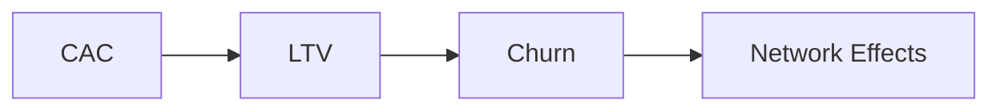

# Module 8: Business Thinking

The numbers behind sustainable products.

> **Think like this:** *"What does it cost to get a customer? How much are they worth? Why do they leave? Does the product get better with scale?"*

## Topics

| # | Topic | One-line mental model | Read time |
|---|-------|----------------------|-----------|
| 47 | [CAC](./47-cac.md) | "What does it cost to get a customer?" | ~12 min |
| 48 | [LTV](./48-ltv.md) | "How much is a customer worth?" | ~12 min |
| 49 | [Churn](./49-churn.md) | "Why are customers leaving?" | ~12 min |
| 50 | [Network Effects](./50-network-effects.md) | "Does the product become better when more users join?" | ~12 min |

## Suggested Learning Order

These four concepts form the unit economics loop — the math that decides whether a business survives:



1. **CAC** — what you pay to acquire each customer
2. **LTV** — what each customer pays you over their lifetime
3. **Churn** — how fast customers leave (and shrink LTV)
4. **Network Effects** — how growth can compound value and defend the business

**The golden rule:** LTV must exceed CAC by a healthy margin (typically 3:1+). Churn is the silent killer of LTV. Network effects are the rare engine that can push LTV up and CAC down at the same time.

## Module Simulation

After finishing all 4 topics, run this scenario (answers at bottom of each topic doc):

> **Q3 board review.** Your travel platform spent ₹2.4 crore on marketing last quarter and acquired 40,000 new customers. Average booking revenue is ₹8,500/year per active user. 6% of paying users churn every month. A competitor launches a "travel community" feature where users share itineraries — bookings on shared trips are 2× higher.

Trace the numbers through each concept. Is the business healthy? What would you fix first — acquisition spend, retention, or product defensibility?

## PDFs

Generated PDFs live in [pdf/](./pdf/). Regenerate:

```bash
python3 md_to_pdf.py --dir learning/module-08-business-thinking --force
```

## Previous Module

← [Module 7: Product Thinking](../module-07-product-thinking/) — PMF, Jobs To Be Done, North Star Metric, Conversion Funnel
