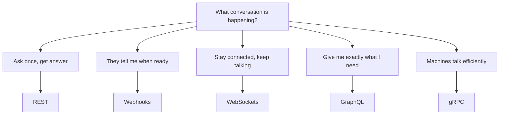

# 51. Conversation Patterns

> **Think:** *"What kind of conversation is happening between these systems?"*

---

## The 4 Questions

| Question | Answer |
|----------|--------|
| **What problem does it solve?** | Choosing the wrong API technology — picking GraphQL for a simple CRUD app, or polling REST every second for live tracking. |
| **What happens if I ignore it?** | You over-engineer early, under-engineer later, or build the wrong interaction model (polling instead of push, 10 REST calls instead of 1). |
| **Where would I use it?** | Every time you design an integration — frontend↔backend, backend↔third-party, service↔service. |
| **What companies use it?** | Every product company — Stripe (REST + webhooks), Uber (REST + WebSockets), Netflix (GraphQL + gRPC internally), Nykaa (REST + webhooks for payments). |

---

## Mental Movie (60 seconds)

A junior developer asks: *"Should we use GraphQL for our booking API?"*

Wrong framing. The right questions:

- Does the user **ask once and get an answer**? → Request/response
- Does **another system tell us** when something happens? → Event notification
- Do we need a **live stream** of updates? → Persistent connection
- Does the screen need **data from 5 services** in one shot? → Flexible query
- Are **two backend services** talking millions of times a day? → High-speed machine protocol

Each answer points to a different technology. The protocol follows the conversation.

---

## How It Works

Every system interaction reduces to one of five conversation patterns:

| Pattern | Conversation | Protocol |
|---------|--------------|----------|
| **Request → Response** | "What's the menu?" / "Here it is." | REST |
| **Event → Notify** | "Call me when the pizza is ready." | Webhooks |
| **Persistent stream** | Phone call — stay connected | WebSockets |
| **Flexible fetch** | "Give me exactly these fields from these places." | GraphQL |
| **Machine-to-machine** | Factory-to-factory high-speed rail | gRPC |

---

## Real-World Examples

### Your Travel Platform

| Feature | Conversation | Protocol |
|---------|--------------|----------|
| Search flights | Ask once, get results | REST |
| Payment confirmed by bank | Bank knows first, tells you | Webhook |
| Live cab tracking to airport | Continuous location updates | WebSocket |
| Trip dashboard (trips + wallet + alerts) | Many data sources, one screen | GraphQL |
| Pricing ↔ Inventory sync | Internal services, high volume | gRPC |

### Nykaa

| Feature | Protocol |
|---------|----------|
| Product catalog, cart, checkout | REST |
| Payment success from Razorpay/PayU | Webhooks |
| Flash sale live stock counter | WebSocket (or SSE) |
| App home screen (deals + orders + recommendations) | GraphQL or BFF |
| Inventory ↔ Warehouse services | gRPC internally |

### Amazon

REST for public APIs. Webhooks for seller notifications. Real-time delivery tracking uses persistent connections. App screens aggregate from dozens of services (GraphQL/BFF pattern). Internal microservices communicate via gRPC at massive scale.

---

## When To Use This Framework

| Use conversation-first thinking when... | Example |
|----------------------------------------|---------|
| Starting any new API design | "How do these systems talk?" |
| Evaluating technology choices | Avoid "let's use GraphQL because it's trendy" |
| Reviewing architecture | "Why are we polling every 2 seconds?" |
| Onboarding engineers | Teach patterns, not protocol specs |

## When NOT To Overthink It

| Keep it simple when... | Why |
|------------------------|-----|
| MVP with one frontend, one backend | REST is enough |
| Internal tool with 5 users | Any protocol works |
| You're copying a well-known pattern | Stripe checkout = REST + webhooks, done |

---

## The Wrong Question vs The Right Question

| Wrong | Right |
|-------|-------|
| "Should we use GraphQL?" | "Does our screen need data from many services in one request?" |
| "We need WebSockets" | "Do users need continuous, immediate updates?" |
| "Let's add gRPC" | "Are internal services drowning in JSON serialization overhead?" |

---

## Problem Simulation

Your team is designing a hotel booking confirmation flow:

1. User clicks "Confirm Booking"
2. Your server calls the hotel supplier API
3. Supplier takes 30–90 seconds to confirm
4. User waits on a confirmation screen

**Questions:**
1. What conversation pattern is step 2?
2. Should the frontend poll `GET /booking/status` every 2 seconds for 90 seconds?
3. What's a better approach if the supplier supports event notification?

Answers

1. **Request → Response** (REST) for the initial booking request — but it's slow/async in practice.
2. **Bad approach** — polling is the "pizza ready? pizza ready?" anti-pattern. Wastes requests, delays UX, loads your server.
3. **Webhook** — supplier calls your endpoint when confirmed. Or **WebSocket** to push status to the user's screen in real time. Best: webhook from supplier → your server → WebSocket to client.

---

## Key Takeaway

Do not start with technology. Start with the conversation. The protocol is the answer to a business behavior.

**Next:** [52 — REST](./52-rest.md) — the most common conversation on the internet.
