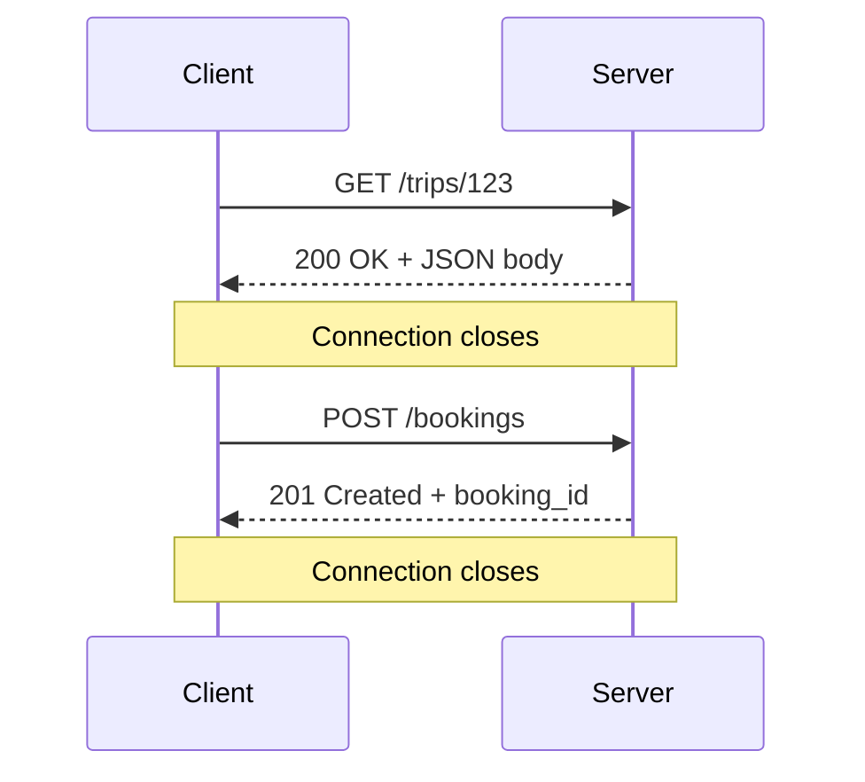

# 52. REST

> **Think:** *"I need information right now — or I need to perform an action right now."*

**Mental Model:** Restaurant order. You ask for the menu. They hand it to you. Conversation ends.

---

## The 4 Questions

| Question | Answer |
|----------|--------|
| **What problem does it solve?** | Structured request/response — ask a question or perform an action, get an answer, connection closes. |
| **What happens if I ignore it?** | You reinvent HTTP with custom protocols, or over-engineer simple CRUD with GraphQL/gRPC when REST would suffice. |
| **Where would I use it?** | CRUD apps, admin panels, ecommerce, booking systems, most startup backends, public APIs. |
| **What companies use it?** | Virtually everyone — Stripe, Twilio, Shopify, MakeMyTrip, GitHub, any REST API you've ever called. |

---

## Mental Movie (60 seconds)

User opens your travel app. Taps "Goa trips."

```
GET /api/v1/trips?destination=goa&limit=20
→ 200 OK
{ "trips": [ { "id": 123, "title": "Goa Beach Escape", ... } ] }
```

Connection opens. Request sent. Response received. Connection closes.

User taps "Book now."

```
POST /api/v1/bookings
{ "trip_id": 123, "passengers": 2, "payment_method": "upi" }
→ 201 Created
{ "booking_id": 789, "status": "pending_payment" }
```

Ask. Answer. Done. That's REST.

---

## How It Works

**REST** (Representational State Transfer) uses HTTP methods on resources (nouns):

| Method | Action | Example |
|--------|--------|---------|
| GET | Read | `GET /trips/123` |
| POST | Create | `POST /bookings` |
| PUT | Replace | `PUT /users/456` |
| PATCH | Partial update | `PATCH /bookings/789` |
| DELETE | Remove | `DELETE /cart/items/3` |



**Key characteristics:**
- **Stateless** — each request carries everything needed
- **Request → Response** — one question, one answer
- **Connection closes** after response
- **JSON** (usually) over HTTP/HTTPS

---

## Real-World Examples

### Your Travel Platform

```
GET    /trips              → list packages
GET    /trips/123          → trip details
POST   /bookings           → create booking
GET    /bookings/789       → booking status
PUT    /users/me           → update profile
DELETE /cart/items/5       → remove from cart
```

REST is your default for 80% of the product: search, book, pay (initiate), profile, admin.

### Nykaa

Product listing, cart, wishlist, order placement, address management — all REST. Simple, cacheable, well-understood. CDN can cache `GET /products/123`. Load balancers handle it trivially.

### Amazon

Product Catalog API, Orders API, many AWS services — REST/HTTP APIs. Mature tooling: Postman, OpenAPI/Swagger, API gateways, rate limiting.

---

## When To Use REST

| Use REST when... | Example |
|------------------|---------|
| You need data **right now** | Show trip details |
| You need to perform an action **right now** | Create booking, update profile |
| CRUD on resources | Users, orders, products |
| Building MVP or most startup backends | Default choice |
| API is public or partner-facing | Easy to document and consume |

## When NOT To Use REST

| Avoid REST when... | Use instead |
|--------------------|-------------|
| Another system knows the answer first | Webhooks |
| You need continuous live updates | WebSockets |
| Screen needs 5+ endpoints worth of data | GraphQL or BFF |
| Internal services at massive scale | gRPC |
| You're polling every N seconds | Webhooks or WebSockets |

---

## REST Best Practices (Product Builder Edition)

- **Nouns, not verbs** — `/bookings` not `/createBooking`
- **Plural resources** — `/trips` not `/trip`
- **HTTP status codes matter** — 200, 201, 400, 401, 404, 500
- **Version your API** — `/api/v1/...`
- **Idempotency keys** on POST (Module 1) — especially payments
- **Pagination** on lists — `?page=1&limit=20`

---

## Problem Simulation

Your travel API has these endpoints:

```
GET  /searchFlights
POST /createBooking
GET  /getBookingStatus?bookingId=789
POST /cancelBooking
```

**Questions:**
1. What's wrong with the URL naming?
2. A mobile app loads the home screen and makes 6 REST calls (user, trips, notifications, wallet, offers, recent searches). Is this a REST problem?
3. Should booking status be polled every 3 seconds via `GET /getBookingStatus`?

<details>
<summary>Answers</summary>

1. **Verbs in URLs** — should be `GET /flights/search`, `POST /bookings`, `GET /bookings/789`, `DELETE /bookings/789`. Resources are nouns.
2. **Not a REST problem** — REST is working fine. The issue is chatty frontend. Fix with a BFF (Backend for Frontend) endpoint or GraphQL — that's Topic 55.
3. **No** — that's polling. Use webhooks from supplier + push to client, or WebSockets for live status.

</details>

---

## Key Takeaway

REST is the default conversation for "ask now, get answer now." Most products should start here.

**Next:** [53 — Webhooks](./53-webhooks.md) — when another system knows first.
