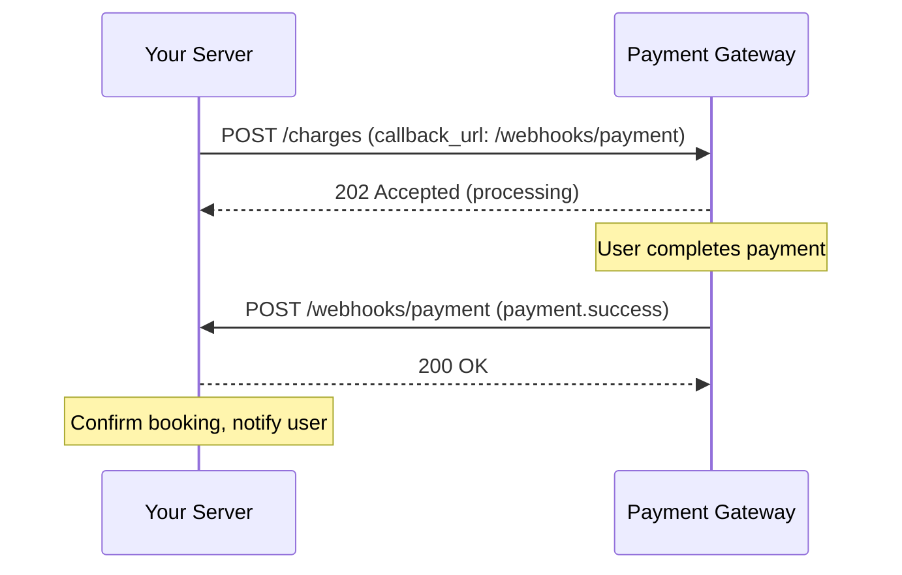
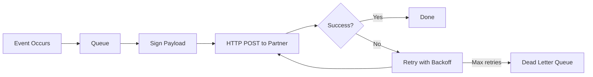

# 53. Webhooks

> **Think:** *"Another system knows first — call me when it's ready."*

**Mental Model:** Pizza delivery notification. Bad: call every minute asking "pizza ready?" Good: give your number, they call when it's ready.

---

## The 4 Questions

| Question | Answer |
|----------|--------|
| **What problem does it solve?** | Event notification — another system owns the event and tells you when it happens, instead of you polling. |
| **What happens if I ignore it?** | You poll REST every 2 seconds ("payment done yet?"), wasting resources, delaying UX, hitting rate limits. |
| **Where would I use it?** | Payments, shipping updates, third-party integrations, booking confirmations, refund notifications. |
| **What companies use it?** | Stripe, Razorpay, PayU, Shopify, GitHub, Slack, Twilio — any SaaS that pushes events to your app. |

---

## Mental Movie (60 seconds)

User pays ₹15,000 for a Goa package.

**Bad approach (polling):**
```
Your server → Razorpay: Payment done?  → No
(wait 2 seconds)
Your server → Razorpay: Payment done?  → No
(wait 2 seconds)
... repeat 30 times ...
Your server → Razorpay: Payment done?  → Yes!
```

**Good approach (webhook):**
```
Your server → Razorpay: Charge ₹15,000, callback_url=https://you.com/webhooks/payment
User completes UPI on phone...
Razorpay → Your server: POST /webhooks/payment { "event": "payment.success", ... }
Your server: Confirm booking, send email, done.
```

They call you. You don't ask repeatedly.

---

## How It Works



**Consuming a webhook:** You expose `POST /webhooks/...` and the provider calls it.

**Providing a webhook (harder):**

```
Create Event → Queue Event → Sign Event → Deliver Event → Retry Event
```

The endpoint is easy. **Reliable delivery is the real product.**

---

## Real-World Examples

### Your Travel Platform

| Event | Webhook from | Your action |
|-------|--------------|-------------|
| `payment.success` | Razorpay | Confirm booking, send voucher |
| `payment.failed` | Razorpay | Release hold, notify user |
| `booking.confirmed` | Hotel supplier | Update status, email customer |
| `shipment.delivered` | Logistics partner | Mark trip complete |
| `refund.completed` | Payment gateway | Update wallet, notify user |

### Nykaa

Payment webhooks from Razorpay/PayU. Warehouse WMS webhooks for dispatch. Courier webhooks for delivery status. Each triggers order state machine transitions.

### Amazon

Seller Central webhooks for order notifications. AWS EventBridge for cloud events. MWS/SP-API notification subscriptions.

---

## When To Use Webhooks

| Use webhooks when... | Example |
|----------------------|---------|
| **Another system knows first** | Bank confirms payment |
| Event happens **asynchronously** | Booking confirmed in 30–90s |
| You'd otherwise **poll** | Payment status, delivery status |
| Integrating **third-party SaaS** | Stripe, Shopify, GitHub |

## When NOT To Use Webhooks

| Avoid webhooks when... | Why |
|------------------------|-----|
| You need data **immediately** in the request | Use synchronous REST |
| You control both sides and need **realtime stream** | WebSockets may be better |
| Provider doesn't support webhooks | Poll as fallback (with backoff) |
| You can't expose a public endpoint | Use polling or message queue bridge |

---

## Webhook Reliability Checklist

Building or consuming webhooks:

- [ ] **Verify signatures** — HMAC/SHA256 (Stripe-Signature header)
- [ ] **Idempotent handler** — same event delivered twice must be safe (Module 1)
- [ ] **Return 200 quickly** — process async via queue if heavy
- [ ] **Retry with backoff** — when providing webhooks to partners
- [ ] **Dead letter queue** — for events that fail after retries (Module 5)
- [ ] **Log event IDs** — for debugging and replay

---

## Provider Mindset

If **you** provide webhooks to partners:



Partners judge you on delivery reliability, not your API docs.

---

## Problem Simulation

Stripe sends `payment.success` to your webhook. Your server:
1. Receives the event
2. Starts booking confirmation (calls slow hotel API — 45 seconds)
3. Stripe times out waiting for your 200 response
4. Stripe retries the webhook
5. You confirm the booking twice

**Questions:**
1. What Module 1 concept prevents step 5?
2. What should you do in step 2 instead of blocking for 45 seconds?
3. Why verify the Stripe-Signature header?

<details>
<summary>Answers</summary>

1. **Idempotency** — handle duplicate `payment.success` for same payment_id safely.
2. **Return 200 immediately**, push booking work to a **message queue**, process async.
3. **Security** — without verification, anyone can POST fake `payment.success` to your endpoint.

</details>

---

## Key Takeaway

Webhooks are for when someone else owns the timeline. Don't poll — let them call you.

**Next:** [54 — WebSockets](./54-websockets.md) — when you need to stay connected.
