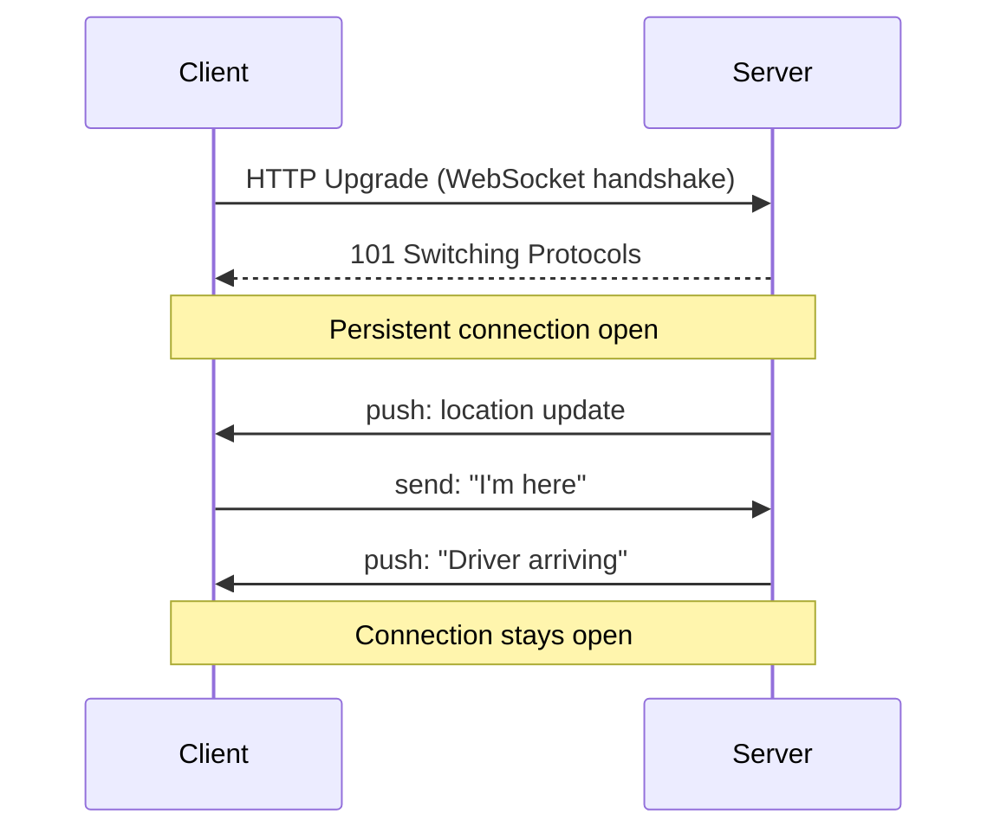

# 54. WebSockets

> **Think:** *"Updates are continuous and immediate — stay connected, keep talking."*

**Mental Model:** Phone call. Instead of ask-answer-disconnect, you stay on the line and both sides can talk anytime.

---

## The 4 Questions

| Question | Answer |
|----------|--------|
| **What problem does it solve?** | Real-time bidirectional communication — server can push data anytime without client polling. |
| **What happens if I ignore it?** | You poll REST every second for live tracking, chat, or stock prices — slow, expensive, battery-draining. |
| **Where would I use it?** | Chat, live tracking, trading platforms, multiplayer games, real-time dashboards, live scores. |
| **What companies use it?** | Uber (driver tracking), Slack (chat), Bloomberg (trading), Dream11 (live scores), Google Docs (collaboration). |

---

## Mental Movie (60 seconds)

User books an airport cab. Watches the car approach on a map.

**Polling (REST every 2 sec):**
```
GET /cab/location → { lat: 12.97, lng: 77.59 }
(wait 2 sec)
GET /cab/location → { lat: 12.971, lng: 77.591 }
... 60 requests per minute per user ...
```

**WebSocket:**
```
Client ↔ Server: persistent connection
Server pushes: { lat: 12.97, lng: 77.59 }
Server pushes: { lat: 12.971, lng: 77.591 }
... only when position changes ...
```

Map updates smoothly. Server sends only when needed. One connection, not 60 requests/minute.

---

## How It Works



**Characteristics:**
- **Persistent connection** — stays open until closed
- **Bidirectional** — both sides send anytime
- **Low overhead** — no HTTP headers on every message
- **Server-initiated push** — server doesn't wait for client to ask

---

## Real-World Examples

### Your Travel Platform

| Feature | Why WebSocket |
|---------|---------------|
| Live cab tracking to airport | Location updates every 1–3 seconds |
| Group trip chat | Messages appear instantly |
| Live flight gate changes | Push alerts during travel day |
| Flash deal countdown | Price/stock updates during sale |
| Agent-assisted booking | Real-time co-browsing with support |

### Nykaa

Live beauty consultation chat. Flash sale stock counter. Order tracking with live status during delivery window.

### Amazon

Not customer-facing for most flows. Internal real-time inventory dashboards. Alexa device communication. Some seller central live updates.

---

## When To Use WebSockets

| Use WebSockets when... | Example |
|------------------------|---------|
| Updates are **continuous** | GPS tracking |
| Updates must be **immediate** | Chat messages |
| **Both sides** send frequently | Multiplayer game |
| Polling would be **>1 request/second** | Stock ticker |

## When NOT To Use WebSockets

| Avoid WebSockets when... | Use instead |
|--------------------------|-------------|
| Ask once, get answer | REST |
| Another system notifies you async | Webhooks |
| Occasional updates (every 30s+) | Polling with backoff, or SSE |
| Simple CRUD app | REST |
| Server-only push, no client messages | **SSE** (Server-Sent Events) — simpler |

---

## WebSockets vs SSE

| | WebSockets | SSE (Server-Sent Events) |
|---|------------|--------------------------|
| Direction | Bidirectional | Server → Client only |
| Complexity | Higher | Lower |
| Use when | Chat, games, collab | Live feeds, notifications |

---

## Operational Challenges

| Challenge | Mitigation |
|-----------|------------|
| Connection drops (mobile networks) | Auto-reconnect with exponential backoff |
| Scaling (millions of connections) | Dedicated WS servers, Redis pub/sub for fan-out |
| Load balancer sticky sessions | Session affinity or shared state |
| Battery drain on mobile | Reduce push frequency, disconnect when backgrounded |
| Authentication | Send token during handshake |

---

## Problem Simulation

Your travel app adds "live bus tracking" for group tours. 500 users on one bus tour. Each polls `GET /bus/location` every 1 second.

**Questions:**
1. How many requests per minute?
2. What protocol fix reduces this by ~99%?
3. What if the bus enters a tunnel and 500 clients reconnect simultaneously?

<details>
<summary>Answers</summary>

1. **500 × 60 = 30,000 requests/minute** for one bus. Unsustainable at scale.
2. **WebSocket** — one connection per user, server pushes location when GPS updates (maybe every 3–5 sec).
3. **Thundering herd** on reconnect — stagger reconnects with jitter, use load balancer with connection draining, consider edge WebSocket gateways.

</details>

---

## Key Takeaway

WebSockets are a phone call, not a text message. Use when the conversation doesn't end after one exchange.

**Next:** [55 — GraphQL](./55-graphql.md) — when the screen needs data from everywhere.
