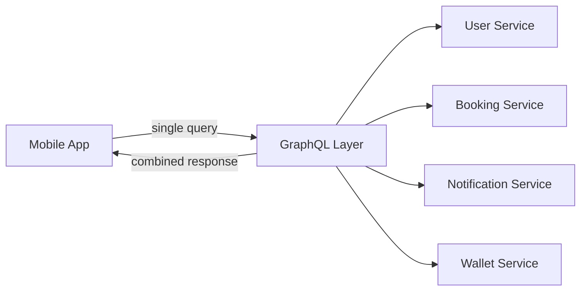

# 55. GraphQL

> **Think:** *"The screen needs data from many places — give me exactly what I need, in one request."*

**Mental Model:** Buffet instead of fixed meal. REST forces 3 separate orders. GraphQL lets you pick exactly what you want in one trip.

---

## The 4 Questions

| Question | Answer |
|----------|--------|
| **What problem does it solve?** | Over-fetching, under-fetching, and multiple round-trips — frontend needs a custom data shape from several sources. |
| **What happens if I ignore it?** | Mobile app makes 8 REST calls to render one screen — slow on 3G, complex loading states, chatty API. |
| **Where would I use it?** | Mobile apps, super apps, complex dashboards, data-heavy frontends with varied screen requirements. |
| **What companies use it?** | Facebook (invented it), GitHub, Shopify, Netflix, Airbnb, Twitter/X (partial). |

---

## Mental Movie (60 seconds)

Travel app home screen needs:
- User name + avatar
- Upcoming trip summary
- 3 notification badges
- Wallet balance
- 5 personalized offers

**REST approach:**
```
GET /users/me
GET /bookings/upcoming
GET /notifications?unread=true
GET /wallet
GET /offers?personalized=true
```
5 round-trips. 5 loading spinners. Slow on mobile.

**GraphQL approach:**
```graphql
query HomeScreen {
  me { name, avatar }
  upcomingBooking { id, destination, startDate }
  unreadNotificationCount
  wallet { balance }
  offers(limit: 5) { id, title, discount }
}
```
1 request. 1 response. Exactly the fields the screen needs.

---

## How It Works



**Characteristics:**
- **Client chooses data shape** — request only needed fields
- **Single endpoint** — usually `POST /graphql`
- **Strongly typed schema** — `User`, `Booking`, `Offer` types
- **Reduces round-trips** — one request, many resources

---

## Real-World Examples

### Your Travel Platform

Home screen, trip detail (flights + hotel + transfers + weather), agent dashboard — each screen defines its own GraphQL query. Mobile team doesn't wait for backend to create bespoke REST endpoints per screen.

### Nykaa

Product detail with reviews, offers, delivery estimate, recommendations, wishlist status — one GraphQL query instead of 6 REST calls. Critical for mobile performance during sales.

### Amazon

Public APIs remain REST. Internal apps and some consumer surfaces use GraphQL/BFF patterns to aggregate across catalog, pricing, inventory, recommendations.

---

## When To Use GraphQL

| Use GraphQL when... | Example |
|---------------------|---------|
| Frontend needs **many resources** per screen | Super app home |
| **Mobile bandwidth** matters | Reduce payload and round-trips |
| **Multiple clients** need different data shapes | iOS vs web vs admin |
| You have many microservices to **aggregate** | GraphQL as BFF layer |

## When NOT To Use GraphQL

| Avoid GraphQL when... | Why |
|-----------------------|-----|
| **Simple CRUD** app | REST is simpler |
| **File uploads / binary** | REST or dedicated endpoints |
| **Caching at CDN** matters | GraphQL POST requests don't cache easily |
| **Team is small** | Operational overhead (schema, resolvers, N+1) |
| **Early MVP** | REST first, GraphQL when screens get painful |

---

## GraphQL Pitfalls

| Pitfall | Mitigation |
|---------|------------|
| **N+1 queries** | DataLoader, batch resolvers |
| **Expensive queries** | Query depth limits, complexity analysis |
| **No caching** | Persisted queries, APQ (Automatic Persisted Queries) |
| **Over-engineering** | Don't add GraphQL on day one |

---

## GraphQL vs BFF (Backend for Frontend)

| | GraphQL | BFF |
|---|---------|-----|
| Approach | Flexible query language | Dedicated backend per client |
| Best for | Many screens, varied needs | One mobile app, fixed screens |
| Complexity | Schema + resolvers | Custom REST endpoints per screen |

Both solve "too many REST calls." BFF is often simpler for startups.

---

## Problem Simulation

Your travel app's trip detail screen makes these REST calls:
1. `GET /trips/123`
2. `GET /trips/123/flights`
3. `GET /trips/123/hotel`
4. `GET /trips/123/weather`
5. `GET /users/me/loyalty`

On 3G, each call takes 400ms. Total: 2+ seconds before screen renders.

**Questions:**
1. Is this a REST failure or a frontend architecture issue?
2. Name two solutions.
3. Why might you choose BFF over GraphQL at seed stage?

<details>
<summary>Answers</summary>

1. **Architecture issue** — REST works fine; the problem is chatty composition.
2. **GraphQL** (one query) or **BFF** (`GET /screens/trip-detail/123` returns everything).
3. **BFF is simpler** — one team, one mobile app, fixed screens. No schema/resolver/N+1 complexity. Add GraphQL when multiple clients need flexible queries.

</details>

---

## Key Takeaway

GraphQL is for when your UI is hungry for data from many places and REST forces too many round-trips.

**Next:** [56 — gRPC](./56-grpc.md) — when machines talk to machines at scale.
