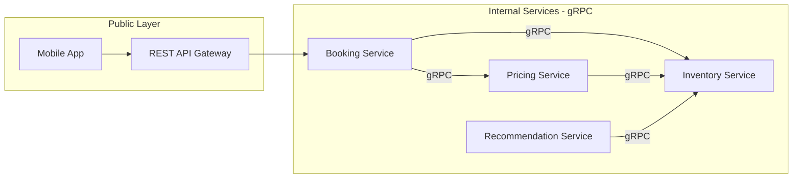

# 56. gRPC

> **Think:** *"Machines are talking to machines all day long — fast, typed, and efficient."*

**Mental Model:** Private high-speed railway between factories. Customers never see it. Machines love it.

---

## The 4 Questions

| Question | Answer |
|----------|--------|
| **What problem does it solve?** | High-performance service-to-service communication — strong typing, code generation, binary protocol, low latency at scale. |
| **What happens if I ignore it?** | Internal services choke on JSON serialization overhead at millions of calls/day, or you lack contract enforcement between teams. |
| **Where would I use it?** | Microservices internals, platform engineering, pricing↔inventory, recommendation engines, backend-to-backend. |
| **What companies use it?** | Google (created it), Netflix, Square, Dropbox, Cisco — any company with large internal microservice meshes. |

---

## Mental Movie (60 seconds)

Your pricing service calls inventory service **50,000 times per minute** during a flash sale.

**REST/JSON:**
```
HTTP headers + JSON serialize → network → JSON deserialize
~5–15ms per call + CPU for parsing
50,000 × 10ms = 500 seconds of CPU per minute on serialization alone
```

**gRPC:**
```
Binary protobuf message → HTTP/2 multiplexed stream → deserialize
~1–3ms per call, strongly typed, generated client stubs
Contract enforced by .proto file — breaking changes caught at compile time
```

Users never see gRPC. Your services feel the difference.

---

## How It Works



**Why REST is slow at scale (internal):**
- HTTP/1.1 overhead per request
- JSON serialize/deserialize on every call
- No enforced contract — runtime errors from typos

**Why gRPC is fast:**
- **Protocol Buffers** — binary, compact
- **HTTP/2** — multiplexing, header compression
- **Code generation** — client/server stubs from `.proto`
- **Strong typing** — compile-time contract enforcement
- **Streaming** — unary, server streaming, bidirectional

---

## Real-World Examples

### Your Travel Platform

| Service pair | Why gRPC |
|--------------|----------|
| Pricing ↔ Inventory | 10K+ calls/min during sales |
| Booking ↔ Availability | Tight latency requirements |
| Search ↔ Recommendation | Large payloads, frequent calls |
| Payment ↔ Fraud check | Low latency, typed contracts |

**Public API stays REST.** gRPC is internal only.

### Nykaa

Inventory service, pricing engine, warehouse management, recommendation service — internal gRPC mesh. Mobile app talks REST to API gateway.

### Amazon

Massive internal RPC infrastructure. Public AWS APIs use REST/JSON. Internal service communication heavily optimized binary protocols.

---

## When To Use gRPC

| Use gRPC when... | Example |
|------------------|---------|
| **Service-to-service** at high volume | Pricing ↔ Inventory |
| **Low latency** matters internally | Fraud check on checkout |
| **Strong contracts** between teams | Shared `.proto` files |
| **Streaming** data between services | Live inventory feed |
| **Polyglot** microservices | Go, Java, Python all generate stubs |

## When NOT To Use gRPC

| Avoid gRPC when... | Why |
|--------------------|-----|
| **Browser/client-facing** APIs | Limited browser support (need gRPC-Web proxy) |
| **Public third-party** APIs | REST is universal, gRPC is not |
| **Simple monolith** | No services to talk to |
| **Early MVP** | REST between services is fine until scale hurts |
| **Team lacks protobuf experience** | Learning curve |

---

## gRPC vs REST (Internal)

| | REST + JSON | gRPC + Protobuf |
|---|-------------|-----------------|
| Payload | Text, verbose | Binary, compact |
| Contract | OpenAPI (optional) | .proto (required) |
| Browser | Native | Needs proxy |
| Performance | Good enough | 5–10× faster at scale |
| Human debugging | Easy (curl) | Harder (grpcurl) |
| Best for | Public APIs, MVPs | Internal microservices |

---

## Problem Simulation

Your travel platform monolith is splitting into services. Team proposes gRPC for everything — including the mobile app API.

**Questions:**
1. Should the mobile app call gRPC directly?
2. What sits between the mobile app and internal gRPC services?
3. At what scale does gRPC between Pricing and Inventory justify the complexity?

<details>
<summary>Answers</summary>

1. **No** — browsers and most mobile HTTP clients expect REST/JSON. Use REST (or GraphQL) for clients.
2. **API Gateway / BFF** — exposes REST/GraphQL publicly, translates to internal gRPC calls.
3. When REST overhead causes **measurable pain** — >1K calls/sec between two services, latency SLOs breached, or teams need enforced contracts. Not on day one of microservices.

</details>

---

## Key Takeaway

gRPC is the private railway between your backend services. Customers ride the public REST bus.

**Next:** [57 — API Stack Evolution](./57-api-stack-evolution.md) — how your protocols grow with your product.
