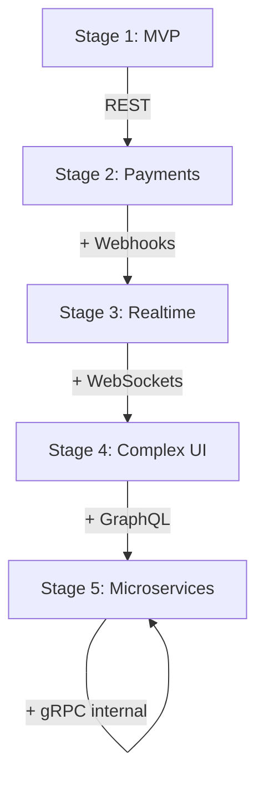

# 57. API Stack Evolution

> **Think:** *"What protocols does my product stage actually need — not what Twitter says is cool?"*

---

## The 4 Questions

| Question | Answer |
|----------|--------|
| **What problem does it solve?** | Premature complexity — adding GraphQL/gRPC on day one, or polling payments when you need webhooks at scale. |
| **What happens if I ignore it?** | You over-engineer early (waste) or under-engineer late (pain). Wrong protocol at wrong stage. |
| **Where would I use it?** | Architecture planning, fundraising tech due diligence, team growth decisions, platform evolution. |
| **What companies use it?** | Every company that survived — Stripe (REST→webhooks), Uber (REST→WebSockets→gRPC internal), Netflix (full evolution). |

---

## Mental Movie (60 seconds)

Founder at Month 3: *"Should we use GraphQL and gRPC?"*

**Month 3 reality:**
```
React App → Node.js API → PostgreSQL
```
You need REST. Maybe one webhook when you add payments. That's it.

**Month 18 reality:**
```
Mobile App → API Gateway → 6 services
                ↓ webhooks from Razorpay, hotel suppliers
                ↓ WebSocket for live tracking
                ↓ GraphQL for home screen
                ↓ gRPC between pricing and inventory
```

Each protocol appeared because a **conversation pattern** emerged — not because someone read a blog post.

---

## The Startup Evolution



### Stage 1 — MVP

```
Frontend → Backend → Database
```

**Protocol:** REST

Build CRUD. Ship features. Don't debate GraphQL.

---

### Stage 2 — Payments & Integrations

```
Backend → Payment Gateway
Backend ← Webhook (payment.success)
Backend → Hotel Supplier
Backend ← Webhook (booking.confirmed)
```

**Protocols:** REST + Webhooks

Stop polling payment status. Let Razorpay call you.

---

### Stage 3 — Realtime Features

```
Backend ↔ WebSocket ↔ Mobile App (live tracking)
Backend ↔ WebSocket ↔ Mobile App (chat support)
```

**Protocols:** REST + Webhooks + WebSockets

Users expect live cab tracking, chat, live notifications.

---

### Stage 4 — Complex Frontend

```
Mobile App → GraphQL Layer → [User, Booking, Wallet, Offers, Notifications]
```

**Protocols:** REST + Webhooks + WebSockets + GraphQL

Home screen needs 5 services. One query beats five REST calls.

**Alternative:** BFF (`GET /screens/home`) — often simpler at this stage.

---

### Stage 5 — Microservices at Scale

```
API Gateway (REST/GraphQL public)
    ↓ gRPC
[Pricing] ↔ [Inventory] ↔ [Booking] ↔ [Recommendation]
```

**Protocols:** Full stack. gRPC internal only.

Services talk thousands of times per minute. JSON can't keep up.

---

## The Architect's Cheat Sheet

| Ask yourself... | Use | Mental model |
|---------------|-----|--------------|
| Do I need data **right now**? | **REST** | Restaurant order |
| Does **another system know first**? | **Webhooks** | Pizza delivery call |
| Do I need **continuous realtime** updates? | **WebSockets** | Phone call |
| Does the frontend need data from **many services**? | **GraphQL** (or BFF) | Buffet |
| Are **internal services** talking at scale? | **gRPC** | Factory railway |

---

## Real-World Examples

### Your Travel Platform — Stage Map

| Stage | Product milestone | API stack |
|-------|-------------------|-----------|
| 1 | Launch search + book | REST |
| 2 | Add Razorpay + hotel suppliers | REST + Webhooks |
| 3 | Airport cab tracking + chat | + WebSockets |
| 4 | Super app home screen | + GraphQL or BFF |
| 5 | Split pricing/inventory services | + gRPC internal |

### Nykaa

Started REST ecommerce. Added payment webhooks. Flash sales needed live counters (WebSocket/SSE). App complexity drove aggregation layer. Scale drove internal service mesh.

### Amazon

Decades of evolution. Public: REST. Internal: custom RPC → gRPC-like patterns. Never exposed gRPC to customers.

---

## When To Add Each Protocol

| Protocol | Add when you feel this pain... |
|----------|-------------------------------|
| REST | Day 1 — always |
| Webhooks | You're polling payment/booking status |
| WebSockets | You're polling more than once per 5 seconds for live data |
| GraphQL/BFF | Mobile screen needs 4+ REST calls to render |
| gRPC | Internal service calls exceed ~1K/sec or latency SLO broken |

## When NOT To Add

| Don't add... | Until... |
|--------------|----------|
| GraphQL | REST chatiness actually hurts UX metrics |
| gRPC | You have multiple backend services with proven traffic |
| WebSockets | Polling is measurably failing (latency, cost, battery) |
| Any new protocol | The conversation pattern clearly demands it |

---

## Final Principle

```
Do not start with technology.
Start with the conversation.
The protocol is the answer to a business behavior.
```

Architects do not choose APIs. They identify communication patterns. The API choice follows naturally.

---

## Module Simulation

Map each feature to the right protocol:

| Feature | Protocol | Why |
|---------|----------|-----|
| Search Goa packages | REST | Ask once, get results |
| Razorpay payment confirmation | Webhook | Bank knows first |
| Live cab to airport | WebSocket | Continuous location |
| Home screen (5 data sources) | GraphQL/BFF | Many resources, one screen |
| Pricing checks inventory 10K/min | gRPC | Internal, high volume |
| Update user profile | REST | Simple CRUD |
| Hotel supplier confirms booking | Webhook | Supplier knows first |
| Flash sale stock counter | WebSocket/SSE | Live push to many clients |

---

## Problem Simulation

You're at Stage 2. Team wants to add GraphQL, gRPC, and WebSockets in the next sprint "to be future-ready."

**Questions:**
1. What's wrong with this plan?
2. What should you add in Stage 2?
3. What metric tells you it's time for Stage 3?

<details>
<summary>Answers</summary>

1. **Premature complexity** — three protocols with no proven pain. Engineering time wasted, ops burden increased, team distracted from product.
2. **Webhooks** — if payments/integrations are live and you're polling. Otherwise, just REST.
3. **Stage 3 trigger** — users need live features (tracking, chat) AND polling is causing measurable problems (server load, UX latency, battery complaints).

</details>

---

## Key Takeaway

Your API stack should grow like your product — REST first, then add protocols when conversation patterns demand them.

**Handbook complete:** 57 topics across 9 modules. You now have mental movies for reliability, scale, performance, data, distributed systems, infrastructure, product, business, and APIs.

Return to [Module 9 README](./README.md) or [Handbook Home](../README.md).
