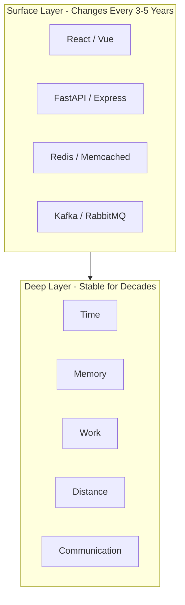

# 58. Principles Over Frameworks

> **Think:** *"What force is at play here — not what framework should I use?"*

---

## The 4 Questions

| Question | Answer |
|----------|--------|
| **What problem does it solve?** | Shallow thinking — jumping to React/Redis/Kafka before understanding the underlying forces (time, memory, work, distance). |
| **What happens if I ignore it?** | You chase trends, rewrite stacks every 3 years, and can't debug systems because you know tools but not principles. |
| **Where would I use it?** | Every architecture decision, code review, system design interview, and "should we adopt X?" conversation. |
| **What companies use it?** | Every long-lived company — Amazon's leadership principles for systems, Google's SRE book, Netflix's chaos engineering — all principle-driven. |

---

## Mental Movie (60 seconds)

**Year 1:** You learn FastAPI + PostgreSQL + Redis. Ship a travel booking app. It works.

**Year 3:** Traffic 100×. App is slow. Team says: "Let's migrate to GraphQL and Kafka!"

**Year 5 engineer (principles-trained):** Before changing tools, asks:
- Where is **work** happening? (Law 1)
- Is data **far** from the user? (Law 2)
- Are we **repeating** work? (Law 3)
- Can we **remember** instead of recompute? (Law 4)

Turns out: countries table queried 50,000 times/day, no cache, images served from Mumbai to US users. Fix with Redis + CDN. No Kafka needed.

**The framework didn't fail. The forces were ignored.**

---

## How It Works



| Layer | Examples | Lifespan |
|-------|----------|----------|
| **Frameworks** | React, Next.js, FastAPI | 3–7 years |
| **Technologies** | Redis, Kafka, PostgreSQL | 10–20 years |
| **Principles** | Caching, queues, idempotency | Decades |
| **Forces** | Time, memory, work, distance | Forever |

---

## The Five Forces

| Force | Question it asks |
|-------|------------------|
| **Time** | How long does this take? (Law 7: latency is additive) |
| **Memory** | Can we remember instead of recompute? (Law 4) |
| **Work** | Where does computation happen? (Law 1: work cannot be destroyed) |
| **Distance** | How far is data from where it's needed? (Law 2) |
| **Communication** | What conversation is happening? (Law 11) |

---

## Real-World Examples

### Your Travel Platform

| Surface question | Principle question |
|------------------|-------------------|
| "Should we use React Query?" | "Are we repeating the same fetches?" (Law 3) |
| "Should we add Redis?" | "Is this read-heavy with tolerable staleness?" (Laws 5, 6) |
| "Should we use GraphQL?" | "What conversation does the screen need?" (Law 11) |

### Nykaa

During a flash sale, the team doesn't ask "Kafka or RabbitMQ?" first. They ask: "Where is work exploding? Can we move it? Can we cache it? Can we avoid it?"

### Amazon

Jeff Bezos: "Focus on things that don't change." Customers want selection, low prices, fast delivery. Those are forces. AWS instance types are tools.

---

## When To Think In Principles

| Think principles when... | Example |
|--------------------------|---------|
| Choosing between technologies | Redis vs Memcached vs in-process cache |
| Debugging slowness | Not "is React slow?" but "where is time going?" |
| Designing for scale | Before adding servers, ask what work can be avoided |
| Learning new tools | Map new tool to which principle it serves |
| Architecture reviews | "What force does this design respect or violate?" |

## When Frameworks Still Matter

| Frameworks matter when... | Why |
|---------------------------|-----|
| Shipping MVP fast | Pick boring, proven stack |
| Team already expert in X | Productivity > theoretical purity |
| Hiring and ecosystem | React developers are easier to find |
| Specific capability needed | You need Kafka's durability guarantees |

**Principles guide which tool. They don't replace the need to pick one.**

---

## The Three Lenses

```
Engineer       → sees APIs, endpoints, code
Architect      → sees flows, services, data movement
Systems thinker → sees time, memory, work, distance, communication
```

This module trains you to shift from engineer to systems thinker.

---

## Problem Simulation

Your CTO proposes: "Rewrite the monolith in microservices with Kafka, GraphQL, and gRPC."

**Questions:**
1. What principles should you evaluate before approving?
2. Name three questions from the Five Forces.
3. What's a sign this is framework-driven, not principle-driven?

<details>
<summary>Answers</summary>

1. **Law 1** (where does work move?), **Law 12** (can we avoid work first?), **Law 11** (what conversations exist?), **Law 7** (will latency add up across services?).
2. Time: "Will 5 services add 200ms?" Memory: "What can we cache?" Work: "What work are we moving, not eliminating?" Distance: "Does data get farther from users?" Communication: "Do we need all these protocols?"
3. **Framework-driven:** Solution named before problem analyzed. No metrics on current bottlenecks. "Everyone uses microservices" as justification.

</details>

---

## Key Takeaway

Master the forces. Tools are interchangeable implementations of principles that don't change.

**Next:** [59 — Work Cannot Be Destroyed](./59-work-cannot-be-destroyed.md)
