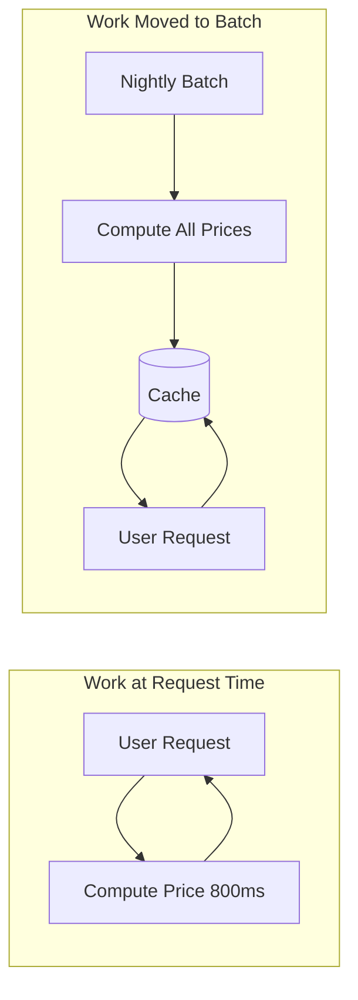

# 59. Law 1: Work Cannot Be Destroyed

> **Think:** *"I can't eliminate this work — only move it somewhere else."*

---

## The 4 Questions

| Question | Answer |
|----------|--------|
| **What problem does it solve?** | The fantasy that you can "optimize away" computation — understanding that work is conserved, only relocated. |
| **What happens if I ignore it?** | You hide work somewhere worse — push to frontend (user's slow phone), batch at night (stale data), or "async" without planning (queue backlog). |
| **Where would I use it?** | Every optimization decision: caching, batch jobs, CDN, client-side rendering, precomputation, queues. |
| **What companies use it?** | Amazon (precompute recommendations overnight), Netflix (encode video once, stream many times), every CDN (compute at edge once). |

---

## Mental Movie (60 seconds)

Your travel search runs a complex pricing algorithm on every `GET /search?destination=goa` — 800ms per request.

**Option A — "Eliminate" the work:**
"We'll remove the pricing algorithm!" → Business dies. Work is required.

**Option B — Move the work:**
```
Before: compute price on every search request (800ms × 10,000 searches/day)
After:  nightly batch precomputes prices → search reads cached price (5ms)
```

Work still happens. 10,000 pricing calculations still occur. But they moved from **request time** to **batch time**. Users get fast search. Prices are 6 hours stale — a tradeoff (Law 6).

**You didn't destroy work. You rescheduled it.**

---

## How It Works



### Common Relocations

| From | To | Trade-off |
|------|-----|-----------|
| Request time | Nightly batch | Staler data, faster UX |
| Backend | Frontend (browser) | Offloads server, uses user's CPU/battery |
| Sync API call | Async queue | Slower feedback, resilient processing |
| Database query | Precomputed materialized view | Storage cost, refresh lag |
| Runtime calculation | Build-time static generation | Less dynamic, blazing fast |

---

## Real-World Examples

### Your Travel Platform

| Work | Moved from | Moved to |
|------|------------|----------|
| Price calculation | Per-search API call | Nightly pricing batch job |
| Image resizing | On every request | CDN at upload time |
| PDF voucher generation | Checkout response | Async queue after payment |
| Filter UI logic | Server-side filtering | Client-side (destination list is small) |
| Tax rules lookup | DB per booking | In-memory cache (changes rarely) |

### Nykaa

Product catalog indexing: work moved from search-time to index-time. Sale prices precomputed before flash sale starts. Image optimization at upload, not at page load.

### Amazon

"Customers who bought X" — computed offline, served from cache. Product pages are pre-rendered. Inventory checks are real-time (work stays at request time because freshness matters).

---

## When To Move Work

| Move work when... | Example |
|-------------------|---------|
| Result tolerates staleness | Destination metadata, country lists |
| Work is identical for many users | Same hotel prices for all users in a window |
| Request-time cost hurts UX | 800ms pricing on search |
| Work can be batched efficiently | Nightly reports, index rebuilds |

## When NOT To Move Work

| Keep work at request time when... | Why |
|-----------------------------------|-----|
| Freshness is critical | Live seat availability, stock count during sale |
| Work is user-specific and unpredictable | Personalized fraud check |
| Moving creates worse bottleneck | Batch job can't finish before next peak |
| "Async" hides failure from user | Payment confirmation must be synchronous |

---

## Work Conservation Checklist

Before any "optimization":

- [ ] Where does work happen **today**?
- [ ] Where will it happen **after**?
- [ ] What **trade-off** am I accepting? (staleness, complexity, cost)
- [ ] Did I **eliminate** work or just **move** it?
- [ ] Is the new location **better** for this work?

---

## Problem Simulation

Search page loads hotel images. Currently: backend fetches from S3, resizes to 3 sizes, returns URLs. Takes 400ms.

Team proposes: "Move image resizing to the CDN using URL parameters."

**Questions:**
1. Did work get destroyed or moved?
2. Where does resizing happen now?
3. What new cost or complexity appears?

<details>
<summary>Answers</summary>

1. **Moved** — resizing still happens, just at CDN edge on first request (then cached).
2. **CDN edge** — closer to user (Law 2 bonus).
3. **CDN cost**, cache invalidation when image updates, URL parameter configuration, possible cold-cache latency on first hit.

</details>

---

## Key Takeaway

Optimization often means moving work to a better location — not pretending work doesn't exist.

**Next:** [60 — The Closest Copy Wins](./60-closest-copy-wins.md)
