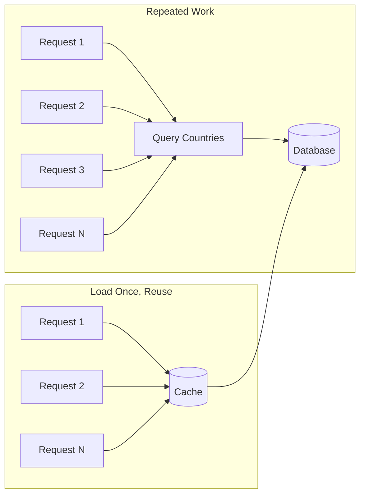

# 61. Law 3: Repetition Is The Enemy

> **Think:** *"Am I doing the same thing more than once?"*

---

## The 4 Questions

| Question | Answer |
|----------|--------|
| **What problem does it solve?** | Wasted computation — identical work repeated on every request, query, or render when it could happen once and be reused. |
| **What happens if I ignore it?** | DB melts under `SELECT * FROM countries` × 50,000/day. N+1 queries. Connection storms. CPU spent on identical work. |
| **Where would I use it?** | Caching, connection pooling, memoization, batch loading, DataLoader, React Query dedup, materialized views. |
| **What companies use it?** | Every performant system — GitHub (memoized API responses), Stripe (idempotent dedup), any app with connection pools. |

---

## Mental Movie (60 seconds)

**Bad code:**
```python
def search_trips(destination):
    countries = db.query("SELECT * FROM countries")  # 200 rows, every search
    hotels = supplier_api.search(destination)         # external call
    return combine(countries, hotels)
```

50,000 searches/day = 50,000 identical country queries. Countries haven't changed in 6 months.

**Good code:**
```python
countries = load_once_at_startup()  # or Redis cache, TTL 24h

def search_trips(destination):
    hotels = supplier_api.search(destination)
    return combine(countries, hotels)
```

Same result. 49,999 fewer queries. **Repetition eliminated.**

---

## How It Works



### Forms of Repetition

| Pattern | Repetition | Fix |
|---------|------------|-----|
| N+1 queries | 1 query per item in loop | Eager load, JOIN, DataLoader |
| No connection pool | New TCP+auth per request | Connection pooling |
| Re-fetch on every render | Same API call per component | React Query, SWR, memo |
| Recompute same price | Pricing logic per search | Cache or precompute |
| Re-validate same JWT | DB lookup per request | Stateless JWT verification |

---

## Real-World Examples

### Your Travel Platform

| Repetition | Fix |
|------------|-----|
| `GET /countries` on every search page | Cache in Redis, TTL 24h |
| 1 DB query per hotel in search results (N+1) | Single JOIN or batch query |
| New DB connection per API request | PgBouncer connection pool |
| Same trip details fetched 3× by React components | React Query with shared cache key |
| Tax rate lookup per line item | Load tax table once at startup |

### Nykaa

Product category tree loaded once per app session. Brand list cached. Cart state deduplicated across components. Warehouse inventory batch-fetched, not per-SKU sequential calls.

### Amazon

"Frequently bought together" precomputed — not calculated per page view. Connection pooling at massive scale. DynamoDB batch gets instead of individual gets.

---

## When To Eliminate Repetition

| Eliminate when... | Example |
|-------------------|---------|
| Result is **identical** across requests | Country list, config, tax rates |
| Work is **expensive** | External API call, complex query |
| Frequency is **high** | Thousands of identical ops/minute |
| Data changes **rarely** | Reference data, static content |

## When Repetition Is OK

| Allow repetition when... | Why |
|--------------------------|-----|
| Each request is **genuinely unique** | Personalized recommendation |
| Caching would cause **stale critical data** | Live seat count |
| Cost of cache **> cost of repeat** | Tiny query, 10 requests/day |
| **Correctness** requires fresh read | Financial balance (with transactions) |

---

## The Diagnostic Question

When debugging slowness, ask:

> **"How many times is this exact work happening?"**

Log it. Count it. You'll often find the same query, API call, or computation repeated hundreds of times per minute.

---

## Problem Simulation

Booking confirmation page loads trip, hotel, flight, user, and payment details. ORM code:

```python
trip = Trip.get(id)
hotel = Hotel.get(trip.hotel_id)      # query 2
flight = Flight.get(trip.flight_id)   # query 3
user = User.get(trip.user_id)         # query 4
payment = Payment.get(trip.payment_id) # query 5
```

5 queries per page view. 10,000 confirmations/hour during peak.

**Questions:**
1. What's the repetition problem if this runs in a loop for batch confirmations?
2. Name two fixes.
3. How does this connect to Law 4?

<details>
<summary>Answers</summary>

1. **N+1 in batch:** 10,000 bookings × 5 queries = 50,000 queries/hour for data that could be JOINed.
2. **Single JOIN query** or **eager loading** (`Trip.with(hotel, flight, user, payment)`). Or **cache** trip bundles after first load.
3. **Law 4 (Memory beats recalculation):** Cache the assembled booking view after first computation.

</details>

---

## Key Takeaway

Many performance problems reduce to: doing the same thing too many times. Find the repeat. Kill the repeat.

**Next:** [62 — Memory Beats Recalculation](./62-memory-beats-recalculation.md)
