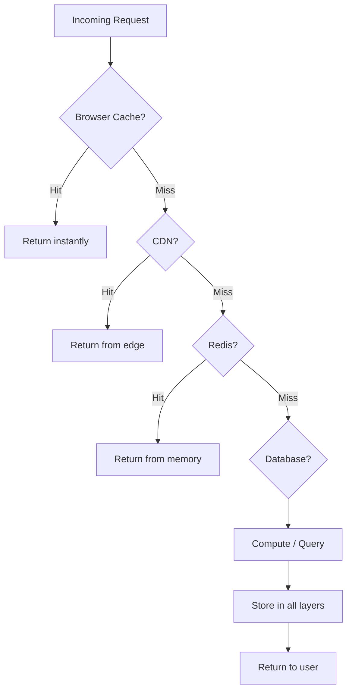

# 62. Law 4: Memory Beats Recalculation

> **Think:** *"Can I remember this answer instead of computing it again?"*

---

## The 4 Questions

| Question | Answer |
|----------|--------|
| **What problem does it solve?** | Expensive recomputation — doing the same calculation, query, or fetch when a stored answer exists. |
| **What happens if I ignore it?** | You burn CPU, DB connections, and API quotas recomputing answers that haven't changed. |
| **Where would I use it?** | Every cache layer in computing — CPU L1/L2, browser cache, CDN, Redis, DB buffer pool, React Query, OS page cache. |
| **What companies use it?** | Every computer ever built. Caching is not a feature — it's how computing survives at scale. |

---

## Mental Movie (60 seconds)

`2 + 2 = ?`

You don't re-derive Peano arithmetic every time. You **remember**: 4.

Software at scale is the same principle, applied everywhere:

```
CPU L1 cache     → remembers recent instructions
Browser cache    → remembers downloaded assets
CDN              → remembers files near users
Redis            → remembers API responses
PostgreSQL       → remembers disk pages in buffer pool
React Query      → remembers fetch results in memory
```

**This is not coincidence. This is survival.**

A remembered answer is almost always cheaper than a recomputed answer.

---

## How It Works



Each layer is **memory** avoiding **recomputation** at the layer below.

---

## The Cache Hierarchy (Universal Pattern)

| Layer | What it remembers | Speed |
|-------|-------------------|-------|
| CPU L1/L2/L3 | Instructions, data | Nanoseconds |
| Browser memory | JS objects, DOM | Microseconds |
| Browser cache | HTTP responses | Milliseconds |
| CDN | Static assets | 10–50ms |
| Application cache (Redis) | API results, sessions | 1–5ms |
| Database buffer pool | Disk pages | 5–20ms |
| Disk | Everything | 5–50ms |
| Network fetch | Origin data | 50–500ms |

**Same law at every level.** Closer memory = faster answer.

---

## Real-World Examples

### Your Travel Platform

| Computation | Cache strategy |
|-------------|----------------|
| Search results for "Goa" | Redis, TTL 5 min |
| Trip detail page | CDN + Redis |
| User session | JWT (client memory) or Redis |
| Exchange rates | Redis, TTL 1 hour |
| "Popular destinations" | Precomputed, cached 24h |

### Nykaa

Product catalog in Redis. Search indexes pre-built. Cart in session memory. Recommendation scores batch-computed, served from cache.

### Amazon

DynamoDB DAX (in-memory cache). CloudFront edge cache. ElastiCache for session and catalog. Every AWS service has a caching layer option.

---

## When To Cache (Remember)

| Cache when... | Example |
|---------------|---------|
| Computation is **expensive** | Complex pricing, search ranking |
| Result **changes infrequently** | Product catalog, config |
| Same answer serves **many requests** | Popular search queries |
| **Read >> Write** ratio | Catalog browsing (Law 5) |

## When NOT To Cache

| Don't cache when... | Why |
|---------------------|-----|
| Data must be **real-time accurate** | Payment balance, seat count |
| Cache invalidation is **harder than recompute** | Highly dynamic, user-specific |
| Dataset is **tiny and fast** | Overhead exceeds benefit |
| **Security-sensitive** per-user data on shared cache | Leakage risk |

---

## Cache Invalidation

> "There are only two hard things in Computer Science: cache invalidation and naming things." — Phil Karlton

| Strategy | When to use |
|----------|-------------|
| **TTL (time-based)** | Data can be slightly stale (country list) |
| **Event-based** | Invalidate on write (product updated → bust cache) |
| **Version/key-based** | Include version in cache key |
| **Write-through** | Update cache on every write |

---

## Problem Simulation

Your API response time breakdown:

| Layer | Time |
|-------|------|
| No cache (DB query) | 120ms |
| With Redis cache (hit) | 3ms |
| With Redis cache (miss) | 125ms (query + store) |

Cache hit rate: 85%. 100,000 requests/hour.

**Questions:**
1. Average response time?
2. What happens if hit rate drops to 50%?
3. How does this relate to Law 3 and Law 6?

<details>
<summary>Answers</summary>

1. **0.85 × 3ms + 0.15 × 125ms ≈ 21ms** average vs 120ms without cache — 5.7× faster.
2. **0.5 × 3 + 0.5 × 125 = 64ms** — still better than 120ms, but Redis overhead on misses hurts. Investigate why hit rate dropped.
3. **Law 3:** Cache eliminates repeated DB queries. **Law 6:** 15% of requests get fresh data (miss), 85% get stale data (hit) — freshness vs speed tradeoff.

</details>

---

## Key Takeaway

Caching is not a feature. It's a biological instinct of software systems. Every layer of computing develops memory because forgetting is expensive.

**Next:** [63 — Read Heavy Systems Want Caches](./63-read-heavy-wants-caches.md)
