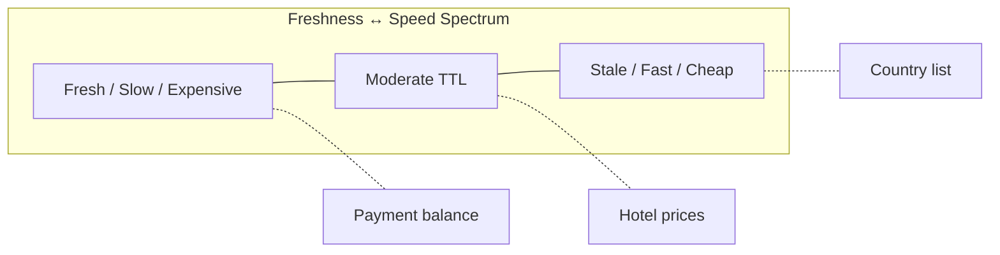

# 64. Law 6: Freshness Fights Speed

> **Think:** *"How stale am I willing to be?"*

---

## The 4 Questions

| Question | Answer |
|----------|--------|
| **What problem does it solve?** | The fundamental tradeoff between fast (cached/stale) and accurate (fresh/slow) — every architect must make this call explicitly. |
| **What happens if I ignore it?** | You serve 2-hour-old prices (angry users) or query the DB on every request (slow app). No universal answer — only tradeoffs. |
| **Where would I use it?** | Every caching decision, CDN TTL, Redis expiry, React Query staleTime, materialized view refresh, eventual consistency. |
| **What companies use it?** | Every company with a cache — the TTL values ARE the freshness decisions. |

---

## Mental Movie (60 seconds)

**Fast system:**
Country list cached 24 hours. Served in 2ms. Might be missing the new country that was added this morning.

**Fresh system:**
Country list queried from DB every request. Always current. 50ms per request. 50,000 requests/day = 2,500 seconds of DB time.

**The architect's job:** Not to eliminate the tradeoff, but to **choose the right point** for each piece of data.

| Data | Staleness tolerance | TTL |
|------|---------------------|-----|
| Country list | Hours | 24h |
| Hotel catalog | Minutes | 15min |
| Product price | Minutes | 5min |
| Stock price | Zero | No cache |
| Seat availability | Zero | No cache |

There is no universal answer. Only tradeoffs.

---

## How It Works

**Fast systems** serve cached (stale) information.
**Fresh systems** perform more work on every request.

You pick per data type, not per system.

---

## Real-World Examples

### Your Travel Platform

| Data | Freshness need | Strategy |
|------|----------------|----------|
| Country/destination list | Hours stale OK | CDN, TTL 24h |
| Hotel photos | Days stale OK | CDN, long TTL |
| Package price | 5–15 min stale OK | Redis, TTL 10min |
| "3 seats left" urgency | Must be real-time | No cache, live query |
| Payment confirmation | Must be exact | Transactional DB read |
| User's booking history | Seconds stale OK | Redis, invalidate on write |

### Nykaa

Product images: days stale (CDN). Sale price: minutes stale (short Redis TTL, bust on price change). Cart inventory: seconds stale during flash sale (risk oversell). Order status: near-real-time (webhook-driven update).

### Amazon

"Only 3 left in stock" — relatively fresh (short cache or live). Product description — very stale (CDN). Price — moderate freshness. Delivery estimate — computed fresh per request.

---

## When To Accept Staleness

| Accept staleness when... | Example |
|--------------------------|---------|
| Users won't notice | Country flags, static content |
| Business risk is low | Slightly outdated recommendation |
| Speed impacts revenue more | Search results, catalog browsing |
| You have **invalidation** on critical changes | Price change busts cache |

## When To Demand Freshness

| Demand freshness when... | Example |
|--------------------------|---------|
| Money is involved | Account balance, payment status |
| Safety/legal compliance | Regulatory data |
| User expects real-time | Live tracking, chat |
| Staleness causes **oversell** | Last seat, flash sale stock |

---

## TTL Selection Framework

| Staleness tolerance | TTL | Invalidation |
|--------------------|-----|--------------|
| Days | CDN long TTL | On content update |
| Hours | Redis 1–24h | Periodic refresh |
| Minutes | Redis 1–15min | Event-based bust |
| Seconds | Redis 1–30s | High churn data |
| Zero | No cache | Always source of truth |

---

## Problem Simulation

Flash sale: 100 units of a Goa package at ₹9,999. Cached price and inventory in Redis (TTL 10 min).

1. Minute 0: Sale starts. Cache says 100 units.
2. Minute 3: 100 units sold. Cache still says 100 units.
3. Minute 4: User sees "100 left" and buys. Only 0 left. **Oversell.**

**Questions:**
1. Which law was violated?
2. Fix for inventory during flash sale?
3. Can price still be cached?

Answers

1. **Law 6** — freshness tolerance was wrong for inventory during high-velocity sale.
2. **No cache for inventory during sale**, or TTL ≤ 1 second with atomic decrement in Redis (`DECR` with Lua script). Or queue-based reservation system.
3. **Price can be cached** if it doesn't change during sale window. Inventory and price have different freshness requirements.

---

## Key Takeaway

Every architect eventually asks: "How stale am I willing to be?" Answer it per data type, not once for the whole system.

**Next:** [65 — Latency Is Additive](./65-latency-is-additive.md)
