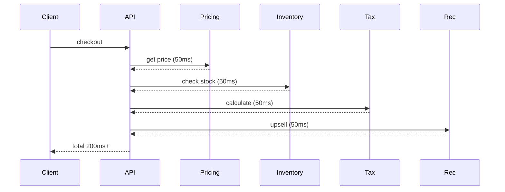

# 65. Law 7: Latency Is Additive

> **Think:** *"Death by a thousand 50ms cuts."*

---

## The 4 Questions

| Question | Answer |
|----------|--------|
| **What problem does it solve?** | Misdiagnosing slowness — hunting for one giant bottleneck when the real problem is many small delays stacking up. |
| **What happens if I ignore it?** | You optimize one service from 50ms to 10ms but total request is still 1.8 seconds because 6 other 50ms calls remain. |
| **Where would I use it?** | Microservice chains, page load waterfalls, API gateway pipelines, checkout flows, any sequential request path. |
| **What companies use it?** | Amazon (strict latency budgets per service), Google (P99 SLOs), Uber (distributed tracing to find additive chains). |

---

## Mental Movie (60 seconds)

Checkout page loads. Each step feels "fine" individually:

```
Pricing Service       50ms  ✓ "fast enough"
Inventory Service     50ms  ✓ "fast enough"
Tax Service           50ms  ✓ "fast enough"
Recommendation Svc    50ms  ✓ "fast enough"
Payment Init          80ms  ✓ "acceptable"
```

**Total: 280ms sequential.** User waits nearly a third of a second — feels sluggish.

No single team is "slow." **The system is slow because latency adds.**

Most slow systems are not suffering from one giant bottleneck. They are suffering from many tiny bottlenecks.

---

## How It Works



### Sequential vs Parallel

| Pattern | 4 × 50ms services | Total |
|---------|-------------------|-------|
| **Sequential** | A → B → C → D | **200ms** |
| **Parallel** | A, B, C, D simultaneously | **~50ms** |

**Fixing latency often means parallelizing, not just speeding up individual calls.**

---

## Real-World Examples

### Your Travel Platform

Booking confirmation calls 5 services sequentially = 280ms. Fix:
- Parallel: pricing + inventory + tax simultaneously → ~80ms
- Remove: recommendation on checkout (move to post-confirm) → save 50ms
- Cache: tax rules (Law 4) → tax drops from 50ms to 2ms

### Nykaa

Product page waterfall: 12 API calls, 40ms each, sequential = 480ms. Fix: GraphQL/BFF single call, or parallel fetch, or cache hot data. Distributed tracing (Jaeger/Datadog) reveals the stack.

### Amazon

Strict **latency budgets** — if your service is allocated 10ms of a 100ms page budget, exceeding it blocks deployment. Additive thinking is institutionalized.

---

## When To Watch For Additive Latency

| Watch when... | Example |
|---------------|---------|
| **Microservices** chain calls | A → B → C → D |
| Page has **waterfall** in DevTools | 10 sequential network calls |
| Each team says **"we're fast"** | But user experience is slow |
| Adding services **increases** total time linearly | Classic additive pattern |

## How To Fight Additive Latency

| Strategy | Effect |
|----------|--------|
| **Parallelize** independent calls | 4×50ms → ~50ms |
| **Eliminate** unnecessary calls (Law 8) | Remove recommendation from critical path |
| **Cache** (Law 4) | 50ms → 2ms per call |
| **Merge** endpoints (BFF/GraphQL) | 4 calls → 1 call |
| **Async** non-critical work | Return fast, enrich later |

---

## The Latency Budget

Assign a total budget. Allocate per service:

```
Page load budget: 200ms
  ├── API gateway:     10ms
  ├── Pricing:         30ms
  ├── Inventory:       30ms
  ├── Tax:             20ms
  ├── Render:          50ms
  └── Buffer:          60ms
```

If any service exceeds its allocation, the page misses budget.

---

## Problem Simulation

Home screen loads 8 resources sequentially:

| Call | Time |
|------|------|
| User profile | 40ms |
| Upcoming trips | 45ms |
| Notifications | 35ms |
| Wallet | 30ms |
| Offers | 50ms |
| Recent searches | 40ms |
| Loyalty points | 35ms |
| App config | 25ms |

**Questions:**
1. Total load time?
2. If parallelized, approximate total?
3. Best single optimization if you can only do one thing?

<details>
<summary>Answers</summary>

1. **40+45+35+30+50+40+35+25 = 300ms** sequential.
2. **~50ms** (longest single call) if all parallel.
3. **BFF/GraphQL single endpoint** — one round-trip (~50ms network) + server-side parallel fetch. Eliminates 7 network round-trips (Law 8).

</details>

---

## Key Takeaway

Latency adds. Optimize the chain, not just the links. Parallelize, merge, cache, or eliminate.

**Next:** [66 — The Fastest Request Is Never Made](./66-fastest-request-never-made.md)
