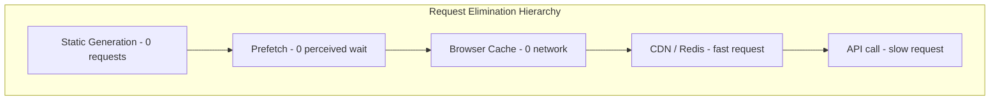

# 66. Law 8: The Fastest Request Is The One Never Made

> **Think:** *"Can I avoid this request entirely?"*

---

## The 4 Questions

| Question | Answer |
|----------|--------|
| **What problem does it solve?** | Optimizing requests that shouldn't exist — making fast network calls instead of eliminating network calls entirely. |
| **What happens if I ignore it?** | You shave 50ms off a 200ms API call when you could have served from browser cache in 0ms. |
| **Where would I use it?** | Browser cache, React Query stale-while-revalidate, prefetching, static generation, local storage, CDN, service workers. |
| **What companies use it?** | Next.js (static generation), Vercel (ISR), every PWA, Netflix (prefetch next episode), Google (prefetch search results). |

---

## The Optimization Hierarchy

```
Bad:     Slow request
Good:    Fast request
Better:  No request
Best:    Data already there before user asks
```

**Eliminating a request beats optimizing a request.**

---

## Mental Movie (60 seconds)

User visits trip detail page for "Goa Beach Escape" — second visit today.

**Level 1 — Slow request:**
Fetch from API: 200ms. Every time.

**Level 2 — Fast request:**
Redis cache hit: 5ms. Better.

**Level 3 — No request:**
React Query cache in browser memory: 0ms network. Data already there.

**Level 4 — Data already there:**
Prefetch on hover over search result. By the time user clicks, page is loaded.

**Level 5 — Never needed a request:**
Static site generation. HTML baked at build time. CDN serves. Zero API calls.

---

## How It Works



### Techniques

| Technique | How it eliminates requests |
|-----------|---------------------------|
| **Browser cache** | `Cache-Control` headers — same asset never re-fetched |
| **React Query / SWR** | Dedup + stale-while-revalidate — no refetch if fresh |
| **Local storage** | Persist across sessions — user prefs, cart |
| **Static generation** | HTML at build time — no server render per request |
| **ISR** | Static + periodic rebuild — best of both |
| **Prefetch** | Load before user clicks — perceived zero wait |
| **CDN** | Edge serves — origin never hit |
| **Service worker** | Offline cache — works without network |

---

## Real-World Examples

### Your Travel Platform

| Feature | Elimination strategy |
|---------|---------------------|
| Destination list | Static JSON bundled in app — zero API calls |
| Popular trips homepage | ISR, rebuild every hour |
| Trip detail (return visit) | React Query cache, staleTime 5min |
| Trip detail (hover prefetch) | Prefetch on search result hover |
| User preferences | localStorage — never fetch again |
| Hotel images | CDN + browser cache — second view = 0 requests |

### Nykaa

App shell cached locally. Category tree bundled. Product images CDN-cached. "Continue shopping" from local cache. Prefetch product page on scroll-into-view.

### Amazon

Aggressive prefetch on hover. "Customers also bought" preloaded. Static elements on product pages. Alexa anticipates requests before you speak.

---

## When To Eliminate Requests

| Eliminate when... | Example |
|-------------------|---------|
| Data is **predictable** | User will likely click next search result |
| Same data requested **repeatedly** | Trip detail revisited |
| Data is **static or slow-changing** | Destination guides |
| **Perceived speed** matters | Prefetch on hover |
| **Offline** capability needed | PWA, service worker |

## When Requests Are Necessary

| Keep requests when... | Why |
|-----------------------|-----|
| Data is **unpredictable** | Personalized pricing |
| **Freshness** is critical | Live inventory |
| **First visit** with no cache | Cold start |
| Prefetch would **waste bandwidth** | Low click-through rate |

---

## Problem Simulation

Search results page: 20 trip cards. Each card fetches trip thumbnail, price, rating on render. 20 trips × 3 calls = 60 API calls per search.

**Questions:**
1. Which law is this also violating? (hint: Law 3)
2. Name two ways to reach "zero requests" for repeat views.
3. How would prefetch change the experience?

<details>
<summary>Answers</summary>

1. **Law 3 (Repetition)** — same trip data fetched repeatedly across searches and users.
2. **Batch API** (`GET /trips?ids=1,2,3...`) reduces 60 to 1. **CDN cache** for popular searches eliminates repeat requests entirely.
3. **Prefetch** trip detail on card hover — by click time, data is in React Query cache. Perceived zero wait.

</details>

---

## Key Takeaway

Before making a request faster, ask if it needs to happen at all. The fastest request is the one never made.

**Next:** [67 — Information Has Gravity](./67-information-has-gravity.md)
