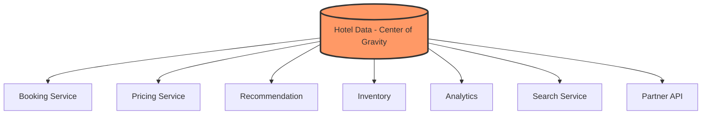

# 67. Law 9: Information Has Gravity

> **Think:** *"This data is pulling everything toward it — am I managing the pull or fighting it?"*

---

## The 4 Questions

| Question | Answer |
|----------|--------|
| **What problem does it solve?** | Understanding why certain data becomes a bottleneck — as information grows important, more systems orbit it, and architecture becomes about managing data movement. |
| **What happens if I ignore it?** | Services tightly coupled to one database. Every team queries hotel data differently. Schema changes break 12 services. The data table becomes a god object. |
| **Where would I use it?** | Data architecture, service boundaries, event-driven design, data mesh, CQRS, read replicas, data pipelines. |
| **What companies use it?** | Amazon (product catalog gravity), Uber (trip data), banks (account data), any company where one dataset becomes the platform core. |

---

## Mental Movie (60 seconds)

Year 1: `hotels` table. Booking service reads it. Simple.

Year 3: Hotel data now used by:
- Booking Service
- Pricing Service
- Recommendation Service
- Inventory Service
- Analytics Service
- Search Service
- Partner API
- Mobile App (via 3 different endpoints)

The `hotels` table became a **center of gravity**. Every new feature pulls toward it. Schema changes are terrifying. Queries compete. The DB is the bottleneck.

**Architecture increasingly becomes: managing data movement around gravitational centers.**

---

## How It Works

### Gravity Effects

| Effect | Symptom |
|--------|---------|
| **Coupling** | 8 services depend on same schema |
| **Contention** | Read/write competition on one DB |
| **Change risk** | Alter column → break 8 services |
| **Scaling limit** | Can't shard because everyone needs it |
| **Team bottleneck** | One team owns the god table |

---

## Real-World Examples

### Your Travel Platform

**Gravitational centers:**
- **Hotel data** — booking, pricing, search, recommendations, analytics
- **User data** — auth, profile, bookings, loyalty, notifications
- **Booking data** — payments, fulfillment, support, analytics

**Managing gravity:**
- Read replicas for search/analytics (don't pull writes toward them)
- Event bus: hotel updated → publish event → services update their copies
- CQRS: write model (normalized) vs read model (denormalized per service)

### Nykaa

Product catalog is gravity center. Inventory, pricing, search, recommendations, warehouse, analytics all orbit it. Solution: product events → each service maintains its own optimized copy.

### Amazon

Product catalog — one of the largest gravitational centers in software. Manages via: event-driven updates, service-specific materialized views, dedicated catalog service, read replicas globally.

---

## Strategies For Managing Gravity

| Strategy | How it helps |
|----------|--------------|
| **Event-driven copies** | Services own their read-optimized copy | 
| **CQRS** | Separate write model from read models |
| **Read replicas** | Offload read gravity from primary |
| **API gateway / BFF** | Single controlled access point |
| **Data mesh** | Domain teams own their data products |
| **Caching layers** | Reduce direct gravitational pull |

---

## When To Recognize Gravity

| Signal | Action |
|--------|--------|
| 5+ services query same table | Introduce data service or events |
| Schema changes cause multi-team coordination | Decouple via events/API |
| DB CPU maxed by diverse queries | Read replicas or denormalized copies |
| New features always need "that one table" | Formalize as data product |

## When Gravity Is Fine

| OK when... | Why |
|------------|-----|
| Early MVP, 1–2 services | Simplicity > architecture |
| Data is truly **shared source of truth** | Bookings must be consistent |
| Team is small | Coordination cost is low |

---

## Problem Simulation

`users` table accessed by: auth, profile, bookings, loyalty, notifications, analytics, recommendations, support.

Schema change: add `preferred_language` column.

**Questions:**
1. How many services might break?
2. What's the event-driven alternative?
3. How does this connect to Module 5 (CQRS, Event Sourcing)?

Answers

1. **Up to 8** — any service with explicit column lists, ORM schemas, or SELECT * breaks.
2. **Publish `UserUpdated` event** — each service updates its own copy. Auth service doesn't care about language; notifications service does.
3. **CQRS:** write to canonical user service, each consumer has read-optimized view. **Event Sourcing:** every user change is an event; services replay what they need.

---

## Key Takeaway

Important data pulls systems toward it like gravity. Architecture is increasingly about managing how data moves, not just how code is organized.

**Next:** [68 — Systems Remember To Survive](./68-systems-remember-to-survive.md)
