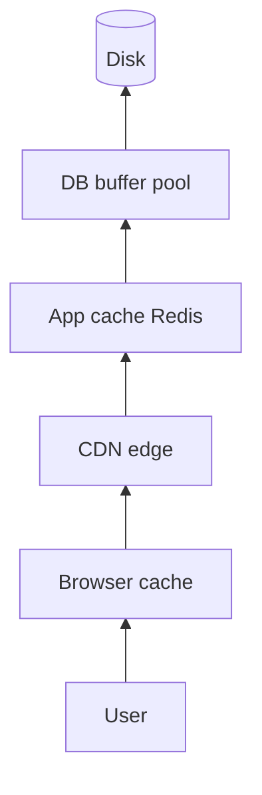

# 68. Law 10: Systems Remember To Survive

> **Lens:** Memory appears at every layer independently. **Canonical:** [62 Memory Beats Recalculation](./62-memory-beats-recalculation.md)

## The One New Question

*"What is remembering at each layer of my stack — and do they agree?"*

## What This Lens Adds

Each layer caches because **recomputation at that layer is expensive**. They don't coordinate automatically — that's Law 15 in [Module 11](../module-11-laws-of-data/74-every-copy-creates-responsibility.md).

## Mental Movie (30 seconds)

Hotel price changes. DB updated. Redis still has old price. CDN still has old image URL. Browser still shows yesterday's fare. **Four memories, one truth — who invalidates whom?**

## Problem Simulation

Map every layer that remembers `hotel` data on your travel platform. For a price change, list the invalidation path. *(DB → cache key → CDN purge → client staleTime.)*

## Key Takeaway

Caching isn't one Redis instance — it's a **stack of memories**. Survival at each layer creates consistency work.

**Next:** [69 — Communication Determines Architecture](./69-communication-determines-architecture.md)
