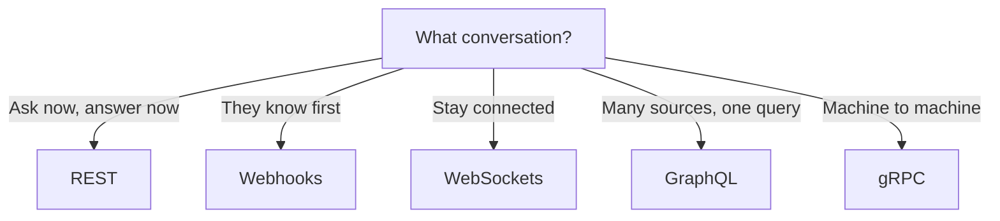

# 69. Law 11: Communication Determines Architecture

> **Think:** *"What conversation is happening — and what protocol naturally follows?"*

---

## The 4 Questions

| Question | Answer |
|----------|--------|
| **What problem does it solve?** | Technology-first architecture — choosing GraphQL/Kafka/gRPC before understanding the communication pattern. |
| **What happens if I ignore it?** | Polling payment status (should be webhook), 8 REST calls per screen (should be GraphQL/BFF), gRPC to the browser (impossible). |
| **Where would I use it?** | Every integration design — frontend↔backend, backend↔third-party, service↔service. |
| **What companies use it?** | Stripe (REST + webhooks), Uber (REST + WebSocket + internal gRPC), every well-designed API. |

---

## Mental Movie (60 seconds)

Before choosing technology, identify the conversation:

| Need | Conversation | Protocol |
|------|--------------|----------|
| Data right now | Ask → Answer → Done | **REST** |
| Another system knows first | "Call me when ready" | **Webhooks** |
| Continuous updates | Stay connected | **WebSockets** |
| Many sources, one screen | "Give me exactly this" | **GraphQL** |
| Machines at scale | Factory-to-factory rail | **gRPC** |

**Technology follows communication patterns. Not the other way around.**

> Deep dive: [Module 9 — APIs For Product Builders](../module-09-apis-for-product-builders/)

---

## How It Works



### The Architect's Cheat Sheet

| Ask yourself... | Use |
|---------------|-----|
| Need data **right now**? | REST |
| Does **another system know first**? | Webhooks |
| Need **continuous realtime**? | WebSockets |
| Frontend needs **many services**? | GraphQL / BFF |
| **Internal services** at scale? | gRPC |

---

## Real-World Examples

### Your Travel Platform

| Feature | Wrong choice | Right conversation | Right protocol |
|---------|-------------|-------------------|----------------|
| Search trips | WebSocket | Ask once, get results | REST |
| Payment confirm | Poll REST every 2s | Bank knows first | Webhook |
| Cab tracking | Poll REST every 1s | Continuous location | WebSocket |
| Home screen | 6 REST calls | Many sources, one screen | GraphQL/BFF |
| Pricing ↔ Inventory | REST JSON 10K/min | Machines at scale | gRPC |

### Nykaa

Same pattern. REST for catalog/cart. Webhooks for payments. WebSocket/SSE for flash sale counters. GraphQL/BFF for app home. gRPC internally.

### Amazon

Public: REST. Notifications: webhooks/SNS. Real-time: specialized protocols. Internal: high-performance RPC. Each protocol matches its conversation.

---

## When This Law Matters Most

| Matters when... | Example |
|-----------------|---------|
| **New integration** design | Adding payment gateway |
| **Architecture review** | "Why are we polling?" |
| **Performance debugging** | 60 sequential REST calls |
| **Team debates technology** | "GraphQL vs REST" → reframe as conversation |

## The Anti-Pattern

```
❌ "Let's use Kafka" → then find problems to solve
✅ "We have async work that must survive failures" → Kafka is a candidate
```

---

## Connection To Module 9

This law is the **principle layer** beneath Module 9's protocol details:

| Module 9 Topic | Law 11 framing |
|----------------|----------------|
| Conversation Patterns | The law stated |
| REST | "Ask now" conversation |
| Webhooks | "They know first" conversation |
| WebSockets | "Stay connected" conversation |
| GraphQL | "Flexible fetch" conversation |
| gRPC | "Machine efficiency" conversation |
| Stack Evolution | Conversations accumulate as product grows |

---

## Problem Simulation

Team architecture diagram shows:
- Mobile app → gRPC → 6 microservices
- Payment: poll `GET /payment/status` every 3 seconds
- Live bus tracking: REST polling
- Home screen: 8 REST calls

**Questions:**
1. Which choices violate Law 11?
2. Correct protocol for each?
3. Is gRPC wrong everywhere here?

<details>
<summary>Answers</summary>

1. **gRPC to mobile** (wrong audience), **polling payment** (should be webhook), **polling tracking** (should be WebSocket), **8 REST calls** (should be GraphQL/BFF).
2. Mobile → REST/GraphQL gateway. Payment → webhook. Tracking → WebSocket. Home → GraphQL/BFF.
3. **gRPC isn't wrong** — just not for mobile clients. Use internally between services if volume justifies it.

</details>

---

## Key Takeaway

Architects don't choose APIs. They identify communication patterns. The API choice follows naturally.

**Next:** [70 — Scale Is Mostly Avoiding Work](./70-scale-is-avoiding-work.md)
