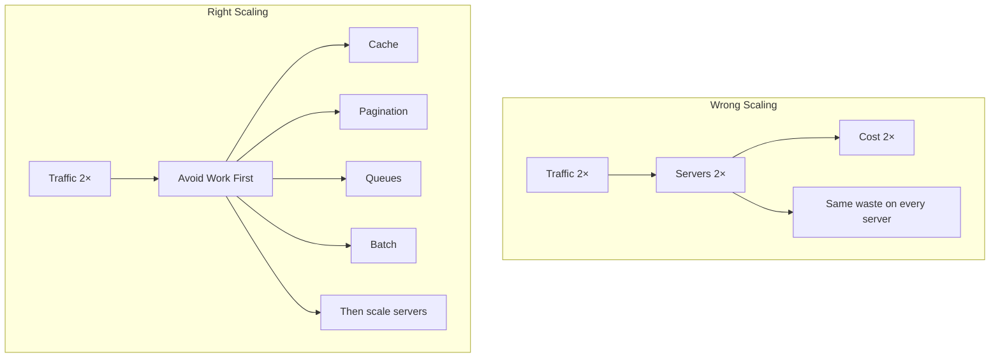

# 70. Law 12: Scale Is Mostly Avoiding Work

> **Think:** *"Before adding servers — what work can I stop doing?"*

---

## The 4 Questions

| Question | Answer |
|----------|--------|
| **What problem does it solve?** | The instinct to scale by adding hardware when the real win is eliminating unnecessary work. |
| **What happens if I ignore it?** | You go from 2 servers to 200, costs 100×, and the app is still slow because every server repeats the same wasteful work. |
| **Where would I use it?** | Every scaling decision — before horizontal scaling, before bigger machines, before new microservices. |
| **What companies use it?** | Google (MapReduce = avoid repeated scans), Netflix (precompute + cache), every company that scales profitably. |

---

## Mental Movie (60 seconds)

Engineer: "We need 10 more servers. Traffic doubled."

Systems thinker: "What work are those 10 servers doing?"

Analysis:
- 40% of DB queries: `SELECT * FROM countries` (Law 3 — repetition)
- 30% of API time: serving images from origin, not CDN (Law 2 — distance)
- 20% of requests: polling payment status (Law 8 — unnecessary requests)
- 10% of latency: 6 sequential API calls per page (Law 7 — additive)

**Fix the 40% + 30% + 20% + 10% → need 2 more servers, not 10.**

Large scale systems win by avoiding unnecessary work.

---

## How It Works



### All Variations of One Idea

| Technique | What work it avoids | Law |
|-----------|---------------------|-----|
| **Caching** | Repeated computation | 3, 4, 5 |
| **Pagination** | Loading entire datasets | 12 |
| **Queues** | Synchronous waiting | 1 (move work) |
| **Precomputation** | Runtime calculation | 1 (move work) |
| **Memoization** | Repeated function calls | 3, 4 |
| **Batching** | Per-item overhead | 3 |
| **Lazy loading** | Loading unused data | 8 |
| **CDN** | Repeated origin fetches | 2, 8 |
| **Connection pooling** | Repeated connection setup | 3 |
| **Rate limiting** | Abuse-driven wasted work | Module 2 |

**All ask: "Can I avoid doing this again?"**

---

## Real-World Examples

### Your Travel Platform

| Problem | Wrong scale | Right avoid |
|---------|-------------|-------------|
| Search slow | 5 more app servers | Cache popular searches in Redis |
| DB maxed | Bigger RDS instance | Cache countries, paginate results |
| Image slow | More API servers | CDN (CloudFront) |
| Checkout timeout | Scale payment service | Async queue for confirmation |
| Home screen slow | GraphQL server farm | BFF + cache + parallel fetch |

### Nykaa

Flash sale: don't scale servers 50×. Precompute sale prices. Cache catalog. Queue orders. Paginate product lists. Rate limit bots. Scale only what's left.

### Amazon

"Scale by avoiding work" is institutional. Precompute recommendations. Cache product pages. Queue order processing. Batch warehouse picks. Scale infrastructure only after waste elimination.

---

## The Scaling Decision Tree

```
Traffic increased?
  ├── Can we cache it? (Laws 4, 5, 6)
  │     └── Yes → cache first
  ├── Can we eliminate the request? (Law 8)
  │     └── Yes → prefetch, static, dedup
  ├── Can we move the work? (Law 1)
  │     └── Yes → batch, async, precompute
  ├── Can we reduce repetition? (Law 3)
  │     └── Yes → pool, batch, memoize
  ├── Can we parallelize? (Law 7)
  │     └── Yes → parallel calls, BFF
  └── Still not enough?
        └── NOW add servers / scale horizontally
```

---

## When To Avoid Work First

| Always first when... | Example |
|----------------------|---------|
| Scaling **cost** is a concern | Startup burn rate |
| Traffic spike is **predictable** | Flash sale, holiday |
| Profiling shows **repeated patterns** | Same query 40% of load |
| Team proposes **"just add servers"** | Red flag — investigate first |

## When To Scale Hardware

| Scale hardware when... | Example |
|------------------------|---------|
| Work is **genuinely necessary** and optimized | Real-time fraud detection |
| **CPU-bound** after caching | Image processing, ML inference |
| **Memory-bound** after optimization | Large in-memory indexes |
| Avoid-work strategies **exhausted** | Proven via profiling |

---

## Problem Simulation

Travel platform: 10,000 concurrent users on search. Current: 4 app servers, 1 DB.

Profiling shows:
- 35% DB time: country/destination queries (identical)
- 25% API time: unpaginated results (500 trips returned, UI shows 20)
- 20% network: images from origin
- 15% API time: sequential supplier calls (Law 7)
- 5%: actual necessary search computation

**Questions:**
1. How much work is actually necessary?
2. Top 3 avoid-work fixes?
3. How many servers needed after fixes at same traffic?

<details>
<summary>Answers</summary>

1. **~5%** is necessary computation. 95% is avoidable waste.
2. **Cache countries** (35%), **paginate to 20 results** (25%), **CDN for images** (20%). Bonus: parallelize supplier calls (15%).
3. **Likely 1–2 servers** handle 10K users after fixes. Maybe same 4 with 10× headroom for growth.

</details>

---

## Key Takeaway

Many engineers believe scaling means more servers. Large systems win by avoiding unnecessary work first, then scaling what remains.

**Next:** [71 — The Unifying Principle](./71-the-unifying-principle.md)
