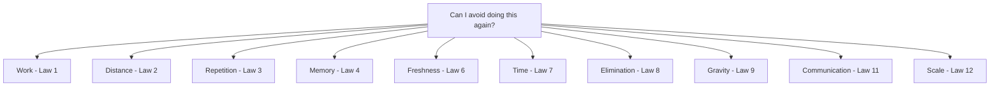

# 71. The Unifying Principle

> **Think:** *"Can I avoid doing this again?"*

---

## The 4 Questions

| Question | Answer |
|----------|--------|
| **What problem does it solve?** | Fragmented knowledge — seeing Redis, CDN, React Query, pagination, and Kafka as unrelated tools instead of one principle. |
| **What happens if I ignore it?** | You learn 50 technologies but can't diagnose a slow system because you don't see the common thread. |
| **Where would I use it?** | Every optimization, architecture review, debugging session, and system design decision. |
| **What companies use it?** | Every engineer who sees patterns instead of tools — the difference between senior and staff-level thinking. |

---

## Mental Movie (60 seconds)

Someone says: "Should we add Redis?"

Engineer hears: "Should we add Redis?"

Systems thinker hears: "Are we doing the same thing too many times, and would remembering the answer be cheaper than recomputing it?"

Someone says: "Should we use a CDN?"

Systems thinker hears: "Is data too far from the user, and can we move a closer copy?"

Someone says: "Should we paginate?"

Systems thinker hears: "Are we doing unnecessary work by loading data nobody will see?"

**One question. Twelve laws. Fifty-seven topics. Same principle.**

---

## The Unifying Question

Whether discussing:

- React Query
- Redis
- CDN
- Kafka
- GraphQL
- Pagination
- Memoization
- Connection pooling
- Static generation
- Materialized views
- Lazy loading
- Precomputation

The same question appears:

> **Can I avoid doing this again?**

| If the answer is... | The law | The tool |
|---------------------|---------|----------|
| "We're repeating identical work" | Law 3 | Cache, memo, pool |
| "Remembering is cheaper" | Law 4 | Redis, React Query |
| "Data is too far away" | Law 2 | CDN, edge cache |
| "This request shouldn't exist" | Law 8 | Static gen, prefetch |
| "Work can happen later" | Law 1 | Queue, batch |
| "Too much data loaded" | Law 12 | Pagination, lazy load |
| "Many small delays" | Law 7 | Parallelize, BFF |
| "Reads vastly exceed writes" | Law 5 | Aggressive cache |
| "Stale is acceptable" | Law 6 | TTL, CDN |
| "Data pulls everything in" | Law 9 | Events, CQRS |
| "Wrong conversation pattern" | Law 11 | Right protocol |

---

## How It Works



---

## The Three Lenses (Final)

| Lens | Sees | Example |
|------|------|---------|
| **Engineer** | APIs, endpoints, code | "This endpoint is slow" |
| **Architect** | Flows, services, data movement | "This service chain adds 300ms" |
| **Systems thinker** | Time, memory, work, distance, communication | "We're repeating work far from the user" |

```
The engineer sees APIs.
The architect sees flows.
The systems thinker sees forces.
```

---

## Real-World Examples

### Your Travel Platform — One Question, Many Answers

| Problem | Unifying question | Solution |
|---------|-------------------|----------|
| Search slow | Avoid recomputing? | Cache popular searches |
| Images slow | Avoid distant fetch? | CDN |
| DB overloaded | Avoid repeating queries? | Redis for reference data |
| Home screen chatty | Avoid multiple requests? | BFF / GraphQL |
| Checkout blocks | Avoid sync work? | Queue confirmation |
| Payment polling | Avoid unnecessary requests? | Webhooks |
| 10 servers planned | Avoid waste first? | Fix 95% waste, need 2 |

### Nykaa

Every optimization is "can we avoid doing this again?" — catalog cache, CDN images, queued orders, paginated search, precomputed sale prices.

### Amazon

Institutionalized avoidance: precompute, cache, queue, batch, paginate. Scale hardware last.

---

## The Complete Handbook Map

| Module | Force |
|--------|-------|
| 1 Reliability | Systems must not break (communication must be safe) |
| 2 Scale | Avoid overload (rate limit, backpressure) |
| 3 Performance | Avoid slow work (cache, CDN, index) |
| 4 Data Systems | Manage consistency vs speed |
| 5 Distributed | Move work async (queues, events) |
| 6 Infrastructure | Deploy without breaking |
| 7 Product | Build the right thing |
| 8 Business | Build profitably |
| 9 APIs | Choose the right conversation |
| **10 Laws** | **See the forces beneath all of it** |

---

## Final Thought

Frameworks are temporary.
Technologies evolve.
Architectures change.

The deeper layer remains remarkably stable.

Software systems are ultimately governed by:

**Time · Memory · Work · Distance · Communication**

Understanding these forces is often more valuable than mastering any specific framework.

---

## Problem Simulation (Capstone)

Your travel platform serves 50,000 users/day. The CTO asks: "What's our scaling plan for 500,000?"

Using all 12 laws, write the scaling plan in 5 bullets.

<details>
<summary>Example answer</summary>

1. **Law 3+4+5:** Cache read-heavy data (countries, catalog, search) in Redis — eliminate 40% of DB load.
2. **Law 2+8:** CDN for all static assets — eliminate origin requests, move data closer.
3. **Law 6:** Define TTL per data type — prices 5min stale OK, inventory real-time.
4. **Law 7+11:** BFF for mobile screens — parallel fetch, one conversation instead of 8 REST calls. Webhooks for payments, WebSocket for tracking.
5. **Law 12:** Only after above — horizontal scale app servers 2→6, RDS read replicas. Measure. Avoid work first, scale what remains.

</details>

---

## Key Takeaway

One question governs them all: **Can I avoid doing this again?** Ask it everywhere. The tools will follow.

**Handbook:** 81 topics · 11 modules · Principles that survive every framework.

**Next chapter:** [Module 11 — The Laws of Data](../module-11-laws-of-data/)

Return to [Module 10 README](./README.md) · [Handbook Home](../README.md)
