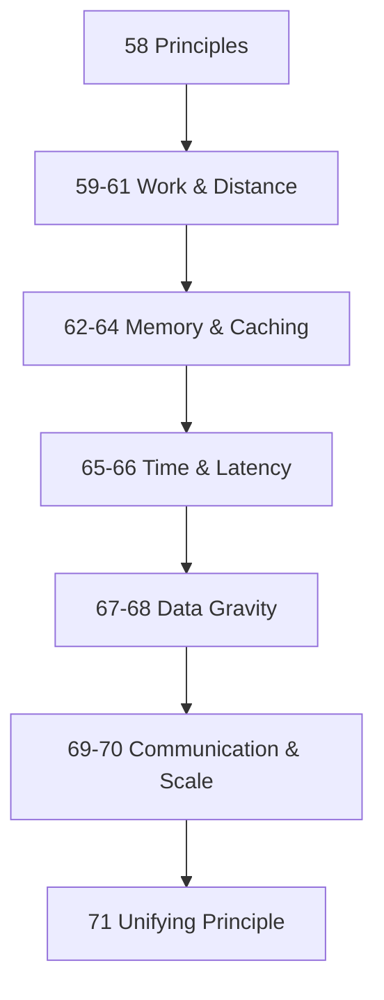

# Module 10: The Laws of Software Systems

*Notes from the journey beyond frameworks*

> **This module does not teach Redis, CDN setup, or REST.** It teaches the **forces** behind every framework. Read [Modules 1–9](../README.md#modules) first, or skip **lens topics** 60, 63, 68 (~3 min each) if you already know caching. See [CONCEPT-INDEX](../CONCEPT-INDEX.md).

> **Frameworks are temporary. Technologies evolve. Architectures change. The deeper layer remains remarkably stable.**

Most engineers learn technologies — React, FastAPI, Redis, Kafka, PostgreSQL. Years later they realize these are **tools**. The deeper layer consists of **principles**. Technologies change. Principles survive.

Software systems are ultimately governed by: **Time · Memory · Work · Distance · Communication**

---

## Topics

| # | Law | One-line principle | Read time |
|---|-----|-------------------|-----------|
| 58 | [Principles Over Frameworks](./58-principles-over-frameworks.md) | Tools change; forces don't | ~10 min |
| 59 | [Work Cannot Be Destroyed](./59-work-cannot-be-destroyed.md) | You can only move work, not eliminate it | ~12 min |
| 60 | [The Closest Copy Wins](./60-closest-copy-wins.md) | Move data closer to where it's consumed | ~3 min *(lens)* |
| 61 | [Repetition Is The Enemy](./61-repetition-is-the-enemy.md) | Doing the same thing twice is expensive | ~12 min |
| 62 | [Memory Beats Recalculation](./62-memory-beats-recalculation.md) | **Memory cluster core** — remembering beats recomputing | ~12 min |
| 63 | [Read Heavy Systems Want Caches](./63-read-heavy-wants-caches.md) | Read frequency matters more than data size | ~3 min *(lens)* |
| 64 | [Freshness Fights Speed](./64-freshness-fights-speed.md) | How stale are you willing to be? | ~12 min |
| 65 | [Latency Is Additive](./65-latency-is-additive.md) | Many small delays become one big delay | ~12 min |
| 66 | [The Fastest Request Is Never Made](./66-fastest-request-never-made.md) | Eliminating beats optimizing | ~12 min |
| 67 | [Information Has Gravity](./67-information-has-gravity.md) | Important data pulls systems toward it | ~12 min |
| 68 | [Systems Remember To Survive](./68-systems-remember-to-survive.md) | Every layer develops memory | ~3 min *(lens)* |
| 69 | [Communication Determines Architecture](./69-communication-determines-architecture.md) | Technology follows conversation patterns | ~12 min |
| 70 | [Scale Is Mostly Avoiding Work](./70-scale-is-avoiding-work.md) | Scale wins by not doing unnecessary work | ~12 min |
| 71 | [The Unifying Principle](./71-the-unifying-principle.md) | Can I avoid doing this again? | ~12 min |

## The Three Lenses

| Lens | Sees |
|------|------|
| **Engineer** | APIs, endpoints, code |
| **Architect** | Flows, services, data movement |
| **Systems thinker** | Time, memory, work, distance, communication |

This module trains the third lens.

## Learning Order



**Cluster 1 (Work):** Laws 1, 3, 12 — where work happens
**Cluster 2 (Distance):** Laws 2, 8 — how close data is to the user
**Cluster 3 (Memory):** Laws 4–6, 10 — start at **62**; 63 and 68 are short lenses
**Cluster 4 (Time):** Laws 7, 8 — latency accumulation
**Cluster 5 (Gravity):** Law 9 — data as center of mass
**Cluster 6 (Communication):** Law 11 — ties to [Module 9](../module-09-apis-for-product-builders/)

## Cross-Module Map

| Law | Connects to Module |
|-----|-------------------|
| Closest Copy Wins | Module 3: Caching, CDN |
| Repetition Is The Enemy | Module 3: Connection Pooling, Query Optimization |
| Freshness Fights Speed | Module 4: Eventual Consistency |
| Latency Is Additive | Module 1: Circuit Breaker, Module 5: Saga |
| Communication Determines Architecture | Module 9: APIs |
| Scale Is Avoiding Work | Module 2: Rate Limiting, Backpressure |

## Module Simulation

Your travel platform search page loads in 4.2 seconds. Trace which laws are being violated:

- Countries loaded from DB on every request (Law 3)
- No CDN for hotel images (Law 2)
- 6 sequential API calls (Law 7)
- Full trip list without pagination (Law 12)

Fix each. Estimate combined improvement.

## PDFs

```bash
python3 md_to_pdf.py --dir learning/module-10-laws-of-software-systems --force
```

## Next Module

**[Module 11: The Laws of Data](../module-11-laws-of-data/)** — Chapter 2: why data outlives code, ownership, copies, consistency, and the memory model beneath every system.
