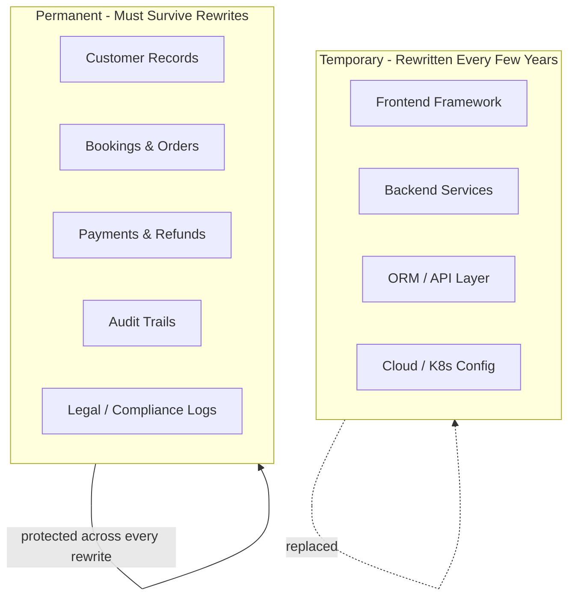

# 72. Law 13: Data Lives Longer Than Code

> **Think:** *"This code will be rewritten. Will this data survive?"*

---

## The 4 Questions

| Question | Answer |
|----------|--------|
| **What problem does it solve?** | Treating deploys as the hard part while ignoring data migration — the thing that actually outlives every stack rewrite. |
| **What happens if I ignore it?** | You ship a beautiful new service but lose booking history, corrupt payment records, or break downstream analytics. The rewrite "succeeds" and the business fails. |
| **Where would I use it?** | Platform migrations, monolith → microservices splits, database upgrades, cloud moves, acquisitions, compliance audits. |
| **What companies use it?** | Every long-lived company — Amazon's multiple rewrites of retail stack, banks running COBOL beside modern APIs, travel OTAs migrating supplier integrations while preserving 10 years of bookings. |

---

## Mental Movie (60 seconds)

**Year 1:** FastAPI + PostgreSQL. Ship fast. 50,000 bookings in `bookings` table.

**Year 4:** Team wants microservices + new ORM + "cloud-native" database. Standup focuses on API design, Kubernetes, CI/CD.

**Year 4 architect (data-trained):** Before any service diagram, asks:
- What **must** survive the rewrite unchanged? (Booking IDs, payment references, audit trails)
- What **can** be rebuilt? (Session cache, search indexes, materialized views)
- What's the **migration path** with zero downtime?
- Who **validates** row counts before and after cutover?

The rewrite takes 6 months instead of 3 — but 2M booking records, 800K payment links, and 5 years of finance reports survive intact.

**Code is temporary. Data is permanent.**

---

## How It Works

| Asset type | Lifespan | Migration priority |
|------------|----------|-------------------|
| React components | 3–5 years | Low — rebuild |
| API endpoints | 5–7 years | Medium — version, deprecate |
| Database schema | 10–20 years | **High** — evolve carefully |
| Transaction records | **Forever** | **Critical** — never lose |
| Audit logs | **Forever** (legal) | **Critical** — append-only |

### The Migration Hierarchy

1. **Identify immortal data** — what the business, finance, and legal teams need forever
2. **Design backward-compatible schema changes** — expand, don't break
3. **Dual-write or shadow-read** during transition
4. **Validate counts and checksums** at cutover
5. **Keep rollback path** until new system proves stable

---

## Real-World Examples

### Your Travel Platform

**Immortal data:**
- Booking confirmations (customer proof of purchase)
- Payment transaction IDs (reconciliation with Razorpay/Stripe)
- Refund records (chargeback defense)
- GST invoices (7-year retention in India)
- Loyalty point ledger

**Expendable on rewrite:**
- Redis session cache
- Elasticsearch search index (rebuild from source)
- React Query client cache
- Nightly analytics rollups (recompute)

**Migration mistake to avoid:** Splitting `bookings` across three microservice DBs without a migration plan. Finance still needs one query: "total revenue by month." Now it's a distributed join nightmare.

### Nykaa

Nykaa has rewritten frontend stacks, scaled inventory systems, and added new fulfillment channels. Customer order history from 2015 must still appear in the app. Product catalog structure changed — but order line items snapshot product name and price at purchase time (immutable facts).

**Lesson:** Order rows store **what was true at purchase time**, not a live link to today's catalog.

### Amazon

Amazon's retail platform has been rewritten multiple times. Order history from 1999 is still accessible. They invested heavily in **data migration tooling** and **schema evolution** (DynamoDB, internal pipelines) because losing order data would destroy customer trust and break tax reporting.

---

## When Data Migration Comes First

| Prioritize migration when... | Example |
|------------------------------|---------|
| **Legal retention** requirements exist | Tax records, healthcare, financial services |
| **Customer-facing history** must persist | "My trips", order history, warranties |
| **Downstream systems** depend on IDs | Payment gateway refs, supplier PNRs |
| **Rewrite touches the database** | Monolith split, DB engine change |
| **Acquisition or merger** | Two companies, one customer record |

## When Code Can Move Faster

| Code can lead when... | Why |
|-----------------------|-----|
| **Greenfield** product with no users | No immortal data yet |
| **Only stateless layer** changes | New frontend, same API + DB |
| **Data is fully rebuildable** | Search index, recommendation cache |
| **Explicit archive strategy** exists | Old data moved to cold storage, read-only |

---

## Connection To Other Laws & Modules

| Connection | Link |
|------------|------|
| Law 14 (Ownership) | Migration is easier when one team owns the schema |
| Law 18 (Gravity) | More dependents = harder migration |
| Module 4: Transactions | Atomic cutover needs transactional guarantees |
| Module 6: Blue-Green | Deploy pattern that preserves data continuity |
| Module 10: Principles | Framework rewrite ≠ principle rewrite |

---

## Migration Checklist

- [ ] Inventory every table: immortal vs rebuildable
- [ ] Document foreign key dependencies before splitting services
- [ ] Preserve primary keys and external reference IDs (payment IDs, supplier refs)
- [ ] Plan dual-write period with reconciliation job
- [ ] Run row-count and checksum validation at cutover
- [ ] Keep old system read-only for 30 days as rollback safety net
- [ ] Test restore from backup — not just backup existence

---

## Problem Simulation

Your CTO announces: "We're migrating from PostgreSQL to MongoDB and splitting the monolith into 8 services. Launch in 90 days."

Current state:
- 2.1M booking records
- 1.8M payment records linked by `payment_id`
- Finance dashboard queries PostgreSQL directly
- 12 cron jobs read from `bookings` table

**Questions:**
1. Which data is immortal vs rebuildable?
2. What breaks if booking IDs change during migration?
3. What should happen before any service diagram is drawn?
4. Is 90 days realistic?

Answers

1. **Immortal:** Bookings, payments, refund records, invoice data. **Rebuildable:** Search index, session cache, analytics aggregates (if recomputable from source).
2. **Everything:** Payment reconciliation, customer "My Trips", supplier callbacks, support tickets referencing booking IDs, finance reports. IDs must be preserved or explicitly mapped with a translation table.
3. **Data audit first:** dependency map, ownership assignment (Law 14), migration strategy with validation, finance sign-off on reporting continuity. Service diagrams come after data survival plan.
4. **Almost certainly not** without a phased approach. Dual-write + shadow-read for bookings alone could take 90 days. Full 8-service split + DB engine change needs 6–12 months with proper validation.

---

## Key Takeaway

Protecting and migrating data is usually more critical than deploying new code. Plan for the rewrite that hasn't happened yet.

**Next:** [73 — Every Data Element Needs an Owner](./73-every-data-element-needs-an-owner.md)
