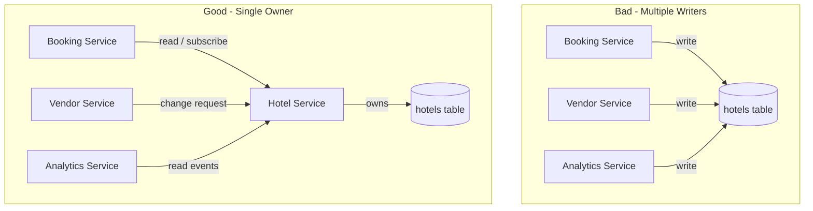

# 73. Law 14: Every Data Element Needs an Owner

> **Think:** *"Who is the only team allowed to change this data?"*

---

## The 4 Questions

| Question | Answer |
|----------|--------|
| **What problem does it solve?** | Multiple services modifying the same data — conflicts, inconsistencies, and debugging nightmares where nobody knows which write "won." |
| **What happens if I ignore it?** | Hotel address updated by booking service, vendor portal, and analytics ETL — each with different values. Support can't tell which is correct. Schema changes break 6 consumers. |
| **Where would I use it?** | Service boundaries, data mesh, microservices, shared databases, master data management, any growing system with 3+ teams. |
| **What companies use it?** | Amazon (service ownership), Uber (domain-oriented boundaries), Spotify (squad owns data), any company that learned "shared database antipattern" the hard way. |

---

## Mental Movie (60 seconds)

**Year 1:** One `hotels` table. Booking service reads and writes. Simple.

**Year 3:** Three services now modify hotel data:

```
Booking Service   → updates hotel availability flags
Vendor Service    → updates hotel description, photos
Analytics Service → updates hotel "popularity score" column
```

A vendor changes the hotel address in Vendor Service. Booking Service still has the old address. Mobile app reads from a cached API that merged both sources. Customer arrives at wrong location.

**Nobody owns hotel data.** Everyone writes. Nobody is accountable.

**Year 3 (fixed):**

```
Hotel Service → owns ALL hotel data (single write path)
     ↓
Booking Service    → reads availability via API/event
Vendor Service     → submits change requests to Hotel Service
Analytics Service  → reads events, never writes back to hotel table
```

One writer. Many readers. Conflicts disappear.

---

## How It Works



### Single Source of Truth (SSOT)

| Concept | Meaning |
|---------|---------|
| **Owner** | One service/team with write authority |
| **Consumers** | Other services read via API, events, or read replicas |
| **Change requests** | Non-owners propose changes; owner validates and applies |
| **Events** | Owner publishes `HotelUpdated` — consumers react, don't write back |

### Ownership Levels

| Level | Example | Owner |
|-------|---------|-------|
| **Entity** | `Hotel`, `User`, `Booking` | Domain service |
| **Field group** | Hotel static info vs live availability | May split over time |
| **Reference data** | Country list, currency codes | Platform/config team |
| **Derived data** | Popularity score, recommendations | Analytics — but stored separately, not in source table |

---

## Real-World Examples

### Your Travel Platform

| Dataset | Owner | Consumers (read only) |
|---------|-------|----------------------|
| Hotels | Hotel Service | Search, Booking, Recommendations |
| Bookings | Booking Service | Payments, Notifications, Support |
| Payments | Payment Service | Finance, Booking, Refunds |
| User profiles | User Service | Booking, Loyalty, Marketing |
| Search index | Search Service | Mobile app (rebuilt from owner events) |

**Anti-pattern:** Analytics team adds columns to `bookings` table for reporting. Now Booking Service schema changes need Analytics sign-off. **Fix:** Analytics reads `BookingCreated` events into its own warehouse.

### Nykaa

Product catalog owned by Product Service. Inventory owned by Inventory Service. Orders owned by Order Service. Pricing owned by Pricing Service.

Flash sale failure mode: two services both decrement stock. **Fix:** Inventory Service is the only writer to stock counts. Order Service sends `ReserveStock` command; Inventory confirms or rejects.

### Amazon

"Two-pizza teams" own their data. The product catalog team owns product data. Order service owns orders. Other teams integrate via well-defined APIs and events — not by writing to each other's tables.

---

## When To Enforce Ownership

| Enforce ownership when... | Example |
|---------------------------|---------|
| **2+ teams** touch the same table | Classic microservices growth pain |
| **Data conflicts** appear in production | Different addresses, prices, statuses |
| **Schema changes** require multi-team coordination | Every ALTER TABLE is a meeting |
| **Debugging** takes hours to find "who wrote this" | Audit trail shows 4 services |
| **Compliance** requires clear accountability | GDPR data subject requests |

## When Shared Data Is Acceptable

| Shared access OK when... | Guardrails |
|--------------------------|------------|
| **Early MVP**, one team | Revisit at 3-team threshold |
| **Read replicas** for reporting | Read-only, no writes |
| **Reference data** with rare changes | Platform team owns, everyone reads |
| **Temporary migration** period | Document end date, dual-write plan |

---

## Connection To Other Laws & Modules

| Connection | Link |
|------------|------|
| Law 13 (Data longevity) | Clear ownership makes migration possible |
| Law 18 (Gravity) | Unowned data becomes gravity without governance |
| Module 5: CQRS | Write model owned by one service |
| Module 5: Event Sourcing | Events as the ownership boundary |
| Module 10: Law 9 | Gravity pulls consumers — owner manages the pull |

---

## Ownership Decision Framework

Ask for every dataset:

1. **Who creates it?** (one service)
2. **Who mutates it?** (same service)
3. **Who deletes it?** (same service, with policy)
4. **Who reads it?** (many — via API/event/replica)
5. **What happens when a non-owner needs a change?** (request → owner applies)

If answers 1–3 aren't the same team, you have an ownership problem.

---

## Problem Simulation

Post-mortem: Hotel star rating shows 3 stars on search page, 5 stars on booking page, 4 stars in vendor portal.

Investigation reveals:
- Vendor Service writes `star_rating` on hotel update
- Analytics Service nightly job recalculates rating from reviews → writes to `hotels.star_rating`
- Booking Service caches hotel details in Redis with 1-hour TTL

**Questions:**
1. Which law was violated?
2. Who should own `star_rating`?
3. How should Analytics contribute without writing to the source table?
4. What's the fix for the cache?

<details>
<summary>Answers</summary>

1. **Law 14** — three writers, no owner. Secondary: **Law 15** (cache stale) and **Law 74** (copy responsibility).
2. **Hotel Service** (or a dedicated Review/Rating Service that Hotel Service delegates to). One write path for all hotel attributes displayed to customers.
3. Analytics computes `computed_rating` in its own warehouse OR publishes `RatingRecalculated` event. Hotel Service (owner) decides whether to adopt it as `star_rating` — Analytics never writes directly to `hotels`.
4. Invalidate Redis cache on `HotelUpdated` event. Or reduce TTL for rating-sensitive pages. Owner publishes event → all caches bust.

</details>

---

## Key Takeaway

Every important dataset needs a single source of truth and one owning team. Other services consume or reference — they don't co-write.

**Next:** [74 — Every Copy Creates Responsibility](./74-every-copy-creates-responsibility.md)
