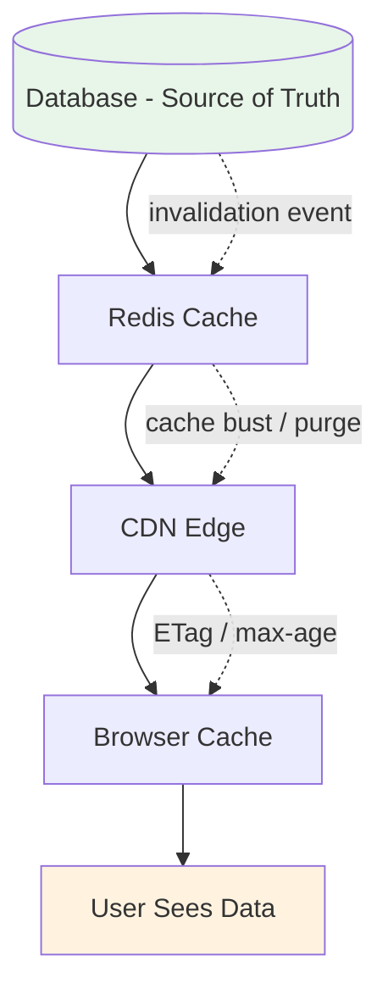

# 74. Law 15: Every Copy Creates Responsibility

> **Think:** *"I made a copy for speed — who keeps it correct?"*

---

## The 4 Questions

| Question | Answer |
|----------|--------|
| **What problem does it solve?** | Treating caches and replicas as "free performance" without planning invalidation, staleness, and sync — every copy is a consistency debt. |
| **What happens if I ignore it?** | User sees old price, booking confirms at new price. Support can't explain why. You add "refresh button" as architecture. |
| **Where would I use it?** | Every cache layer — Redis, CDN, browser, read replicas, materialized views, mobile offline storage, search indexes. |
| **What companies use it?** | Every scaled system. The difference is whether they **designed** invalidation or **discovered** bugs in production. |

---

## Mental Movie (60 seconds)

Hotel price changes from ₹12,000 to ₹9,999 for a flash sale.

Your stack:

```
PostgreSQL (source of truth)
    ↓
Redis cache (15 min TTL)
    ↓
CDN (static hotel page, 1 hour TTL)
    ↓
Browser cache (session)
    ↓
React Query (staleTime: 5 min)
```

Price updated in PostgreSQL at 10:00 AM.

**Questions you must answer:**
- Which copy updates first?
- Which copy is stale at 10:05?
- How long can stale price exist?
- What happens if user books at cached ₹12,000 while DB says ₹9,999?

**Every copy you added for speed is now your responsibility.**

---

## How It Works



### The Copy Stack

| Layer | Speed gain | Responsibility you inherit |
|-------|------------|---------------------------|
| **Read replica** | Offload reads from primary | Replication lag — how stale? |
| **Redis** | Sub-ms reads | Invalidation on write, TTL policy |
| **CDN** | Global edge delivery | Purge API, cache key design |
| **Browser cache** | Zero network | Cache-Control headers, ETags |
| **Search index** | Fast full-text | Reindex pipeline on source change |
| **Materialized view** | Precomputed aggregates | Refresh schedule or trigger |

### Three Sync Strategies

| Strategy | How | Best for |
|----------|-----|----------|
| **TTL (time-based)** | Expire after N seconds | Low-risk stale data (country list) |
| **Invalidation (event-based)** | Bust cache on write | Price changes, profile updates |
| **Write-through** | Update cache with DB write | Strong consistency needs |

---

## Real-World Examples

### Your Travel Platform

| Data | Copies | Sync strategy |
|------|--------|---------------|
| Country list | Redis + CDN | TTL 24h — stale OK |
| Hotel catalog | Redis + CDN + search index | Event invalidation on `HotelUpdated` |
| Package price | Redis | Write-through or 5min TTL + bust on change |
| Live seat count | None during sale | **No copy** — source read only |
| User booking history | Redis | Invalidate on new booking |

**Incident pattern:** Price changed in admin panel. Redis busted. CDN not purged. 40% of users saw old price for 55 minutes. **Root cause:** copy added without purge responsibility assigned.

### Nykaa

Product page: CDN (images), Redis (product metadata), search index (Elasticsearch), mobile app cache. Each layer needs invalidation on price drop during sale. Nykaa uses event-driven bust: `PriceChanged` → purge CDN keys → bust Redis → trigger search reindex.

### Amazon

Product detail pages heavily cached globally. Price accuracy is contractual — they invest in **sophisticated invalidation** (Dynamic Pricing updates propagate in seconds). "Only 3 left" uses shorter TTL or live inventory service — different copy policy for different data.

---

## When Copies Are Worth The Responsibility

| Worth it when... | Example |
|------------------|---------|
| Read volume **100×+** writes | Catalog, metadata |
| Staleness is **explicitly acceptable** | Static content, recommendations |
| You have **invalidation infrastructure** | Event bus, CDN purge API |
| **Owner publishes change events** (Law 14) | Hotel Service → `HotelUpdated` |

## When Copies Create More Pain Than Gain

| Skip or minimize when... | Example |
|--------------------------  |---------|
| **Financial accuracy** required | Payment balance, invoice amount |
| **High-velocity writes** | Flash sale inventory, live bids |
| **No invalidation path** exists yet | Don't cache until you can bust |
| **Many dependent copies** | 5 layers deep without event chain |

---

## Connection To Other Laws & Modules

| Connection | Link |
|------------|------|
| Law 16 (Consistency cost) | Every copy is a consistency tradeoff |
| Law 14 (Ownership) | Owner must trigger invalidation |
| Module 3: Caching | Tactical cache implementation |
| Module 10: Law 5 | Read-heavy → cache candidate |
| Module 10: Law 6 | Freshness vs speed per copy |
| Module 10: Law 10 | Systems remember — copies are memory |

---

## Copy Responsibility Checklist

For every new cache or replica, document:

- [ ] **Source of truth** — which DB/table/service?
- [ ] **Staleness tolerance** — seconds, minutes, hours?
- [ ] **Invalidation trigger** — event, TTL, or write-through?
- [ ] **Failure mode** — what does user see if copy is stale?
- [ ] **Monitoring** — cache hit rate, replication lag, age of oldest entry

---

## Problem Simulation

Architecture review proposes:

> "Add Redis cache, CDN, read replica, and Elasticsearch for hotel search. Ship in 2 weeks."

Hotel data: 50,000 hotels, ~200 updates/day, search 100K requests/min.

**Questions:**
1. How many copies will exist?
2. When a hotel closes (status = inactive), what must happen at each layer?
3. Which copy is hardest to invalidate?
4. What's missing from the 2-week plan?

<details>
<summary>Answers</summary>

1. **Five copies minimum:** PostgreSQL primary, read replica, Redis, CDN (if hotel pages cached), Elasticsearch index. Plus browser/React Query on client.
2. **Inactive hotel must disappear from:** DB (owner write) → event → Redis bust → ES delete/reindex → CDN purge → client cache invalidate. Miss any layer → ghost hotel in search.
3. **CDN** — purge propagation is slow (minutes), keys may be URL-based and hard to target. **Elasticsearch** — reindex latency. Both need explicit pipeline, not "TTL and hope."
4. **Invalidation design, ownership (Law 14), event schema, lag monitoring, runbook for partial staleness.** Two weeks for storage; invalidation architecture needs its own sprint.

</details>

---

## Key Takeaway

Every cache introduces a consistency problem. Copies improve performance — but someone must own keeping them correct.

**Next:** [75 — Consistency Has a Cost](./75-consistency-has-a-cost.md)
