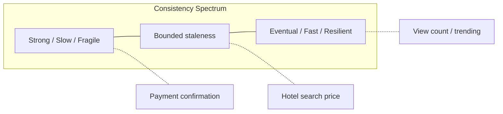

# 75. Law 16: Consistency Has a Cost

> **Think:** *"How synchronized does this data need to be — and what am I paying for it?"*

---

## The 4 Questions

| Question | Answer |
|----------|--------|
| **What problem does it solve?** | Assuming everything must be instantly consistent — leading to slow systems, unavailable services during partitions, or over-engineered sync for data that could be briefly stale. |
| **What happens if I ignore it?** | You either build a fragile "always consistent" system that can't scale, or you accidentally serve stale prices/inventory and lose customer trust. |
| **Where would I use it?** | Every distributed architecture decision — read replicas, multi-region, caches, microservices, flash sales, search vs transactional data. |
| **What companies use it?** | Amazon DynamoDB (tunable consistency), Netflix (AP for recommendations, CP for billing), banks (strong consistency for balances), social feeds (eventual consistency). |

---

## Mental Movie (60 seconds)

Hotel price drops from ₹15,000 to ₹9,999 at noon for a 2-hour flash sale.

**Strong consistency ask:**
Every user worldwide sees ₹9,999 within 100ms. Every search replica, cache, CDN edge, and mobile app syncs instantly.

**Cost:** Global sync infrastructure, cache busting on every price tick, cross-region coordination, higher latency on writes, system unavailable if one region can't confirm.

**Pragmatic ask:**
Price in booking checkout is **always** read from primary DB (strong). Search results may show ₹15,000 for up to 5 minutes (eventual). Checkout re-validates price before payment.

**Cost:** Much lower. User might see old price on browse — but pays correct price at checkout.

**Consistency is never free. You choose where to pay.**

---

## How It Works

### The CAP Tradeoff (Simplified)

In a distributed system during a network partition, you often choose:

| Choice | Means | Example |
|--------|-------|---------|
| **Consistency (CP)** | All nodes agree; some requests may fail/wait | Bank transfer, inventory decrement |
| **Availability (AP)** | System responds; data may temporarily disagree | Social feed, product recommendations |

### Consistency Levels In Practice

| Level | Behavior | Travel platform example |
|-------|----------|------------------------|
| **Strong** | Read always sees latest write | Payment amount at checkout |
| **Bounded staleness** | Max N seconds old | Search prices, TTL 5 min |
| **Eventual** | Converges over time | Analytics dashboard, review counts |
| **Session** | Consistent within one user's session | Cart contents during browsing |

### What Strong Consistency Costs

- **Latency** — wait for replication/ quorum
- **Availability** — can't serve if primary unreachable
- **Complexity** — distributed transactions, 2PC, consensus (Raft/Paxos)
- **Throughput** — coordination limits write rate

---

## Real-World Examples

### Your Travel Platform

| Data | Consistency need | Strategy |
|------|------------------|----------|
| Payment amount | Strong | Single DB transaction, no cache |
| Booking confirmation | Strong | ACID commit before showing success |
| Hotel search price | Bounded (5 min) | Redis TTL + checkout re-validation |
| "Trending destinations" | Eventual | Hourly batch job |
| Live seat count (sale) | Strong | Atomic decrement, no replica lag |
| User profile name | Session/bounded | Invalidate cache on update |

**Checkout pattern:** Always re-read price and availability from source of truth before charging card — regardless of what search showed.

### Nykaa

Flash sale: cart inventory must be strongly consistent at order placement (prevent oversell). Product listing can lag seconds behind. Recommendation "people also bought" is eventually consistent — stale by minutes is fine.

### Amazon

"Add to Cart" uses strong inventory reservation at checkout. "Customers who viewed this" is eventually consistent. DynamoDB offers **per-request** consistency choice — architects pick per access pattern.

---

## When To Pay For Strong Consistency

| Pay for strong consistency when... | Example |
|------------------------------------|---------|
| **Money** is involved | Charges, refunds, wallet balance |
| **Inventory** can't oversell | Last seat, limited flash sale units |
| **Legal/audit** requires exact state | Tax records, compliance snapshots |
| **User expectation** is "this must be exact now" | Booking confirmation number |

## When Eventual Consistency Is Enough

| Eventual is fine when... | Example |
|--------------------------|---------|
| Staleness is **invisible** to users | Internal metrics |
| **Recommendation** quality, not correctness | "Similar hotels" |
| **High read volume**, low write volume | Product catalog browse |
| **Brief disagreement** is acceptable | Like counts, view counts |

---

## Connection To Other Laws & Modules

| Connection | Link |
|------------|------|
| Law 15 (Copies) | Each copy adds consistency challenge |
| Law 17 (Read/Write split) | Different consistency per workload |
| Module 4: Eventual Consistency | Tactical implementation |
| Module 4: ACID | Strong consistency within one DB |
| Module 10: Law 6 | Freshness fights speed — same tradeoff |
| Module 5: Saga | Consistency across services without 2PC |

---

## Consistency Decision Framework

For each data type, answer:

1. **What happens if user sees stale data for 30 seconds?**
2. **What happens if user sees stale data at payment time?**
3. **Can we re-validate at the critical moment?** (checkout pattern)
4. **What's the cost of strong consistency at this scale?**

If (2) is catastrophic → strong at payment boundary.
If (1) is harmless → eventual everywhere else.

---

## Problem Simulation

Multi-region travel platform: Mumbai primary DB, Singapore read replica (2s lag), Redis cache (5 min TTL), CDN (1 hour TTL).

At 12:00:00, Goa package price drops to ₹9,999 (was ₹15,000). 10,000 users browsing.

**Questions:**
1. Which users see which price at 12:00:30?
2. User in Singapore books at 12:00:01 — replica still shows ₹15,000. Problem?
3. What's the minimum fix for checkout?
4. Which law pairs with this one?

Answers

1. **Depends on layer:** CDN users may see ₹15,000 for up to 1 hour. Redis users up to 5 min. Replica users up to 2s lag. Primary readers see ₹9,999 immediately.
2. **Yes, if checkout reads replica** — user charged wrong amount or booking fails on price mismatch. Financial and trust issue.
3. **Checkout always reads primary** (or uses `read-your-writes` from primary). Re-validate price + availability in transaction before payment. Display price on browse can be stale; **charge price must be strong**.
4. **Law 15** (copy responsibility) + **Law 16** (consistency cost). Also **Module 4: Replication** lag awareness.

---

## Key Takeaway

You can't have fast, available, and perfectly consistent everywhere. Choose the consistency level per data type — and pay the cost only where the business requires it.

**Next:** [76 — Reads and Writes Are Different Workloads](./76-reads-and-writes-are-different-workloads.md)
