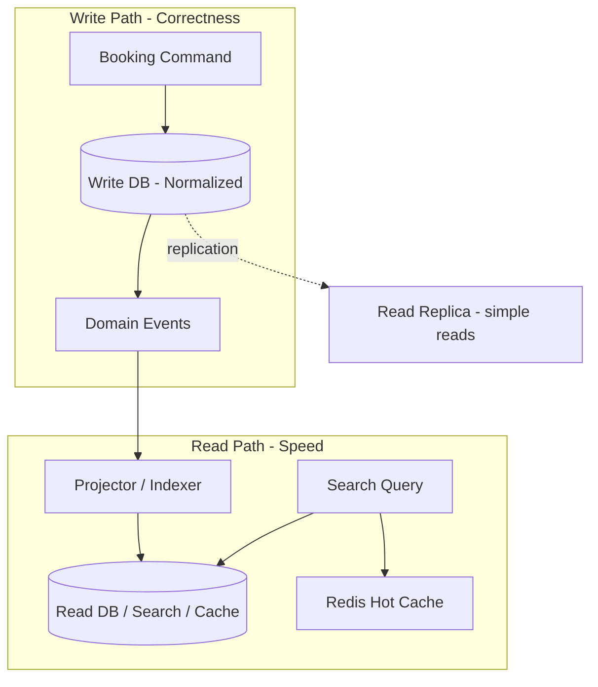

# 76. Law 17: Reads and Writes Are Different Workloads

> **Think:** *"One booking write vs 100,000 search reads — why optimize them the same way?"*

---

## The 4 Questions

| Question | Answer |
|----------|--------|
| **What problem does it solve?** | Using one database schema, one scaling strategy, and one optimization path for workloads that behave oppositely — writes need correctness and normalization; reads need speed and denormalization. |
| **What happens if I ignore it?** | Search page does 12 JOINs on write-optimized schema. Booking writes block under read traffic. You scale DB vertically forever. |
| **Where would I use it?** | Read replicas, search indexes, CQRS, materialized views, analytics warehouses, caching layers, separate OLTP vs OLAP. |
| **What companies use it?** | Amazon (catalog reads vs order writes), Uber (trip history vs trip creation), Nykaa (product browse vs order placement), every high-traffic platform. |

---

## Mental Movie (60 seconds)

**One booking creation:**
```
1 write → bookings table
1 write → inventory decrement
1 write → payment record
= 3 writes, strict ACID, must not fail
```

**Hotel search page (one user load):**
```
Read hotels (50 rows)
Read reviews aggregate
Read pricing rules
Read availability snapshot
Read destination metadata
= 100+ reads, can tolerate 30s staleness, must return in <200ms
```

Same database. Opposite needs.

**Write path:** Normalized, transactional, consistent, moderate volume.
**Read path:** Denormalized, cached, eventually consistent, massive volume.

Large systems **optimize reads and writes independently.**

---

## How It Works



### Read vs Write Characteristics

| Dimension | Writes | Reads |
|-----------|--------|-------|
| **Volume** | Lower (usually) | Higher (often 10–1000×) |
| **Schema** | Normalized (integrity) | Denormalized (speed) |
| **Consistency** | Strong (ACID) | Often eventual |
| **Optimization** | Indexes on FK, short transactions | Covering indexes, caches, precompute |
| **Scaling** | Shard by write key | Replicas, CDN, search cluster |
| **Failure impact** | Lost booking = revenue loss | Slow search = bounce, not data loss |

### Common Patterns

| Pattern | What it does | Module link |
|---------|--------------|-------------|
| **Read replicas** | Copy primary for read scaling | Module 4: Replication |
| **Search index** | Elasticsearch for full-text browse | Module 3: Indexing |
| **CQRS** | Separate read/write models | Module 5: CQRS |
| **Materialized views** | Precomputed read tables | Module 4: Denormalization |
| **Cache layer** | Hot read path in Redis | Module 3: Caching |
| **Analytics warehouse** | BigQuery/Snowflake for reports | Separate from OLTP |

---

## Real-World Examples

### Your Travel Platform

| Operation | Volume | Optimized how |
|-----------|--------|---------------|
| `POST /bookings` | 50/min | PostgreSQL primary, ACID, normalized |
| `GET /search?destination=goa` | 100K/min | Elasticsearch + Redis, denormalized hotel cards |
| `GET /users/me/bookings` | 5K/min | Read replica + Redis per user |
| Finance monthly report | 1/day | Warehouse query, not production DB |

**Mistake:** Running search against primary PostgreSQL with 8-table JOIN. Works at 100 users. Dies at 100K searches/min.

### Nykaa

**Writes:** Order placement, inventory decrement, payment — transactional core.
**Reads:** Product listing, category browse, search autocomplete — CDN + Redis + search index, denormalized product cards with price, image, rating in one document.

Diwali sale: read path scaled horizontally (50 search nodes). Write path protected (queue for order processing if needed).

### Amazon

Product page (read): heavily cached, denormalized, served from edge.
Place order (write): transactional, multi-step, inventory reservation, payment auth — completely different path and infrastructure.

---

## When To Split Read/Write Paths

| Split when... | Signal |
|---------------|--------|
| Read:write ratio **> 10:1** | Search, catalog, feeds |
| Read queries need **JOINs** writes don't | Product page vs order insert |
| **Analytics** slows production | Report queries lock tables |
| Read **latency SLA** < write tolerance | 200ms search vs 2s booking OK |
| Teams **scale independently** | Search team vs payments team |

## When One Path Is Enough

| Keep unified when... | Why |
|----------------------|-----|
| **Early MVP**, low traffic | Complexity not justified |
| Read:write ratio **near 1:1** | Booking status polling |
| **Strong read-your-writes** required everywhere | Simple CRUD admin panel |
| Team size **< 5** | Operational overhead of split |

---

## Connection To Other Laws & Modules

| Connection | Link |
|------------|------|
| Law 16 (Consistency) | Reads often eventual; writes strong |
| Law 18 (Gravity) | High-value write data pulls read projections |
| Law 19 (Queries) | Read path = better questions on read model |
| Module 5: CQRS | Full read/write separation pattern |
| Module 4: Replication | Simple read scaling step |
| Module 10: Law 5 | Read-heavy wants caches |

---

## Read/Write Audit

For your top 5 endpoints, fill in:

| Endpoint | Reads/min | Writes/min | Same DB? | Should split? |
|----------|-----------|------------|----------|---------------|
| | | | | |

If reads >> writes and reads use JOINs → candidate for read model or search index.

---

## Problem Simulation

Travel platform metrics:

| Endpoint | Traffic | Current backend |
|----------|---------|-----------------|
| Hotel search | 120K req/min | PostgreSQL 8-JOIN query on primary |
| Create booking | 80 req/min | PostgreSQL transaction on primary |
| Admin reports | 20 req/day | Same PostgreSQL, heavy aggregations |

Primary DB CPU: 95%. Search p99: 2.4s. Booking error rate: 3% (timeouts).

**Questions:**
1. Which workload is killing the primary?
2. First optimization (not "add more CPU")?
3. Where does CQRS fit vs simpler fixes?
4. Should admin reports share this DB?

<details>
<summary>Answers</summary>

1. **Search reads** — 120K/min vs 80 writes/min (1500:1 ratio). Reads dominate CPU and I/O.
2. **Search index (Elasticsearch) or materialized search view** + Redis for hot destinations. Move search off primary immediately. Add read replica for lighter read endpoints.
3. **Phase 1:** Search index + cache (80% win, lower complexity). **Phase 2:** CQRS if write model still constrained by read schema or teams need independent evolution.
4. **No.** Replicate to warehouse or read replica with lag tolerance. Admin aggregations shouldn't run on OLTP primary.

</details>

---

## Key Takeaway

Reads and writes behave differently. Large systems optimize them independently — replicas, indexes, caches, and separate read models exist because of this law.

**Next:** [77 — Data Creates Gravity](./77-data-creates-gravity.md)
