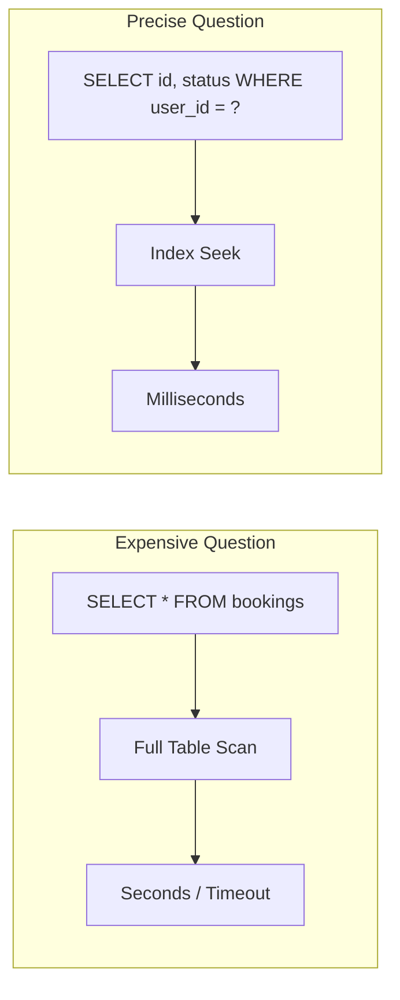

# 78. Law 19: Every Query Is a Question

> **Think:** *"What question is this query asking — and is it the right one?"*

---

## The 4 Questions

| Question | Answer |
|----------|--------|
| **What problem does it solve?** | Throwing hardware at bad queries — `SELECT *`, missing WHERE, full table scans, N+1 patterns — instead of asking tighter questions of the data. |
| **What happens if I ignore it?** | DB CPU at 100%, p99 latency 8 seconds, you add a bigger RDS instance, bill doubles, problem returns at 2× traffic. |
| **Where would I use it?** | Every slow endpoint, ORM review, analytics pipeline, admin dashboard, API design (what fields does client actually need?). |
| **What companies use it?** | Every company that learned EXPLAIN ANALYZE — Amazon, Nykaa, any team that fixed performance by rewriting 5 lines of SQL instead of adding 5 servers. |

---

## Mental Movie (60 seconds)

**Bad question:**
```sql
SELECT * FROM bookings;
```
*"Give me everything about every booking ever."*
5 million rows. 2.3 GB over the wire. 12 seconds. App timeout.

**Better question:**
```sql
SELECT booking_id, status, check_in_date, hotel_name
FROM bookings
WHERE user_id = 101 AND status = 'confirmed'
ORDER BY check_in_date DESC
LIMIT 20;
```
*"What are this user's upcoming confirmed trips?"*
47 rows. 4 KB. 8ms.

Same table. Different question. **400× faster** — no new servers.

System performance often improves by asking **better questions**, not adding more servers.

---

## How It Works



### Query Quality Checklist

| Bad pattern | Why expensive | Better question |
|-------------|---------------|-----------------|
| `SELECT *` | Fetches unused columns, more I/O | Select only needed columns |
| No `WHERE` | Full table scan | Filter to relevant subset |
| No `LIMIT` | Returns unbounded rows | Paginate (Module 3) |
| N+1 queries | 1 + N round trips | JOIN or batch `WHERE IN` |
| `LIKE '%goa%'` | Can't use index | Full-text search index |
| Function on indexed column | `WHERE YEAR(date) = 2024` | Range: `date >= '2024-01-01'` |
| OR across columns | Index can't help | UNION of two indexed queries |

### The Question Behind The API

| API endpoint | Hidden question | Query shape |
|--------------|-----------------|-------------|
| `GET /users/me/bookings` | "My upcoming trips?" | `WHERE user_id = ? LIMIT 20` |
| `GET /hotels?city=goa` | "Hotels in Goa for search?" | Indexed `city_id`, paginated |
| `GET /admin/revenue` | "Total revenue this month?" | Aggregate with date range, not all rows |
| GraphQL `{ hotel { reviews { user { ... } } } }` | "Everything about everything?" | Danger — needs field-level limits |

---

## Real-World Examples

### Your Travel Platform

**Incident:** "My Trips" page slow (4.2s).

**Investigation:**
```sql
-- What ORM generated:
SELECT * FROM bookings WHERE user_id = 101;
-- 340 historical bookings, all columns, including JSON metadata blob

-- Fix:
SELECT id, status, check_in, hotel_name, total_amount
FROM bookings
WHERE user_id = 101 AND check_in >= CURRENT_DATE
ORDER BY check_in LIMIT 10;
-- 3 upcoming trips, 12ms
```

**Also found:** N+1 — loop fetching hotel for each booking (340 queries). Fixed with JOIN or batch load.

### Nykaa

Product listing at scale: never `SELECT * FROM products`. Curated column list for card view: `id, name, price, image_url, rating, brand`. Full product detail is a separate query on click — different question, different shape.

### Amazon

Order history API returns summary fields. Order detail is separate call. List endpoints always paginated. Internal teams use EXPLAIN and query budgets — expensive questions get rejected in code review.

---

## When To Interrogate Queries

| Investigate when... | Tool |
|---------------------|------|
| Endpoint p99 **> 500ms** | APM + slow query log |
| DB CPU **> 70%** sustained | CloudWatch / pg_stat |
| **Linear growth** in latency with users | Missing index or full scan |
| ORM **generates SQL** you didn't review | Log SQL in staging |
| New feature **"loads all"** by default | Code review red flag |

## When Query Optimization Isn't The Answer

| Look elsewhere when... | Why |
|------------------------|-----|
| Data should be **cached** (Law 15) | Same question asked 50K times/day |
| Wrong **read path** (Law 17) | OLTP DB doing search analytics |
| Data **too far away** (Law 21) | Cross-region fetch on every request |
| Question should be **precomputed** | Nightly aggregate vs live scan |

---

## Connection To Other Laws & Modules

| Connection | Link |
|------------|------|
| Law 20 (Indexes) | Good questions + indexes = fast |
| Law 17 (Read/Write) | Read model shaped for the question |
| Module 3: Query Optimization | Tactical patterns |
| Module 3: Pagination | LIMIT/OFFSET for large questions |
| Module 3: Database Indexing | Indexes answer questions faster |
| Module 10: Law 12 | Avoid loading data nobody needs |

---

## EXPLAIN Habit

Before shipping any query that touches >10K rows:

```sql
EXPLAIN ANALYZE
SELECT booking_id, status
FROM bookings
WHERE user_id = 101 AND status = 'confirmed';
```

Look for: `Seq Scan` (bad at scale), `Index Scan` (good), `rows=` estimate vs actual.

---

## Problem Simulation

Slow query log shows top offender:

```sql
SELECT b.*, h.name, h.address, h.star_rating, p.amount
FROM bookings b
JOIN hotels h ON b.hotel_id = h.id
JOIN payments p ON b.payment_id = p.id
WHERE b.created_at > '2020-01-01'
ORDER BY b.created_at DESC;
```

Called 400 times/minute from admin dashboard. Average: 6.2 seconds.

**Questions:**
1. What's wrong with this question?
2. Rewrite for admin viewing "recent bookings" (last 7 days, 50 per page).
3. Would an index help? On what?
4. Is this the right read path for admin analytics?

<details>
<summary>Answers</summary>

1. **Unbounded time range** (5 years of data), `SELECT b.*` (all columns), no LIMIT, heavy JOINs on every call, wrong question for dashboard ("all history" vs "recent activity").
2. ```sql
SELECT b.id, b.status, b.created_at, h.name, p.amount
FROM bookings b
JOIN hotels h ON b.hotel_id = h.id
JOIN payments p ON b.payment_id = p.id
WHERE b.created_at >= NOW() - INTERVAL '7 days'
ORDER BY b.created_at DESC
LIMIT 50 OFFSET 0;
```
3. **Yes** — composite index on `(created_at DESC)` or `(created_at, status)`. FK indexes on `hotel_id`, `payment_id` if missing.
4. **Probably not** — high-volume admin analytics should use read replica or warehouse (Law 17), not OLTP primary with a 5-year scan.

</details>

---

## Key Takeaway

Databases answer questions. Ask precise questions — filter, select only what you need, paginate, index the access pattern. Better questions beat more servers.

**Next:** [79 — Indexes Are Memory for Databases](./79-indexes-are-memory-for-databases.md)
