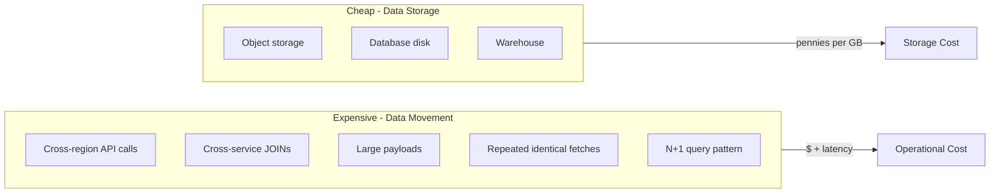

# 80. Law 21: Moving Data Is More Expensive Than Storing It

> **Think:** *"Storage is cheap — bandwidth and round trips are not."*

---

## The 4 Questions

| Question | Answer |
|----------|--------|
| **What problem does it solve?** | Over-fetching, cross-region chatter, chatty APIs, and repeated transfers of the same bytes — treating network movement as free because storage is cheap. |
| **What happens if I ignore it?** | Mumbai user hits US API (300ms RTT). Search returns 2MB JSON per request. Cross-region DB joins add 200ms per hop. Bill and latency explode while storage costs stay flat. |
| **Where would I use it?** | API response design, CDN placement, read replica geography, microservice boundaries, batch vs real-time sync, mobile payload size. |
| **What companies use it?** | Netflix (Open Connect — move content once to edge), Cloudflare, Amazon (regional endpoints), every global app that learned cross-region is a tax. |

---

## Mental Movie (60 seconds)

**Storage cost:** 1TB S3 = ~$23/month.

**Movement cost:** 1TB cross-region egress = ~$90+ (varies by cloud). Same data transferred 1000×/day across regions = operational pain + latency, not storage pain.

**Example — hotel search response:**
```
Bad:  Return 50 hotels × full object (photos URLs, amenities JSON, reviews)
      = 800 KB per search × 100K searches/day = 80 GB/day over the wire

Good: Return 50 hotels × card fields (id, name, price, thumbnail, rating)
      = 40 KB per search × 100K = 4 GB/day
```

Same data **stored** once. **Moved** 20× less.

**Principle:** Store data freely. Move data carefully.

> **Same force, different lens:** [Module 10: Law 2 — The Closest Copy Wins](../module-10-laws-of-software-systems/60-closest-copy-wins.md) teaches moving copies closer. This law teaches minimizing movement altogether.

---

## How It Works



### What Makes Movement Expensive

| Movement type | Cost driver |
|---------------|-------------|
| **Cross-region RTT** | 100–300ms per round trip |
| **Cross-AZ** | 1–5ms + egress charges |
| **Large JSON payloads** | Serialize + transfer + parse |
| **N+1 API/DB calls** | N round trips instead of 1 |
| **Cross-service JOINs** | Network between DBs, not local join |
| **Repeated identical fetches** | Same countries list 50K times/day from US |
| **Chatty microservices** | 6 sequential calls to render one page |

### Movement Reduction Strategies

| Strategy | Law/Module link |
|----------|-----------------|
| **CDN / edge cache** | Closest copy (Module 10: Law 2) |
| **Pagination / field selection** | Law 19 — smaller questions |
| **Batch APIs** | `GET /hotels?ids=1,2,3` not 3 calls |
| **Denormalized read models** | Law 17 — one fetch, no cross-DB join |
| **Compression** | Module 3: gzip/brotli |
| **Regional deployment** | Serve Mumbai users from Mumbai |
| **Event sync vs polling** | Push delta, don't pull full state |

---

## Real-World Examples

### Your Travel Platform

**Movement audit — search page load:**

| Before | Data moved | Fix |
|--------|------------|-----|
| 6 sequential API calls (Mumbai → US supplier) | 6 × 150ms RTT | BFF aggregating in Mumbai |
| Full hotel object in list API | 800 KB/response | Card DTO: 40 KB |
| Countries from DB every request | 50K DB reads/day | Cache in Redis (Module 3) |
| Images from origin S3 (US) | 400ms/image | CDN in Delhi (Module 3) |
| Reviews fetched per hotel (N+1) | 50 extra calls | Batch or embed in search index |

**Storage:** Hotel photos in S3 — 500 GB — $12/month.
**Movement without CDN:** 500 GB × 100K views = unsustainable egress + 400ms latency.

### Nykaa

Product images: stored once in object storage, served from CDN edge near user. Product metadata: denormalized in search index — one read, no cross-service JOIN at browse time. Order placement: minimal payload — only cart IDs and quantities, not full product catalog.

### Amazon

CloudFront exists because **moving bytes to users** was more expensive than **storing bytes at edge**. Open Connect puts caches inside ISP networks — extreme version of "move once, serve many."

---

## When Movement Cost Dominates

| Watch movement when... | Signal |
|------------------------|--------|
| **Global users**, single region API | High RTT in APAC/EU metrics |
| **Mobile users** on 4G | Payload size affects conversion |
| **Microservices** with chained calls | Law 65: latency is additive |
| **Cross-region DR** with active reads | Replication traffic + consistency |
| **Analytics** pulling OLTP data hourly | ETL bandwidth, not storage |

## When Storage Cost Dominates

| Storage matters more when... | Example |
|------------------------------|---------|
| **Cold archive** (rarely accessed) | 7-year invoice retention |
| **Data lake** for ML training | Store once, compute local |
| **Event log** (Kafka) with retention | Disk, not egress |
| **Precomputed aggregates** | Cheaper to store than recompute daily |

---

## Connection To Other Laws & Modules

| Connection | Link |
|------------|------|
| Law 19 (Queries) | `SELECT *` moves unnecessary bytes |
| Law 15 (Copies) | CDN copy reduces repeated movement |
| Law 17 (Read/Write) | Denormalized read model = one local fetch |
| Module 3: CDN, Compression, Pagination | Tactical movement reduction |
| Module 10: Law 2 | Closest copy wins |
| Module 10: Law 3 | Repetition moves same data repeatedly |
| Module 10: Law 7 | Latency additive across hops |

---

## Movement Audit Template

For one user journey (e.g. search → select → book):

| Step | Bytes transferred | Round trips | Cross-region? | Reduce how? |
|------|-------------------|-------------|---------------|-------------|
| | | | | |

Target: minimize round trips first, then bytes per trip.

---

## Problem Simulation

Architecture:
- API in `us-east-1`
- Database in `us-east-1`
- Users primarily in India
- Search API returns full hotel objects (avg 16 KB × 40 hotels = 640 KB)
- Mobile app calls search, then 40 separate `GET /hotels/{id}/reviews` calls

Traffic: 50K searches/day from India.

**Questions:**
1. Where is movement most expensive — storage or transfer?
2. Three fixes ranked by impact.
3. Estimated latency improvement for India users.
4. Does adding a bigger DB instance help?

<details>
<summary>Answers</summary>

1. **Transfer and round trips.** Storage of hotel data is tiny. 50K × 640 KB search + 50K × 40 review calls = massive cross-Pacific movement + 41 round trips per search session.
2. **(1) Deploy API + read replica in ap-south-1 (Mumbai)** — cut RTT 250ms→20ms. **(2) Slim search response + embed review summary** — 640 KB → 50 KB, eliminate 40 review calls. **(3) CDN for images** — don't move image bytes from US origin.
3. **Search latency:** 250ms RTT × 41 calls = 10+ seconds theoretical serial; parallel helps but still 250ms+ per wave. Mumbai region: ~20ms RTT → sub-second possible with batching.
4. **No.** Bigger DB doesn't fix cross-Pacific network. Law 21 + Law 2 (distance) problem, not compute.

</details>

---

## Key Takeaway

Storage is increasingly cheap. Data movement — cross-region, cross-service, repeated, oversized — remains expensive. Store freely; move carefully.

**Next:** [81 — Every Software System Is a Memory System](./81-every-software-system-is-a-memory-system.md)
