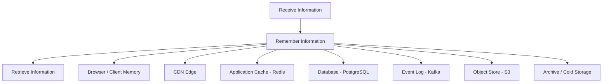

# 81. Law 22: Every Software System Is a Memory System

> **Think:** *"At its core, software receives information, remembers it, and retrieves it."*

---

## The 4 Questions

| Question | Answer |
|----------|--------|
| **What problem does it solve?** | Fragmented view of infrastructure — seeing Redis, Kafka, PostgreSQL, CDN, and browser cache as unrelated tools instead of one pattern: **memory at different layers**. |
| **What happens if I ignore it?** | You misdesign systems — wrong store for retention needs, no cache strategy, event log treated as database, or stateless fantasy that collapses at scale. |
| **Where would I use it?** | Architecture design, choosing storage (SQL vs Redis vs Kafka vs S3), retention policies, debugging "where did this value come from?", capacity planning. |
| **What companies use it?** | All of them — every production stack is a hierarchy of memory layers with different speed, size, and durability tradeoffs. |

---

## Mental Movie (60 seconds)

Strip away frameworks. What does your travel platform actually do?

```
User submits booking
    → Receive information (HTTP POST)
    → Remember information (PostgreSQL INSERT)
    → Retrieve information (GET /bookings/123)

User opens search page
    → Receive (search query)
    → Remember? (Redis already has hot hotels from earlier searches)
    → Retrieve (return cached result in 5ms, not 200ms DB query)
```

Every component is memory with different properties:

| Component | Remembers what | For how long |
|-----------|----------------|--------------|
| PostgreSQL | Bookings, payments | Years (durable) |
| Redis | Hot search results | Minutes (fast, volatile) |
| Kafka | Booking events | Days/weeks (replay buffer) |
| CDN | Hotel images | Hours/days (edge) |
| Browser | JS, CSS, API responses | Session/days (local) |
| Elasticsearch | Search index | Rebuildable projection |

**Most software complexity is ultimately memory management and information retrieval.**

> **Same instinct, systems lens:** [Module 10: Law 10 — Systems Remember To Survive](../module-10-laws-of-software-systems/68-systems-remember-to-survive.md). Law 22 unifies that instinct under one data architecture model.

---

## How It Works



### The Three Activities

| Activity | Examples |
|----------|----------|
| **Receive** | HTTP request, webhook, message from queue, user input, sensor data |
| **Remember** | INSERT, cache SET, publish event, write file, index document |
| **Retrieve** | SELECT, cache GET, consume event, read file, search query |

Every API endpoint, batch job, and cron is one of these three.

### Memory Layer Properties

| Layer | Speed | Durability | Capacity | Use for |
|-------|-------|------------|----------|---------|
| **CPU/register** | Fastest | Volatile | Tiny | In-process |
| **Browser cache** | ~1ms | Session | MB | Static assets, API cache |
| **Redis** | ~1ms | Configurable | GB | Hot data, sessions |
| **PostgreSQL** | ~5–50ms | Durable | TB | Source of truth |
| **Kafka** | ~ms | Retention-based | TB | Event memory, replay |
| **S3** | ~100ms | Durable | Unlimited | Files, backups, archive |
| **Cold archive** | Seconds | Years | Unlimited | Compliance, history |

**Architecture = choosing what to remember where, for how long, and how to retrieve it.**

---

## Real-World Examples

### Your Travel Platform — Memory Map

```
Receive:  POST /bookings, webhook from Razorpay, supplier availability push
Remember: PostgreSQL (bookings), Kafka (BookingCreated), Redis (invalidate search)
Retrieve: GET /search (Redis → ES), GET /bookings/:id (PostgreSQL), My Trips (Redis → PG)
```

**Design questions as memory questions:**
- "Should we add Redis?" → "Should we **remember** search results to avoid recomputing?"
- "Should we use Kafka?" → "Should we **remember** events so other systems can **retrieve** them later?"
- "Should we archive old bookings?" → "How long must we **remember**, and where's the cheapest durable layer?"

### Nykaa

Order flow: Receive order → Remember in Order DB + publish event → Retrieve for status page, invoice, logistics. Catalog: Remember in DB + project to search index + CDN for images. Each layer is memory with different TTL and durability.

### Amazon

DynamoDB (fast durable memory), S3 (object memory), ElastiCache (hot memory), Kinesis (stream memory), Glacier (cold memory). Product naming reflects memory hierarchy thinking.

---

## When The Memory Model Helps

| Use this lens when... | Insight |
|-----------------------|---------|
| **Choosing between tools** | "What memory properties do I need?" not "Redis vs Memcached hype" |
| **Debugging stale data** | Trace which layer remembered the wrong value (Law 15) |
| **Designing retention** | GDPR delete must reach every memory layer |
| **Explaining architecture** | Non-technical stakeholders understand "remember and retrieve" |
| **Planning scale** | Each layer has limits — plan overflow to next tier |

## Common Memory Mistakes

| Mistake | Fix |
|---------|-----|
| **Redis as primary store** | Redis is fast memory, not durable source of truth |
| **No retention policy** | Kafka disk fills; logs grow forever |
| **Forgot browser/CDN layer** | User sees stale after backend fix |
| **Everything in one DB** | No read/write memory separation (Law 17) |
| **Stateless fantasy** | "We don't store state" — but DB, cache, and queue do |

---

## Connection To Other Laws & Modules

| Connection | Link |
|------------|------|
| Law 13 (Longevity) | Durable memory survives code rewrites |
| Law 15 (Copies) | Each memory layer is a copy |
| Law 17 (Read/Write) | Different memory for different workloads |
| Law 20 (Indexes) | DB's internal memory for lookups |
| Module 3: Caching | Application memory layer |
| Module 4: ACID | Durable transactional memory guarantees |
| Module 5: Event Sourcing | Event log as primary memory |
| Module 10: Law 4, 10 | Memory beats recalculation; systems remember |

---

## Memory Layer Worksheet

For your travel platform, fill in:

| Data | Receive via | Remember in | Retrieve via | Retention |
|------|-------------|-------------|--------------|-----------|
| Booking | POST /bookings | PostgreSQL | GET /bookings/:id | Forever |
| Search results | GET /search | ? | ? | ? |
| Payment webhook | Razorpay POST | ? | ? | ? |
| Hotel images | Admin upload | ? | ? | ? |

Empty cells = architecture gaps to design.

---

## Problem Simulation

Startup pitch: "We're going fully serverless and stateless. No database — we'll call supplier APIs in real time for every search. Infinite scale."

Reality check:
- 100K searches/day
- Supplier API: 400ms, rate limit 100 req/min
- Users expect "My Trips" history
- Payment reconciliation needs transaction records

**Questions:**
1. Why is "stateless" incorrect for this product?
2. Minimum memory layers needed?
3. Map Receive → Remember → Retrieve for booking flow.
4. How does this law connect to Module 10's unifying question?

<details>
<summary>Answers</summary>

1. **Bookings, payments, and user history are inherently state** — you must remember them. Supplier API can't replace memory; it adds latency and dependency (Law 21). Rate limits make real-time-only impossible at scale.
2. **At minimum:** Durable memory (PostgreSQL for bookings/payments), hot memory (Redis for search/catalog cache), event memory (Kafka or queue for async notifications), object memory (S3 for images).
3. **Booking:** Receive POST → Remember INSERT booking + payment record + Kafka event → Retrieve GET /bookings/:id from PostgreSQL, My Trips from indexed query.
4. **Module 10 unifying question:** "Can I avoid doing this again?" — cache/search index remembers search results; DB remembers bookings; events remember state changes for downstream retrieval. Memory layers ARE the answer to that question.

</details>

---

## Key Takeaway

Software receives, remembers, and retrieves information. Databases, caches, queues, CDNs, and filesystems are memory layers with different speed, size, and durability. Most complexity is choosing what to remember where.

---

## Module Complete

You've finished **Module 11: The Laws of Data**.

**The ten enduring truths:**
1. Data outlives code
2. Every dataset needs an owner
3. Every copy introduces responsibility
4. Consistency requires tradeoffs
5. Reads and writes are different problems
6. Data attracts architecture
7. Better questions produce faster systems
8. Indexes are stored memory
9. Moving information is expensive
10. Software systems exist primarily to remember reality

**Previous chapter:** [Module 10 — The Laws of Software Systems](../module-10-laws-of-software-systems/)

**Next chapter:** [Module 12 — The Laws of Scale](../module-12-laws-of-scale/)

**Full handbook:** [Founder-Architect Handbook](../README.md)
