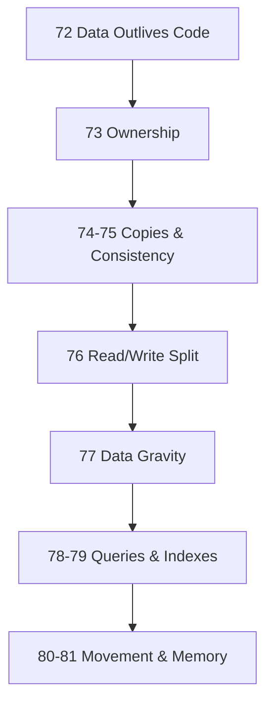

# Module 11: The Laws of Data

*Chapter 2 — Foundations of Software Systems*

> **This module does not re-teach indexing or gravity from scratch.** Topics **77** and **79** are ~3 min lenses — read [Module 10 Law 9](../module-10-laws-of-software-systems/67-information-has-gravity.md) and [Module 3 Indexing](../module-03-performance/13-database-indexing.md) first. See [CONCEPT-INDEX](../CONCEPT-INDEX.md).

> **Most software eventually becomes a data problem. Frameworks change. Languages change. Infrastructure changes. Data remains.**

Module 10 taught the **forces** beneath systems — work, distance, memory, time, gravity, communication.

Module 11 teaches why **data** becomes the center of gravity — ownership, copies, consistency, queries, migration. These are the laws architects use when code is rewritten but customer records must survive.

---

## Prerequisites

Complete **[Module 10: Laws of Software Systems](../module-10-laws-of-software-systems/)** first. This module assumes you already think in forces. Here you apply those forces to data specifically.

Helpful background from earlier modules:

| Module | Why it matters here |
|--------|---------------------|
| [Module 3: Performance](../module-03-performance/) | Caching, indexing, query optimization |
| [Module 4: Data Systems](../module-04-data-systems/) | ACID, replication, eventual consistency |
| [Module 5: Distributed Systems](../module-05-distributed-systems/) | CQRS, event sourcing, read/write separation |

---

## Topics

| # | Law | One-line principle | Read time |
|---|-----|-------------------|-----------|
| 72 | [Data Lives Longer Than Code](./72-data-lives-longer-than-code.md) | Protect and migrate data before chasing rewrites | ~12 min |
| 73 | [Every Data Element Needs an Owner](./73-every-data-element-needs-an-owner.md) | One source of truth per important dataset | ~12 min |
| 74 | [Every Copy Creates Responsibility](./74-every-copy-creates-responsibility.md) | Every cache is a consistency problem | ~12 min |
| 75 | [Consistency Has a Cost](./75-consistency-has-a-cost.md) | Fast, available, consistent — pick your tradeoffs | ~12 min |
| 76 | [Reads and Writes Are Different Workloads](./76-reads-and-writes-are-different-workloads.md) | Optimize reads and writes independently | ~12 min |
| 77 | [Data Creates Gravity](./77-data-creates-gravity.md) | Architecture eventually orbits valuable data | ~3 min *(lens)* |
| 78 | [Every Query Is a Question](./78-every-query-is-a-question.md) | Better questions beat more servers | ~12 min |
| 79 | [Indexes Are Memory for Databases](./79-indexes-are-memory-for-databases.md) | Trade storage for lookup speed | ~3 min *(lens)* |
| 80 | [Moving Data Is More Expensive Than Storing It](./80-moving-data-is-more-expensive-than-storing-it.md) | Store freely; move carefully | ~12 min |
| 81 | [Every Software System Is a Memory System](./81-every-software-system-is-a-memory-system.md) | Software receives, remembers, retrieves | ~12 min |

---

## The Data Lens

| Lens | Sees |
|------|------|
| **Engineer** | Tables, APIs, ORMs |
| **Architect** | Ownership, copies, consistency boundaries |
| **Data thinker** | What survives rewrites, what pulls the system, what questions the DB answers |

This module trains the third lens — building on Module 10's systems thinker.

---

## Learning Order



**Cluster 1 (Survival):** Laws 13, 14 — data longevity and ownership
**Cluster 2 (Copies):** Laws 15, 16 — cache responsibility and consistency cost
**Cluster 3 (Workloads):** Law 17 — read/write separation
**Cluster 4 (Gravity):** Law 18 — data as architectural center
**Cluster 5 (Questions):** Laws 19, 20 — query shape and indexes
**Cluster 6 (Physics):** Laws 21, 22 — movement cost and memory model

---

## Cross-Module Map

| Law | Connects to Module |
|-----|-------------------|
| Data Lives Longer Than Code | Module 6: CI/CD, blue-green deploys (migration strategy) |
| Every Data Element Needs an Owner | Module 5: CQRS write model, event ownership |
| Every Copy Creates Responsibility | Module 3: Caching; Module 10: Laws 5, 6, 10 |
| Consistency Has a Cost | Module 4: Eventual Consistency |
| Reads and Writes Are Different | Module 5: CQRS; Module 4: Replication |
| Data Creates Gravity | Module 10: Law 9 (Information Has Gravity) |
| Every Query Is a Question | Module 3: Query Optimization, Pagination |
| Indexes Are Memory | Module 3: Database Indexing; Module 10: Law 4 |
| Moving Data Is Expensive | Module 10: Law 2 (Closest Copy Wins) |
| Every System Is Memory | Module 10: Law 10 (Systems Remember To Survive) |

---

## Module Simulation

Your travel platform is planning a full rewrite: React → new framework, monolith → microservices, PostgreSQL → "maybe something else."

Before approving, trace each law:

1. **Law 13:** Which datasets must survive unchanged? What's the migration plan for 2M booking records?
2. **Law 14:** Who owns `hotels` data today? Will three new services all write to it?
3. **Law 15:** You have Redis, CDN, and read replicas. What goes stale when a hotel price changes?
4. **Law 16:** Can search show a 5-minute-old price during a flash sale?
5. **Law 17:** Search gets 100K reads/min; booking gets 50 writes/min. Same database?
6. **Law 18:** List every system that depends on booking data. What breaks if the schema changes?
7. **Law 19:** Audit the top 5 slow queries. Are they bad questions?
8. **Law 20:** Which tables are missing indexes on foreign keys?
9. **Law 21:** How much data crosses regions per search request?
10. **Law 22:** Map every layer that "remembers" hotel data.

Fix the rewrite plan before writing code.

---

## Architect's Reflection

Junior engineers focus on services, APIs, and frameworks.

Senior engineers focus on data.

Architects eventually realize:

> Applications come and go. Data becomes the business.

Module 10 explained **why systems behave the way they do**.

Module 11 explains **why data becomes the thing worth protecting**.

---

## PDFs

```bash
python3 md_to_pdf.py --dir learning/module-11-laws-of-data --force
```

## Previous Module

**[Module 10: The Laws of Software Systems](../module-10-laws-of-software-systems/)** — Forces beneath every framework.

## Next Module

**[Module 12: The Laws of Scale](../module-12-laws-of-scale/)** — What breaks when growth stresses the system.
