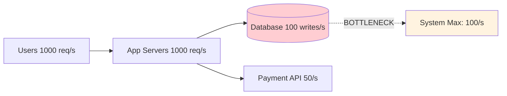

# 82. Law 23: Every System Has a Bottleneck

> **Think:** *"What breaks first — not what's strongest?"*

---

## The 4 Questions

| Question | Answer |
|----------|--------|
| **What problem does it solve?** | False confidence from strong components — your app handles 1000 req/s but the DB handles 100, and you wonder why the system dies at 100. |
| **What happens if I ignore it?** | You scale the wrong thing. Add app servers while DB melts. Buy faster CPUs while network is saturated. Fix symptoms, not the limit. |
| **Where would I use it?** | Capacity planning, load testing, architecture reviews, incident post-mortems, "how many users can we handle?" conversations. |
| **What companies use it?** | Every SRE team — Google's "useful capacity" is always bottleneck-defined. Amazon measures end-to-end chain, not individual service CPU. |

---

## Mental Movie (60 seconds)

Your travel platform load test results:

```
Application servers:  1000 requests/sec ✅
PostgreSQL:           100 writes/sec  ⚠️
Payment API (Razorpay): 50 calls/sec   ⚠️
```

Marketing announces: "We can handle 1000 bookings per second!"

Reality: **100 bookings/sec** — limited by the database write path.

The app isn't the bottleneck. The database is. Adding 10 more app servers changes nothing.

**System capacity = capacity of the weakest link in the critical path.**

---

## How It Works



### Common Bottlenecks

| Resource | Symptom | How to detect |
|----------|---------|---------------|
| **CPU** | High utilization, slow compute | `top`, CloudWatch CPU |
| **Memory** | OOM kills, swapping | Memory metrics, GC pauses |
| **Database** | Connection pool exhausted, slow queries | `pg_stat`, slow query log |
| **Network** | High latency, bandwidth saturation | RTT, egress metrics |
| **Disk I/O** | High iowait, slow reads/writes | `iostat`, EBS metrics |
| **Third-party API** | Rate limits, timeouts | 429 errors, partner SLAs |
| **Single thread/lock** | One hot mutex blocks all | Profiling, lock contention |

### Finding the Bottleneck

1. **Map the critical path** — user action → every hop until response
2. **Load test end-to-end** — not individual services in isolation
3. **Measure each hop** — latency, throughput, error rate
4. **Find the first saturated resource** — that's your bottleneck
5. **Fix it** — then find the *next* one (there's always a next one)

---

## Real-World Examples

### Your Travel Platform

Critical path for booking:

```
POST /bookings → validate → check inventory → write DB → call payment → send confirmation
```

| Hop | Capacity | Bottleneck? |
|-----|----------|-------------|
| App server CPU | 2000 req/s | No |
| Inventory check (Redis) | 5000/s | No |
| DB INSERT booking | 120/s | **Yes** |
| Razorpay API | 80/s | Close second |

**Fix order:** Optimize DB writes (batch, connection pool, indexes) → add read replicas for non-write paths → queue non-critical work (Law 91).

### Nykaa

Flash sale bottleneck shifts by the minute:
- Minute 0: CDN (image load)
- Minute 1: App servers (traffic spike)
- Minute 2: Inventory DB (write contention)
- Minute 3: Payment gateway (partner limit)

Nykaa engineers monitor **which resource saturates first** during sale simulations — not average CPU.

### Amazon

Black Friday planning maps every service's bottleneck in the purchase funnel. Cart service, inventory, payment, shipping estimate — each has a measured ceiling. Capacity = min(all ceilings on critical path).

---

## When To Hunt Bottlenecks

| Hunt when... | Tool |
|--------------|------|
| Planning **launch** or marketing spike | Load test |
| **p99 latency** climbing while avg is fine | Trace slow requests |
| Adding capacity **doesn't help** | Wrong layer scaled |
| **One component** at 100% while others idle | Classic bottleneck |
| Post-incident **"why did we fall over?"** | Timeline + saturation metrics |

## Common Bottleneck Mistakes

| Mistake | Reality |
|---------|---------|
| Scale app servers when **DB** is saturated | Waste money, no improvement |
| Optimize avg latency, ignore **p99** | Tail latency is the user experience |
| Load test **one service** in isolation | Misses chain bottlenecks |
| Assume cloud **auto-scales infinitely** | DB, partners, locks don't auto-scale |

---

## Connection To Other Laws & Modules

| Connection | Link |
|------------|------|
| Law 24 (Bigger machine) | First fix attempt — often wrong layer |
| Law 26 (Contested resources) | Shared DB becomes bottleneck under growth |
| Module 10: Law 12 | Avoid work before scaling — removes bottlenecks |
| Module 2: Scale | Tactical scaling after bottleneck identified |
| Module 3: Indexing | DB bottleneck often = missing index (Law 93) |

---

## Bottleneck Worksheet

For your top user journey, fill in:

| Step | Component | Max throughput | Saturated at? |
|------|-----------|----------------|---------------|
| | | | |

Lowest number in "Max throughput" = your bottleneck.

---

## Problem Simulation

Load test results:

| Component | Throughput |
|-----------|------------|
| Load balancer | 50,000 req/s |
| 6 app servers (aggregate) | 12,000 req/s |
| Redis cache | 80,000 req/s |
| PostgreSQL primary | 400 writes/s |
| Elasticsearch search | 3,000 queries/s |

Checkout flow: 1 DB write + 1 payment API call (200/s limit) + 3 search reads.

**Questions:**
1. What's the system capacity for checkout?
2. What's the bottleneck for search-only traffic?
3. Team adds 10 more app servers. Checkout capacity change?
4. What do you fix first?

<details>
<summary>Answers</summary>

1. **200 checkouts/s** — payment API is the bottleneck (200/s limit on critical path). DB at 400/s isn't limiting checkout yet.
2. **3,000 searches/s** — Elasticsearch is the bottleneck (search doesn't hit payment API).
3. **No change** for checkout — payment API still caps at 200/s. App servers weren't the limit.
4. **Payment path first** — negotiate higher limits, cache payment tokens, async payment confirmation. Then optimize DB before it becomes next bottleneck at 2× growth.

</details>

---

## Key Takeaway

No system scales infinitely. Capacity is determined by the weakest component on the critical path — find it before you scale anything else.

**Next:** [83 — A Faster Horse Does Not Fix Traffic](./83-a-faster-horse-does-not-fix-traffic.md)
