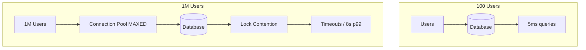

# 85. Law 26: Shared Resources Become Contested Resources

> **Think:** *"Who else is fighting for this database connection right now?"*

---

## The 4 Questions

| Question | Answer |
|----------|--------|
| **What problem does it solve?** | Surprise slowdown when growth turns shared resources — one DB, one cache, one API key — into competition zones. |
| **What happens if I ignore it?** | Slow queries, lock contention, connection pool exhaustion, timeouts, cascading failures as everyone waits for the same resource. |
| **Where would I use it?** | Database connection pools, row-level locks, shared Redis, rate-limited partner APIs, singleton services. |
| **What companies use it?** | Every scaled system — connection pool tuning is core DBA/SRE work. Flash sales are contention wars. |

---

## Mental Movie (60 seconds)

**100 users → 1 database:** Works beautifully. Queries return in 5ms.

**1,000,000 users → 1 database:**
- 500 concurrent connections (pool maxed)
- Row locks on hot `inventory` rows during flash sale
- Queries queue behind long transactions
- p99 latency: 8 seconds
- Timeouts cascade to app servers

Same database. Same schema. **Different competition level.**

Growth increases competition for shared resources. What was abundant becomes fought over.

---

## How It Works



### Common Contention Points

| Resource | Symptom | Mitigation |
|----------|---------|------------|
| **DB connections** | `too many connections` | Pool sizing, PgBouncer, read replicas |
| **Row locks** | Slow writes on hot rows | Shorter transactions, queue, partition |
| **Table locks** | Migrations block reads | Online migrations, off-peak |
| **Redis single thread** | Hot key bottleneck | Key sharding, local cache |
| **Partner API quota** | 429 rate limit | Cache, queue, negotiate limits |
| **Single leader/election** | One node does all writes | Shard leadership |

### Contention Symptoms

- Slow queries that were fast at low volume
- **Lock wait** timeouts in logs
- Connection pool **exhausted** errors
- **Queue buildup** — requests waiting, not processing
- **Retry storms** — failures cause retries that worsen contention

---

## Real-World Examples

### Your Travel Platform

**Flash sale — 50 rooms, 10,000 concurrent buyers:**

```sql
UPDATE hotel_inventory SET rooms = rooms - 1 WHERE hotel_id = 55 AND rooms > 0;
```

10,000 transactions fight for the same row. Row lock serializes decrements. DB CPU spikes. App servers wait.

**Mitigations:**
- **Redis atomic DECR** for reservation count (fast path)
- **Queue-based booking** — accept request, process in order
- **Optimistic locking** — version column, retry on conflict
- **Shard inventory** by hotel_id across partitions

### Nykaa

SKU inventory row is the hottest contested resource during sales. Nykaa uses dedicated inventory service with in-memory counters + async sync to DB. Contention moved from PostgreSQL row to optimized inventory layer.

### Amazon

DynamoDB partition limits — too much traffic to one partition key causes throttling. Amazon designs partition keys to **spread contention**. Hot product during Prime Day gets partitioned access patterns.

---

## When To Expect Contention

| Expect contention when... | Plan for |
|-------------------------|----------|
| **Many writers** to same row/table | Queue, shard, or atomic counter |
| **Connection pool** < concurrent requests | Pool tuning, PgBouncer |
| **Shared singleton** service | Scale out or cache |
| **Flash sale / spike** (Law 92) | Pre-warm, queue, rate limit |
| **Long transactions** hold locks | Keep transactions short |

## When Contention Is Acceptable

| Acceptable when... | Why |
|--------------------|-----|
| **Low concurrency** writes | ACID without queue overhead |
| **Strong consistency** required | Locks are the mechanism |
| **Rare conflicts** | Optimistic locking sufficient |

---

## Connection To Other Laws & Modules

| Connection | Link |
|------------|------|
| Law 23 (Bottleneck) | Contention creates bottleneck |
| Law 25 (Parallel work) | More workers → more contention on shared DB |
| Law 89 (Sharding) | Splits contention across shards |
| Law 91 (Queues) | Serializes access to reduce fight |
| Module 4: Transactions | Locks are contention mechanism |
| Module 2: Rate Limiting | Limits who can contest |

---

## Problem Simulation

6 app servers, each pool: 20 DB connections. PostgreSQL max: 100 connections. Flash sale starts.

Symptoms: `FATAL: too many connections`, p99 12s, `lock timeout` on inventory updates.

**Questions:**
1. What's the connection math problem?
2. Why do row locks worsen under 10K concurrent buyers?
3. Three mitigations ranked by impact.
4. Which law pairs with this?

<details>
<summary>Answers</summary>

1. **6 × 20 = 120 connections** needed, max 100. Pool exhaustion before lock contention even matters. Fix: reduce pool per server (10 each = 60), add PgBouncer, or increase max_connections with memory headroom.
2. **Law 26** — all 10K fight for same inventory row. Serialized writes, long wait chains.
3. **(1) Redis reservation layer** — move hot path off DB row. **(2) Queue booking requests** — absorb spike (Law 91). **(3) Connection pool fix** — immediate relief.
4. **Law 92** (uneven traffic) caused the spike. **Law 23** (DB is bottleneck).

</details>

---

## Key Takeaway

Shared resources work until growth makes them contested. Plan for competition — connection limits, lock contention, and hot keys — before the spike, not during it.

**Next:** [86 — Distribution Creates Complexity](./86-distribution-creates-complexity.md)
