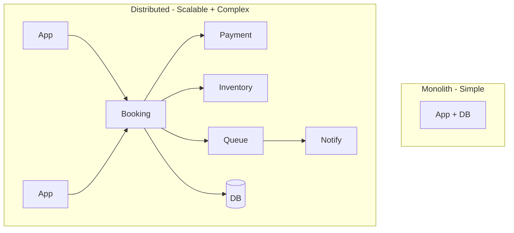

# 86. Law 27: Distribution Creates Complexity

> **Think:** *"What new failures appear when this runs on many machines?"*

---

## The 4 Questions

| Question | Answer |
|----------|--------|
| **What problem does it solve?** | Underestimating distributed systems — assuming 8 microservices behave like one monolith with extra steps. |
| **What happens if I ignore it?** | Network partitions, partial failures, inconsistent state, debugging nightmares, "it works on my machine" at scale. |
| **Where would I use it?** | Microservices decisions, multi-region deploys, service mesh, event-driven architecture, any "let's split the monolith" conversation. |
| **What companies use it?** | Every company that split a monolith — and every company that learned why the monolith existed. |

---

## Mental Movie (60 seconds)

**Single machine:**
```
[ Application + Database ]
```
One process. One log file. One deployment. Debug in 10 minutes.

**Distributed:**
```
App 1 ──┐
App 2 ──┼── API Gateway ── Booking Svc ── PostgreSQL
App 3 ──┘         │              │
                  │              ├── Payment Svc ── Razorpay
                  │              ├── Inventory Svc ── Redis
                  │              └── Kafka ── Notification Svc
Cache ── Search Svc ── Elasticsearch
```

**New challenges:**
- App 2 can't reach Payment Svc (network blip) — partial booking?
- Booking succeeds, notification fails — user never gets email?
- 3 services have different versions deployed — schema mismatch?
- Which of 6 logs has the error?

**Every distributed system trades simplicity for scale.**

---

## How It Works



### Complexity Tax

| Simple (monolith) | Distributed equivalent |
|-------------------|------------------------|
| Function call | Network RPC (Law 28) |
| DB transaction | Saga + compensating actions (Module 5) |
| Stack trace | Distributed tracing (Jaeger, X-Ray) |
| Single deploy | Rolling deploy + version compatibility |
| One log file | Centralized logging (ELK, CloudWatch) |
| ACID | Eventual consistency (Law 90) |

### Failure Modes That Don't Exist Locally

| Failure | What happens |
|---------|--------------|
| **Network partition** | Service A thinks B is down; B is fine |
| **Partial failure** | Payment charged, booking not created |
| **Clock skew** | Event ordering wrong across nodes |
| **Cascading timeout** | Slow DB → all services wait → all fail |
| **Split brain** | Two primaries think they're leader |

---

## Real-World Examples

### Your Travel Platform

**Monolith split proposal:** Booking, Payment, Inventory, Notification as separate services.

**Complexity introduced:**
- Checkout now = 4 network hops minimum (Law 28)
- Distributed transaction = Saga: book → pay → if pay fails, cancel book (Module 5)
- Debugging = correlate trace IDs across 4 services
- Deploy = 4 services must stay API-compatible

**Valid when:** Teams scale independently, components scale differently (inventory needs 10× payment's resources), clear bounded contexts.

**Premature when:** 5 engineers, 1000 users, no team boundary pain yet.

### Nykaa

Migrated from monolith to services over years — not a big-bang rewrite. Each split justified by **independent scaling** (catalog vs orders) or **team ownership**. Invested heavily in observability before splitting further.

### Amazon

"Two-pizza teams" with service ownership — but also strict API contracts, chaos engineering, and cell-based architecture. Distribution works because **complexity is managed systematically**, not hoped away.

---

## When Distribution Is Worth It

| Worth it when... | Sign |
|------------------|------|
| **Teams** blocked on each other in monolith | Deploy conflicts weekly |
| **Components** need different scale | Search 100× booking traffic |
| **Failure isolation** required | Payment crash shouldn't take search down |
| **Technology fit** differs | ML service on GPU, API on CPU |

## When To Stay Simple

| Stay monolith when... | Why |
|-----------------------|-----|
| **< 10 engineers**, product-market fit search | Distribution tax > benefit |
| **No clear boundaries** | Split creates distributed monolith |
| **Strong consistency** everywhere | Distributed transactions are hard |
| **Can't invest in observability** | You'll be blind |

---

## Connection To Other Laws & Modules

| Connection | Link |
|------------|------|
| Law 25 (Parallel) | Distribution enables parallelism |
| Law 28 (Networks) | Distribution's primary cost |
| Law 90 (CAP) | Consistency harder when distributed |
| Module 5: Saga | Multi-service transaction pattern |
| Module 5: Distributed Systems | Full tactical toolkit |
| Module 1: Circuit Breaker | Survive partial failures |

---

## Distribution Readiness Checklist

Before splitting a service:

- [ ] Distributed tracing in place
- [ ] Centralized logging with correlation IDs
- [ ] API versioning strategy
- [ ] Failure modes documented per hop
- [ ] Saga/compensation for multi-step flows
- [ ] Load tested **as a system**, not per service

---

## Problem Simulation

Checkout migrated to 4 microservices. Incident: 3% of checkouts show "payment failed" but users are charged.

Trace: Payment Svc returns 200, Booking Svc times out after 5s, client retries, double charge on retry without idempotency.

**Questions:**
1. Which law predicted this class of failure?
2. What three fixes?
3. Was the split premature — what info is missing?
4. Module 1 concept that prevents double charge?

<details>
<summary>Answers</summary>

1. **Law 27** — partial failure in distributed system. Payment succeeded, booking didn't confirm, client retried.
2. **(1) Idempotency keys** on payment. **(2) Saga** — booking pending until payment confirms. **(3) Increase timeout + circuit breaker** on booking call.
3. Need team size, traffic, whether observability existed pre-split. Symptom suggests split happened without saga/idempotency readiness.
4. **Idempotency** — same payment request twice = one charge.

</details>

---

## Key Takeaway

Distribution enables scale but introduces network failures, partial states, and operational complexity. Split only when the scale or team benefits exceed the complexity tax.

**Next:** [87 — Networks Are Not Instant](./87-networks-are-not-instant.md)
