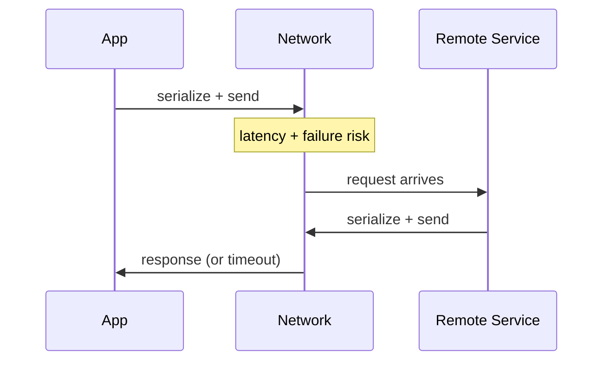

# 87. Law 28: Networks Are Not Instant

> **Think:** *"This felt like a function call in dev — in prod it's 50ms and might fail."*

---

## The 4 Questions

| Question | Answer |
|----------|--------|
| **What problem does it solve?** | Treating remote service calls like local function calls — ignoring latency, failure probability, serialization cost, and retry complexity. |
| **What happens if I ignore it?** | Chatty APIs (20 internal calls per page load), cascading timeouts, retry storms, "works in monolith, slow as microservices." |
| **Where would I use it?** | Service boundaries, API design, BFF pattern, batch APIs, sync vs async decisions, timeout/retry configuration. |
| **What companies use it?** | Netflix (Hystrix/Resilience4j), Amazon (strict internal API budgets), every team that learned gRPC isn't free. |

---

## Mental Movie (60 seconds)

**Developer mental model:**
```python
price = pricing_service.get_price(hotel_id)  # "feels instant"
```

**Production reality:**
```
pricing_service.get_price(hotel_id)
  → DNS lookup          2ms
  → TCP handshake       5ms
  → TLS negotiation    15ms
  → Serialize request   1ms
  → Network transit    10ms
  → Server process     20ms
  → Serialize response  1ms
  → Return             54ms (if nothing fails)
```

**6 sequential remote calls = 324ms minimum** — before your code runs.

A local function call and a remote service call are **fundamentally different operations**.

> **You met this in [Module 10: Law 7 — Latency Is Additive](../module-10-laws-of-software-systems/65-latency-is-additive.md). At scale, network calls are the dominant source.**

---

## How It Works



### What Every Network Call Costs

| Cost | Impact |
|------|--------|
| **Latency** | 1–100ms+ per hop (Law 65: additive) |
| **Failure risk** | Timeout, connection reset, 503 |
| **Serialization** | JSON encode/decode CPU + bytes |
| **Retries** | Multiply latency on failure |
| **Connection overhead** | Pool management, TLS |
| **Cognitive overhead** | Timeouts, circuit breakers, idempotency |

### Reducing Network Tax

| Pattern | How |
|---------|-----|
| **Batch API** | `GET /hotels?ids=1,2,3` not 3 calls |
| **BFF aggregation** | One server-side call composes data |
| **Cache** | Don't call remote if answer known |
| **Async/queue** | Don't block user on slow remote |
| **Colocate** | Same AZ/region reduces RTT |
| **GraphQL/data loader** | Batch N+1 into one request |

---

## Real-World Examples

### Your Travel Platform

**Hotel detail page — bad design:**
```
GET /hotels/55           → 40ms
GET /hotels/55/reviews   → 45ms
GET /hotels/55/pricing   → 50ms
GET /hotels/55/availability → 60ms
GET /suppliers/55/status → 120ms (external!)
Total: 315ms network alone
```

**Better — BFF or aggregated endpoint:**
```
GET /hotels/55/full      → 80ms (one call, server-side parallel fetch)
```

**Best — cache denormalized card:**
```
Redis GET hotel:55:card  → 2ms
```

### Nykaa

Product page data aggregated at API gateway or BFF layer. Internal services called in **parallel**, not series, where possible. External supplier calls always async or cached.

### Amazon

Internal service calls have **latency budgets**. Exceed budget → must cache, batch, or redesign. "Service-oriented architecture" doesn't mean "call 40 services per page."

---

## When Remote Calls Are Acceptable

| Acceptable when... | Guardrails |
|--------------------|------------|
| **Low frequency** | Once per checkout, not per search result row |
| **Parallelized** | Independent calls in `asyncio.gather` |
| **Cached** | TTL appropriate to data |
| **Async to user** | Queue the slow remote, return immediately |
| **Budgeted** | < 100ms total network per user request |

## When Remote Calls Hurt

| Hurts when... | Symptom |
|---------------|---------|
| **N+1 pattern** | 1 call per row in list |
| **Sequential chain** | 6 services in series |
| **Synchronous external API** | User waits for supplier |
| **No timeout** | Thread blocked forever |
| **Retry without backoff** | Retry storm (Module 1) |

---

## Connection To Other Laws & Modules

| Connection | Link |
|------------|------|
| Law 27 (Distribution) | More services = more network |
| Law 23 (Bottleneck) | Network can be the limit |
| Module 10: Law 7 | Latency is additive |
| Module 11: Law 21 | Moving data over network is expensive |
| Module 1: Circuit Breaker | Stop calling failing remote |
| Module 1: Retry | Network fails — retry with idempotency |

---

## Network Budget Worksheet

For one user-facing request, list every remote call:

| Call | Sync/async | Latency p99 | Can eliminate? |
|------|------------|-------------|----------------|
| | | | |

Target: < 3 sync remote calls, < 200ms total network.

---

## Problem Simulation

Search page calls 40 hotels. For each hotel, app calls Pricing Svc (50ms) and Review Svc (40ms) sequentially.

**Questions:**
1. Network time for 40 hotels?
2. Three optimizations ranked by impact.
3. Which laws apply?
4. Monolith vs microservices — who wins here?

<details>
<summary>Answers</summary>

1. **40 × (50+40) = 3600ms = 3.6 seconds** network only. Catastrophic.
2. **(1) Batch APIs** — `GET /pricing?ids=...` one call. **(2) Denormalize into search index** — zero per-hotel calls. **(3) Parallel async** if batch impossible.
3. **Law 28** (network cost), **Law 65/10:7** (additive), **Law 93** (N+1 amplified at scale).
4. **Monolith** — in-process function calls, no network. This is why premature microservices hurt read-heavy aggregations. Fix isn't monolith — it's batching/caching.

</details>

---

## Key Takeaway

Remote calls carry latency, failure risk, and serialization cost. Design to minimize, batch, parallelize, and cache — never treat them like local functions.

**Next:** [88 — Replication Buys Availability](./88-replication-buys-availability.md)
