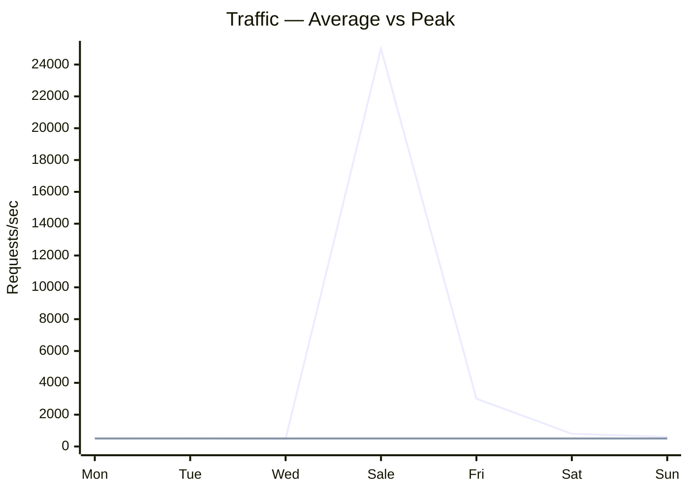

# 92. Law 33: Most Traffic Is Uneven

> **Think:** *"What happens at 50× average — not at 2×?"*

---

## The 4 Questions

| Question | Answer |
|----------|--------|
| **What problem does it solve?** | Capacity planning for average load when reality is spikes — festivals, flash sales, viral moments, Monday morning peaks. |
| **What happens if I ignore it?** | System sized for 500 req/s average dies at 25,000 req/s peak. "It handled load tests" but load tests used flat traffic. |
| **Where would I use it?** | Capacity planning, auto-scaling policies, sale preparation, rate limiting, queue sizing, CDN pre-warming. |
| **What companies use it?** | Nykaa (flash sales), ticket platforms (on-sale moments), news sites (breaking news), travel (holiday booking windows). |

---

## Mental Movie (60 seconds)

**Capacity plan:** "We average 500 requests/second. Peak is maybe 2× = 1000. We'll provision for 1500."

**Reality — Diwali sale:**
```
Hour 1:  500 req/s   (normal)
Hour 2:  800 req/s   (warming up)
Hour 3: 25,000 req/s (sale opens)
Hour 4: 18,000 req/s (still hot)
Hour 5:  2,000 req/s (cooling)
Hour 6:    600 req/s (normal)
```

**Systems fail during peaks, not averages.**

The sale minute defines your architecture — not the quiet Tuesday afternoon.

---

## How It Works



### Peak Patterns

| Pattern | Example | Multiplier |
|---------|---------|------------|
| **Flash sale** | Nykaa Pink Friday | 20–50× |
| **Holiday booking** | Christmas travel | 5–10× |
| **Viral moment** | Influencer post | 100×+ (unpredictable) |
| **Daily peak** | 9 AM office hours | 2–3× |
| **Seasonal** | Summer vacation | 3–5× sustained |

### Design For Peaks

| Strategy | Law/Module |
|----------|------------|
| **Auto-scale** ahead of known events | Module 2 |
| **Queue** non-critical work | Law 91 |
| **Rate limit** abusive clients | Module 2 |
| **CDN/cache** pre-warm | Module 3 |
| **Load test at peak shape** | Not flat line |
| **Graceful degradation** | Drop recommendations, keep checkout |
| **Circuit breaker** on non-critical | Module 1 |

---

## Real-World Examples

### Your Travel Platform

**Winter Getaway sale — known peak:**

Preparation checklist:
- Load test at **30,000 req/s** shape (not 500)
- Pre-scale app servers 2→20 before hour 3
- Redis cluster warmed with catalog
- CDN cache bust pre-loaded
- Queue workers scaled 5→50
- Rate limit: 10 bookings/min per user (prevent bot abuse)
- **Degrade:** disable recommendations widget, keep search + checkout

**Unknown peak — viral TikTok:**
- Auto-scale policies (with 3–5 min lag — may not be enough)
- Static fallback page if overload
- Law 91: queue booking requests with "high demand" message

### Nykaa

Flash sales are **rehearsed events**. Capacity planned for 50× normal. Inventory layer pre-scaled. Payment partners notified. War room during sale. They don't plan for average — they plan for **opening minute**.

### Amazon

Prime Day: years of capacity planning. Pre-warming, cell isolation, synthetic load tests mimicking peak shape. "Average day" capacity is irrelevant.

---

## When Peak Planning Matters

| Plan for peaks when... | Action |
|------------------------|--------|
| **Known sale/event** | Pre-scale, rehearse, runbook |
| **Viral potential** | Auto-scale + degradation plan |
| **Partner SLAs** at risk | Queue + rate limit |
| **Financial exposure** | Oversell prevention at peak (Law 90) |

## Common Mistakes

| Mistake | Fix |
|---------|-----|
| Load test **flat** traffic | Ramp + spike shape |
| Size for **average** | Size for p99 peak or known event |
| Ignore **auto-scale lag** | Pre-warm before known peak |
| No **degradation** plan | Drop features before dropping checkout |

---

## Connection To Other Laws & Modules

| Connection | Link |
|------------|------|
| Law 91 (Queues) | Absorb peak overflow |
| Law 26 (Contention) | Peaks maximize contention |
| Law 23 (Bottleneck) | Peak reveals true bottleneck |
| Module 2: Rate Limiting | Protect during peaks |
| Module 10: Law 12 | Avoid work — less to do at peak |

---

## Peak Planning Template

| Event | Expected peak | Current capacity | Gap | Mitigation |
|-------|---------------|------------------|-----|------------|
| Diwali sale | 25K req/s | 3K req/s | 8× | Pre-scale + queue + CDN |

---

## Problem Simulation

System handles 2000 req/s in load test (flat, 30 min). Diwali sale: 15,000 req/s in first 60 seconds, then 8000 for 10 min.

Observed: 40% error rate minute 1, recovery minute 12.

**Questions:**
1. Why did flat load test mislead?
2. Three changes for next sale.
3. Which laws explain the failure chain?
4. Acceptable degradation during minute 1?

<details>
<summary>Answers</summary>

1. **Never tested spike shape** — connection pools, auto-scale, and queues sized for sustained 2000, not instant 15K (Law 33).
2. **(1) Pre-scale** before sale. **(2) Queue** booking overflow (Law 91). **(3) Load test spike** ramp 0→15K in 30s.
3. **Law 33** (uneven), **Law 26** (DB contention), **Law 23** (bottleneck), **Law 32** (no queue).
4. **Disable search facets, recommendations, reviews** — keep checkout + payment. Better partial service than 40% errors everywhere.

</details>

---

## Key Takeaway

Traffic is uneven — spikes define capacity requirements. Plan, load-test, and architect for the peak minute, not the average hour.

**Next:** [93 — Scale Amplifies Small Mistakes](./93-scale-amplifies-small-mistakes.md)
