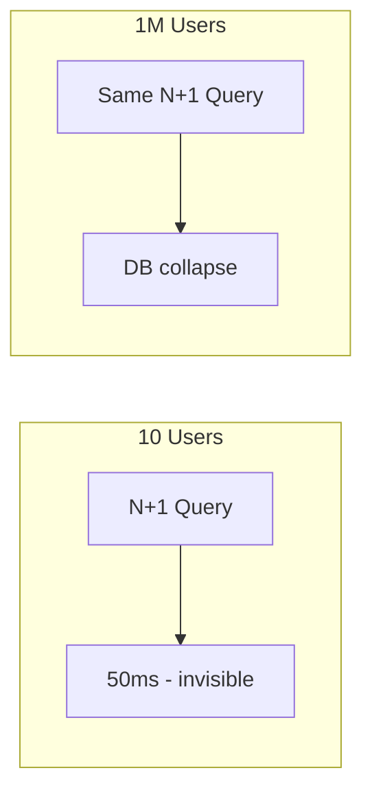

# 93. Law 34: Scale Amplifies Small Mistakes

> **Think:** *"This bug was invisible at 10 users — what happens at 1 million?"*

---

## The 4 Questions

| Question | Answer |
|----------|--------|
| **What problem does it solve?** | Dismissing "minor" inefficiencies — N+1 queries, missing indexes, large payloads — that are harmless at low traffic but catastrophic at scale. |
| **What happens if I ignore it?** | Same code that worked in dev takes down production. One missing index becomes 8-second queries × 100K users = DB death. |
| **Where would I use it?** | Code review, query audit, API design, "we'll fix it later" technical debt prioritization, pre-scale hardening. |
| **What companies use it?** | Every team that said "works on my machine" then melted at launch. Scale is the magnifying glass. |

---

## Mental Movie (60 seconds)

**At 10 users:**

```python
for booking in get_user_bookings(user_id):      # 1 query
    hotel = get_hotel(booking.hotel_id)         # N queries — 10 hotels
```
11 queries. 50ms total. Nobody notices.

**At 1 million users, 340 bookings each:**

Same pattern on "My Trips" page load:
- 1 + 340 = **341 queries per page view**
- 100K concurrent users loading trips
- **34 million queries** hitting DB
- DB dies. App dies. Engineers discover N+1 for the first time.

**Scale magnifies inefficiencies.** The mistake was always there. Scale made it visible — and fatal.

---

## How It Works



### Mistakes That Scale Kills You

| Mistake | At 10 users | At 1M users |
|---------|-------------|-------------|
| **N+1 queries** | 11 queries, fine | Millions of queries/sec |
| **Missing index** | 50ms scan | 30s scan × traffic |
| **`SELECT *`** | Small payload | GB/sec over network |
| **No pagination** | 340 rows | 5M rows in one response |
| **Repeated API calls** | 6 calls, 300ms | 6 × 100K users = partner ban |
| **Unbounded cache** | 10 MB Redis | OOM kill |
| **Sync external call** | 400ms wait | Thread pool exhausted |
| **Log everything DEBUG** | Fine | Disk full in minutes |

### The Magnification Formula

```
Pain = (inefficiency per request) × (requests per second) × (duration)
```

Tiny inefficiency × massive traffic × sustained peak = catastrophe.

---

## Real-World Examples

### Your Travel Platform

**Pre-scale audit findings:**

| Issue | Per-request cost | At 10K req/s |
|-------|------------------|--------------|
| N+1 on search cards | +40 DB queries | 400K extra queries/s |
| No index on `booking_status` | +2s per cron | Cron blocks DB 2 min |
| 800KB search JSON | +600ms transfer on 4G | Mobile users abandon |
| Countries fetched every request | 50K redundant DB reads/day | Redis fix: 1 read/day |

**One week of fixes** before Diwali sale prevented outage. Same code "worked" for a year at low traffic.

### Nykaa

Pre-sale code freeze includes **scale review**: query plans, payload sizes, cache hit rates. Bugs that survived dev are caught because team asks "what at 50×?"

### Amazon

"Correction of errors" — post-incident reviews often trace to O(n) operations that were O(1) at launch. Amazon mandates pagination, query budgets, and load tests before feature launch.

---

## When To Hunt Amplified Mistakes

| Hunt before... | Focus |
|----------------|-------|
| **Marketing campaign** | Top 5 endpoints by traffic |
| **10× growth** milestone | EXPLAIN on all hot queries |
| **Microservices split** | N+1 becomes network N+1 (worse) |
| **Mobile launch** | Payload size per screen |
| **International expansion** | Cross-region calls (Law 28) |

## Prevention Habits

| Habit | Catches |
|-------|---------|
| **EXPLAIN** every new query on large tables | Missing indexes |
| **Pagination** by default | Unbounded result sets |
| **APM** on staging with realistic data volume | N+1 patterns |
| **Load test** with production-shaped data | Everything |
| **Code review:** "cost at 100K users?" | Mental amplification |

---

## Connection To Other Laws & Modules

| Connection | Link |
|------------|------|
| Law 23 (Bottleneck) | Amplified mistake becomes bottleneck |
| Law 33 (Peaks) | Peak × mistake = outage |
| Module 11: Law 19 | Bad queries amplified |
| Module 3: Indexing, Pagination | Fixes for common mistakes |
| Module 10: Law 3 | Repetition amplified |

---

## Scale Review Checklist

For each hot endpoint:

- [ ] Query count per request (N+1?)
- [ ] EXPLAIN on largest table access
- [ ] Response payload size
- [ ] External API calls per request
- [ ] Memory allocation per request
- [ ] Tested with **realistic row counts** (not empty dev DB)

---

## Problem Simulation

"My Trips" endpoint:

```python
bookings = db.query("SELECT * FROM bookings WHERE user_id = ?", user_id)
for b in bookings:
    b.hotel = db.query("SELECT * FROM hotels WHERE id = ?", b.hotel_id)
    b.payment = db.query("SELECT * FROM payments WHERE id = ?", b.payment_id)
```

Average user: 50 bookings. Page load: 10K req/s at peak.

**Questions:**
1. Queries per request?
2. Total queries/sec at peak?
3. Three fixes.
4. Why didn't QA catch this?

<details>
<summary>Answers</summary>

1. **1 + 50 + 50 = 101 queries** per request (N+1 on hotels and payments).
2. **1,010,000 queries/sec** — instant DB death.
3. **(1) JOIN or batch `WHERE IN`**. **(2) `SELECT` only needed columns, add pagination**. **(3) Cache trip list per user with invalidation**.
4. **QA used test users with 2 bookings** (3 queries felt fine). Law 34 — mistake invisible at small N. Need realistic data volume in staging.

</details>

---

## Key Takeaway

Scale magnifies every inefficiency. The N+1 query, missing index, and bloated payload that "works fine" in dev will become your production incident at growth.

**Next:** [94 — The Goal Is Predictability](./94-the-goal-is-predictability.md)
