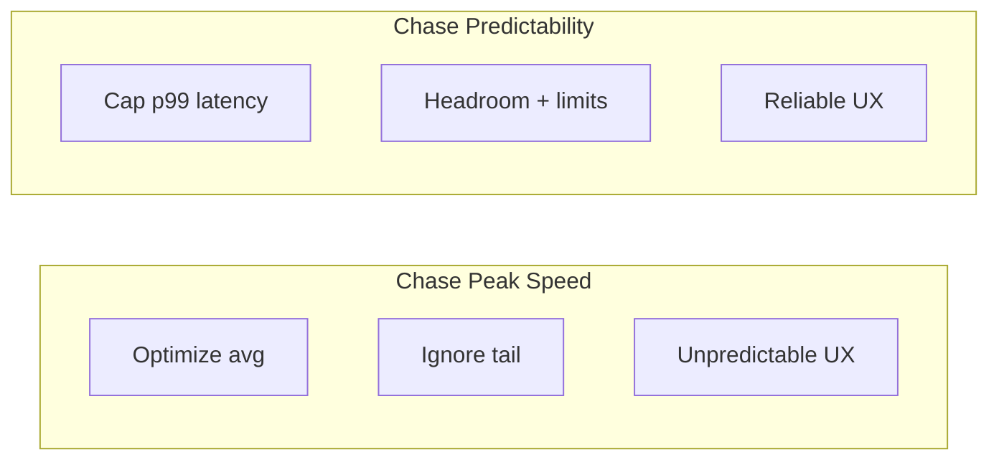

# 94. Law 35: The Goal Is Predictability

> **Think:** *"Would I rather be fast sometimes — or reliably fast enough?"*

---

## The 4 Questions

| Question | Answer |
|----------|--------|
| **What problem does it solve?** | Chasing peak benchmark numbers while p99 latency swings wildly — users experience the tail, not the average. |
| **What happens if I ignore it?** | Avg latency 50ms looks great in dashboards. Users hit 4-second loads randomly. Trust erodes. "The app is flaky." |
| **Where would I use it?** | SLO design, timeout budgets, circuit breakers, load shedding, capacity headroom, graceful degradation. |
| **What companies use it?** | Google SRE (error budgets), Amazon (p99 SLAs), every team that learned average latency lies. |

---

## Mental Movie (60 seconds)

**System A — "fast":**
```
Request latencies: 10ms, 20ms, 4000ms, 50ms, 15ms, 8000ms, 30ms
Average: ~870ms (misleading)
p99: 8000ms
User experience: "Sometimes it's instant, sometimes I give up"
```

**System B — "predictable":**
```
Request latencies: 100ms, 110ms, 95ms, 105ms, 100ms, 120ms, 95ms
Average: 103ms
p99: 120ms
User experience: "It always feels the same — reliable"
```

**System B is healthier** for a booking platform. Users plan trips — they need trust, not lottery.

> **Consistency of performance often matters more than peak speed.**

---

## How It Works



### Metrics That Matter

| Metric | What it tells you | Target mindset |
|--------|-------------------|----------------|
| **Average** | Misleading — hides outliers | Don't optimize this alone |
| **p50 (median)** | Typical experience | Baseline |
| **p99** | Worst 1% — real user pain | **Primary SLO** |
| **p999** | Extreme tail | Investigate outliers |
| **Error rate** | Reliability | < 0.1% for checkout |

### Tools for Predictability

| Tool | How it helps |
|------|--------------|
| **Timeouts** | Cap how long any hop can stall |
| **Circuit breaker** | Stop calling failing deps (Module 1) |
| **Rate limiting** | Prevent overload cascade |
| **Load shedding** | Drop low-priority work under stress |
| **Queue with backpressure** | Smooth spikes (Law 91) |
| **Headroom** | Run at 60% capacity, not 95% |
| **Graceful degradation** | Slow features before core fails |

---

## Real-World Examples

### Your Travel Platform

**SLO targets:**

| Endpoint | p99 target | Error budget |
|----------|------------|--------------|
| Search | 500ms | 99.9% |
| Hotel detail | 800ms | 99.9% |
| Checkout | 2s | 99.99% |
| Payment | 3s | 99.99% |

**Predictability tactics:**
- Timeout every internal call at 200ms — fail fast, don't queue
- Circuit breaker on supplier API — show "availability updating" not 30s hang
- Shed: disable "similar hotels" before search slows
- **Never** run DB at 95% CPU — scale at 70%

**Bad:** Optimized search to 50ms avg by aggressive cache — but cache miss = 6s. Users can't trust it.

**Good:** Search p99 400ms consistently. Cache helps avg, but miss path still bounded.

### Nykaa

Sale UX: slightly slower but **consistent** "add to cart" beats fast-then-timeout. Progress indicators during queue. Predictable > flashy.

### Amazon

"Sustainable performance" — systems designed for steady p99, not benchmark wins. Auto-scale with headroom. Error budgets per team.

---

## When To Prioritize Predictability

| Prioritize when... | Why |
|--------------------|-----|
| **Trust-critical** flows | Booking, payment, healthcare |
| **High tail latency** | p99 >> p50 |
| **Cascading dependencies** | One slow hop stalls all |
| **Mobile users** on variable networks | Tail matters more |
| **SLA commitments** | B2B partners measure p99 |

## When Peak Speed Still Matters

| Peak speed when... | Example |
|--------------------|---------|
| **Real-time** interaction | Live auction, gaming |
| **Competitive differentiator** | Sub-100ms trading |
| **Tail already bounded** | Optimize avg after p99 fixed |

**Order of operations:** Fix p99 first. Then optimize average.

---

## Connection To Other Laws & Modules

| Connection | Link |
|------------|------|
| Law 33 (Peaks) | Peaks destroy predictability |
| Law 28 (Networks) | Network adds tail latency |
| Law 23 (Bottleneck) | Saturated resource = tail spikes |
| Module 1: Circuit Breaker | Bounds failure propagation |
| Module 10: Law 7 | Additive latency creates tail |
| Module 2: Backpressure | Maintains steady flow |

---

## SLO Worksheet

| Endpoint | p50 today | p99 today | p99 target | Biggest tail contributor |
|----------|-----------|-----------|------------|--------------------------|
| | | | | |

Fix the row with largest p99 gap first.

---

## Problem Simulation

Dashboards show:
- Search avg: 120ms ✅
- Search p99: 4.2s ❌
- Checkout avg: 800ms ✅
- Checkout p99: 12s ❌

Investigation: p99 spikes when supplier API slow (no timeout) and when DB connection pool waits.

**Questions:**
1. Which law explains avg vs p99 gap?
2. Two fixes for supplier API tail.
3. Is avg latency a useful alert?
4. What SLO would you set for checkout?

<details>
<summary>Answers</summary>

1. **Law 34/28** — rare slow paths (supplier, pool wait) dominate tail. Avg hides them. **Law 35** — chasing avg misses the point.
2. **(1) 500ms timeout** on supplier with cached fallback. **(2) Circuit breaker** — stop calling when supplier unhealthy.
3. **No** — alert on p99 and error rate. Avg can improve while tail worsens.
4. **Checkout p99 < 3s, error rate < 0.01%** — predictable booking completion. Optimize tail before avg.

</details>

---

## Key Takeaway

Predictable performance beats occasional peak speed. Design for p99, headroom, and bounded failure — users trust systems that behave consistently.

---

## Module Complete

You've finished **Module 12: The Laws of Scale**.

**The thirteen enduring truths:**
1. Every system has a bottleneck
2. Bigger machines eventually stop helping
3. Parallel work creates capacity
4. Shared resources create contention
5. Distribution increases complexity
6. Networks are expensive
7. Replication improves availability
8. Sharding improves capacity
9. Consistency and availability compete
10. Queues absorb spikes
11. Traffic is uneven
12. Scale amplifies mistakes
13. Predictability beats raw speed

**Previous chapter:** [Module 12 — The Laws of Scale](../module-12-laws-of-scale/)

**Next chapter:** [Module 13 — The Laws of Communication](../module-13-laws-of-communication/)

**Full handbook:** [Founder-Architect Handbook](../README.md)
