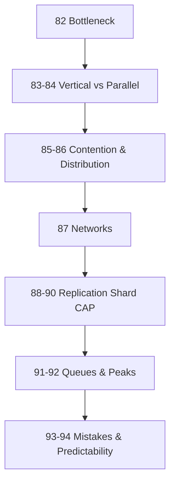

# Module 12: The Laws of Scale

*Chapter 3 — Foundations of Software Systems*

> **Topics 83–84, 88–89, 91 are ~3 min lenses on Modules 2, 4, 5.** Core unique topics: **82, 85–87, 92–94**. See [CONCEPT-INDEX](../CONCEPT-INDEX.md).

> **A system for 10 users and a system for 10 million users solve the same business problem. The difference is scale.**

Module 10 taught **forces**. Module 11 taught **data**. Module 12 teaches what emerges when growth stresses the system — bottlenecks, contention, distribution, and the tradeoffs that appear only under load.

---

## Prerequisites

Complete **[Module 11: Laws of Data](../module-11-laws-of-data/)** first. Scale laws assume you understand data ownership, copies, and consistency.

Helpful background:

| Module | Why it matters here |
|--------|---------------------|
| [Module 2: Scale](../module-02-scale/) | Vertical/horizontal scaling, load balancer, rate limiting |
| [Module 4: Data Systems](../module-04-data-systems/) | Replication, sharding, eventual consistency |
| [Module 5: Distributed Systems](../module-05-distributed-systems/) | Queues, pub/sub, sagas |
| [Module 10: Laws of Systems](../module-10-laws-of-software-systems/) | Latency additive, avoiding work |

---

## Topics

| # | Law | One-line principle | Read time |
|---|-----|-------------------|-----------|
| 82 | [Every System Has a Bottleneck](./82-every-system-has-a-bottleneck.md) | Capacity is set by the weakest link | ~12 min |
| 83 | [A Faster Horse Does Not Fix Traffic](./83-a-faster-horse-does-not-fix-traffic.md) | Bigger machines hit a ceiling | ~3 min *(lens)* |
| 84 | [Parallel Work Creates Scale](./84-parallel-work-creates-scale.md) | Independent work scales horizontally | ~3 min *(lens)* |
| 85 | [Shared Resources Become Contested](./85-shared-resources-become-contested.md) | Growth creates competition for resources | ~12 min |
| 86 | [Distribution Creates Complexity](./86-distribution-creates-complexity.md) | Many machines trade simplicity for scale | ~12 min |
| 87 | [Networks Are Not Instant](./87-networks-are-not-instant.md) | Remote calls ≠ local function calls | ~12 min |
| 88 | [Replication Buys Availability](./88-replication-buys-availability.md) | Copies survive failures | ~3 min *(lens)* |
| 89 | [Sharding Buys Capacity](./89-sharding-buys-capacity.md) | Split data to split workload | ~3 min *(lens)* |
| 90 | [Availability and Consistency Compete](./90-availability-and-consistency-compete.md) | CAP tension at scale | ~3 min *(lens)* |
| 91 | [Queues Absorb Chaos](./91-queues-absorb-chaos.md) | Spikes become manageable flow | ~3 min *(lens)* |
| 92 | [Most Traffic Is Uneven](./92-most-traffic-is-uneven.md) | Design for peaks, not averages | ~12 min |
| 93 | [Scale Amplifies Small Mistakes](./93-scale-amplifies-small-mistakes.md) | Invisible bugs become catastrophes | ~12 min |
| 94 | [The Goal Is Predictability](./94-the-goal-is-predictability.md) | Stable p99 beats occasional 10ms | ~12 min |

---

## The Scale Lens

| Lens | Asks |
|------|------|
| **Beginner** | "How many users can this handle?" |
| **Engineer** | "Where is CPU/memory maxed?" |
| **Architect** | **"What breaks first?"** |

This module trains the third lens.

---

## Learning Order



**Cluster 1 (Limits):** Laws 23, 24 — find the bottleneck, know when hardware stops helping
**Cluster 2 (Capacity):** Laws 25, 26 — parallel work and resource contention
**Cluster 3 (Distribution):** Laws 27, 28 — complexity and network cost
**Cluster 4 (Data at scale):** Laws 29, 30, 31 — replication, sharding, CAP
**Cluster 5 (Flow):** Laws 32, 33 — queues and traffic spikes
**Cluster 6 (Maturity):** Laws 34, 35 — amplified mistakes and predictable performance

---

## Cross-Module Map

| Law | Connects to Module |
|-----|-------------------|
| Every System Has a Bottleneck | Module 2: Scale; Module 10: Law 12 |
| A Faster Horse Does Not Fix Traffic | Module 2: Vertical Scaling |
| Parallel Work Creates Scale | Module 2: Horizontal Scaling, Load Balancer |
| Shared Resources Become Contested | Module 11: Law 15; Module 4: Transactions |
| Distribution Creates Complexity | Module 5: Distributed Systems |
| Networks Are Not Instant | Module 10: Law 7 (Latency Is Additive) |
| Replication Buys Availability | Module 4: Replication; Module 1: HA |
| Sharding Buys Capacity | Module 4: Sharding |
| Availability and Consistency Compete | Module 11: Law 16; Module 4: Eventual Consistency |
| Queues Absorb Chaos | Module 5: Message Queue; Module 2: Backpressure |
| Most Traffic Is Uneven | Module 2: Rate Limiting |
| Scale Amplifies Small Mistakes | Module 11: Law 19; Module 3: Indexing |
| The Goal Is Predictability | Module 1: Circuit Breaker; Module 10: Law 7 |

---

## Module Simulation

**Diwali flash sale.** Traffic jumps 50×. Trace each law:

1. **Law 23:** App handles 1000 req/s. DB handles 100. What's max capacity?
2. **Law 24:** Team proposes 32GB → 128GB RAM. Enough?
3. **Law 25:** Can booking validation run on 6 app servers in parallel?
4. **Law 26:** 1M users hit one PostgreSQL. What symptoms appear?
5. **Law 27:** Monolith → 8 microservices. What new failure modes?
6. **Law 28:** Search calls pricing, inventory, reviews sequentially. Cost?
7. **Law 29:** Primary DB dies. Do bookings still work?
8. **Law 30:** 50M users — one DB enough?
9. **Law 31:** Price update — India sees ₹5000, US sees ₹4800 for 3s. Acceptable?
10. **Law 32:** Post-booking email/invoice/notification — sync or queue?
11. **Law 33:** Planned for 500 req/s average. Peak is 25,000. What breaks?
12. **Law 34:** N+1 query invisible at 10 users. At 1M?
13. **Law 35:** p99 latency 2s with spikes to 30s. Better than avg 200ms?

Fix the architecture before adding servers.

---

## Architect's Reflection

Beginners ask: *"How many users can this handle?"*

Architects ask: *"What breaks first?"*

Growth is not the challenge. Finding and removing the **next bottleneck** is.

> A small system is a program. A large system is an ecosystem. The challenge is not making one machine stronger — it is teaching many machines to cooperate.

---

## PDFs

```bash
python3 md_to_pdf.py --dir learning/module-12-laws-of-scale --force
```

## Previous Module

**[Module 11: The Laws of Data](../module-11-laws-of-data/)** — Why data outlives code and owns architecture.

## Next Module

**[Module 13: The Laws of Communication](../module-13-laws-of-communication/)** — Who talks to whom, about what, and when.
