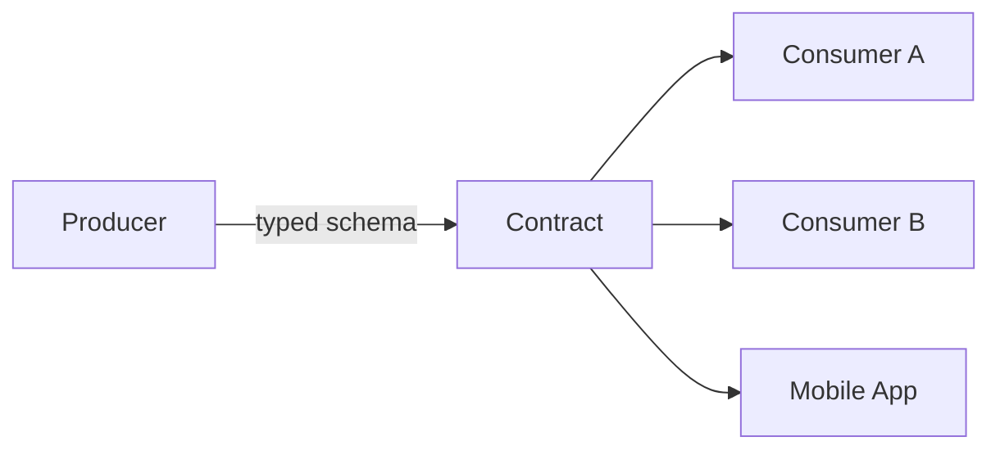

# 101. Law 42: Machines Prefer Structured Conversations

> **Think:** *"Could two different engineers interpret this payload differently?"*

---

## The 4 Questions

| Question | Answer |
|----------|--------|
| **What problem does it solve?** | Ambiguous APIs — `"status": "ok"`, missing fields, inconsistent date formats, prose in JSON — that cause integration bugs. |
| **What happens if I ignore it?** | Client parses `"success"` and `"Success"` differently. Amount in rupees vs paise. Timezone-less dates. Production incidents from ambiguity. |
| **Where would I use it?** | API schemas, OpenAPI specs, protobuf definitions, webhook payloads, event schemas. |
| **What companies use it?** | Stripe (exemplary API docs + typed errors), gRPC/protobuf shops, any company with OpenAPI-first design. |

---

## Mental Movie (60 seconds)

**Ambiguous:**
```json
{
  "result": "ok",
  "amount": "5000",
  "when": "tomorrow",
  "user": "rahul"
}
```
Is amount rupees or paise? Which timezone for "tomorrow"? Full name or username?

**Structured:**
```json
{
  "status": "payment_captured",
  "amount_paise": 500000,
  "currency": "INR",
  "captured_at": "2026-06-22T14:30:00+05:30",
  "user_id": "usr_101",
  "booking_id": "bkg_789"
}
```
One interpretation. Machines agree.

**Explicit contracts reduce communication risk.**

---

## How It Works

### Structure Checklist

| Element | Good practice |
|---------|---------------|
| **Field names** | Explicit: `amount_paise` not `amount` |
| **Enums** | Closed set: `pending \| captured \| failed` |
| **Types** | Number not string for money |
| **Timestamps** | ISO 8601 with timezone |
| **IDs** | Prefixed strings: `bkg_`, `pay_` |
| **Errors** | `{code, message, field}` shape |
| **Version** | `api_version` or URL `/v1/` |



---

## Real-World Examples

### Your Travel Platform

**Booking API response contract:**
```json
{
  "booking_id": "bkg_abc123",
  "status": "confirmed",
  "total_amount_paise": 4500000,
  "currency": "INR",
  "check_in": "2026-07-15",
  "check_out": "2026-07-18",
  "hotel": {
    "hotel_id": "htl_55",
    "name": "Goa Beach Resort"
  }
}
```

Publish OpenAPI spec. Mobile, web, partner API — all parse identically.

### Nykaa

Order status enum standardized across services. No team invents `"COMPLETE"` while another uses `"completed"`.

### Amazon

Protocol buffers internally — schema enforced at compile time. External REST with strict models.

---

## When Structure Matters Most

| Critical when... | |
|------------------|---|
| **Multiple consumers** of same API | |
| **Money** fields | |
| **Cross-team** integration | |
| **Webhooks** from partners | |
| **Events** on message bus | |

## Tools

| Tool | Use |
|------|-----|
| **OpenAPI** | REST contract |
| **JSON Schema** | Validation |
| **Protobuf** | gRPC contracts |
| **Avro** | Kafka events |

---

## Connection To Other Laws & Modules

| Connection | Link |
|------------|------|
| Law 43 | Contracts outlive code |
| Law 48 | gRPC/protobuf for machine speed + structure |
| Module 9 | API design patterns |

---

## Problem Simulation

Webhook payload changes silently:
- `amount` was rupees, now paise
- `status: "done"` renamed to `status: "completed"`

Finance reconciliation breaks. Mobile app shows ₹50 instead of ₹5000.

**Questions:**
1. Which law was violated?
2. Prevention?
3. Breaking change process?
4. Law 43 connection?

<details>
<summary>Answers</summary>

1. **Law 42** — ambiguous/unversioned contract. **Law 43** — contract broken without notice.
2. **Explicit schema**, versioned API, `amount_paise` naming, enum documentation, contract tests in CI.
3. **Version bump** `/v2/webhook`, deprecation period, dual-write period, consumer notification.
4. Contracts are **long-lived assets** — protect like production data.

</details>

---

## Key Takeaway

Machines need explicit, typed, unambiguous contracts. Structure the conversation so two implementations cannot disagree on meaning.

**Next:** [102 — Contracts Outlive Implementations](./102-contracts-outlive-implementations.md)
