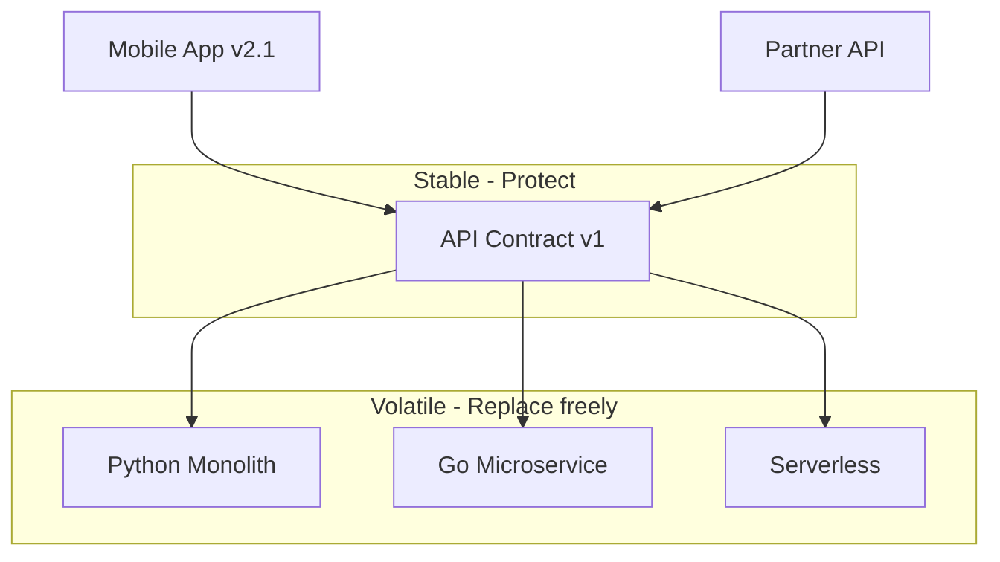

# 102. Law 43: Contracts Outlive Implementations

> **Think:** *"The backend will rewrite — will mobile apps still work?"*

---

## The 4 Questions

| Question | Answer |
|----------|--------|
| **What problem does it solve?** | Breaking API changes that orphan clients — mobile apps in the wild, partner integrations, third-party developers can't update instantly. |
| **What happens if I ignore it?** | Rename field → 50K mobile users crash. Change auth → partner integration down. "Just deploy together" fails for external consumers. |
| **Where would I use it?** | API versioning, deprecation policy, mobile backward compatibility, partner SLAs, public API governance. |
| **What companies use it?** | Stripe (API version headers, never break old versions), Twilio, GitHub API — contract stability as product promise. |

---

## Mental Movie (60 seconds)

**Year 1:** `GET /bookings/{id}` returns `{id, status, amount}`. Mobile app ships.

**Year 3:** Backend rewritten in Go from Python. Database migrated. Team restructures.

**Mobile app in user's pocket** still calls `GET /bookings/{id}` expecting `{id, status, amount}`.

If contract broke → app crashes for users who haven't updated.

**The API contract often survives longer than the code behind it.**

Protect contracts carefully. Breaking contracts breaks trust.

---

## How It Works

### Contract Protection Practices

| Practice | How |
|----------|-----|
| **Versioning** | `/v1/`, `/v2/` or version header |
| **Additive changes only** | New fields OK, removing fields not OK in v1 |
| **Deprecation window** | 6–12 months notice |
| **Contract tests** | CI fails if response shape breaks |
| **Changelog** | Published API changelog |
| **Mobile min version** | Force upgrade only when necessary |

---

## Real-World Examples

### Your Travel Platform

**Safe change:** Add `carbon_offset_kg` to booking response — old apps ignore it.

**Breaking change:** Rename `amount` to `total_price` — old apps break.

**Policy:**
- v1 frozen except additive fields
- v2 for breaking redesign
- Mobile supports v1 for 18 months after v2 launch

### Nykaa

Mobile apps can't force-update all users overnight. API backward compatibility is **release blocker** for backend deploys.

### Amazon

AWS API compatibility legendary — decade-old SDK calls still work. Contract is the product.

---

## When To Break Contracts

| Break only when... | Mitigation |
|--------------------|------------|
| **Security** vulnerability | Emergency, communicate fast |
| **< 1% traffic** on old version | Sunset metrics |
| **All consumers** under your control | Coordinated deploy |
| **Major version** with migration path | v2 + deprecation period |

## Never Break Silently

| Bad | Good |
|-----|------|
| Deploy breaking change Friday | Version bump + changelog |
| "Fix the app" | Support old contract N months |
| Undocumented field removal | Deprecation warning in response |

---

## Connection To Other Laws & Modules

| Connection | Link |
|------------|------|
| Law 42 | Structure enables stable contracts |
| Law 44 | Contract is coupling surface |
| Module 11: Law 13 | Data/API longevity parallel |
| Module 9 | Public API design |

---

## Problem Simulation

Backend team removes `hotel_name` from booking response — "clients should fetch from hotel API." Mobile app displays blank hotel name for 200K users.

**Questions:**
1. Which law violated?
2. Correct migration path?
3. Who are the contract consumers?
4. Contract test that would have caught this?

Answers

1. **Law 43** — broke contract mobile depended on.
2. **Phase 1:** Add deprecation header, keep field populated. **Phase 2:** Ship mobile update using hotel API. **Phase 3:** Remove field in v2 after adoption metrics.
3. **Mobile iOS/Android**, partner white-label, internal support dashboard, cached offline trips.
4. **Snapshot test** — `GET /bookings/123` response matches JSON schema; CI fails on removed field.

---

## Key Takeaway

API contracts outlive backend implementations. Add freely, remove rarely, version intentionally — clients in the wild can't deploy when you do.

**Next:** [103 — Communication Creates Coupling](./103-communication-creates-coupling.md)
