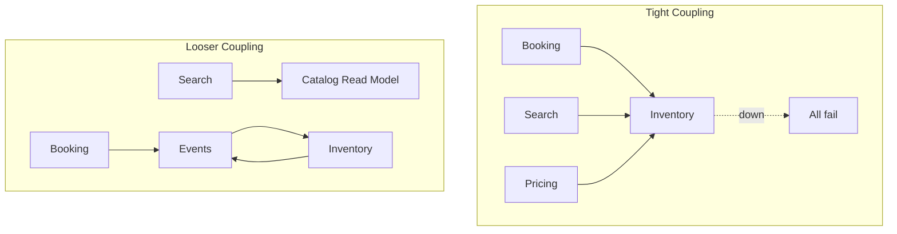

# 103. Law 44: Communication Creates Coupling

> **Think:** *"If they go down — who else stops talking?"*

---

## The 4 Questions

| Question | Answer |
|----------|--------|
| **What problem does it solve?** | Spaghetti integrations — every service calling every other service directly, creating fragile dependency webs. |
| **What happens if I ignore it?** | Inventory service down → search, booking, pricing, notifications all fail. One team's deploy breaks four teams. |
| **Where would I use it?** | Service boundary design, dependency graphs, circuit breakers, event-driven decoupling. |
| **What companies use it?** | Amazon (dependency audits), Netflix (Hystrix), any team that learned "shared everything" doesn't scale organizationally. |

---

## Mental Movie (60 seconds)

```
Booking Service ──calls──► Inventory Service
Booking Service ──calls──► Pricing Service
Booking Service ──calls──► Payment Service
Search Service  ──calls──► Inventory Service
Search Service  ──calls──► Pricing Service
Pricing Service ──calls──► Inventory Service
```

**Inventory goes down.**

Booking fails. Search fails. Pricing fails. **Three user-facing features dead** from one dependency.

**The more direct communication paths exist, the more coupling.**

Communication increases dependency. Dependency increases complexity.

---

## How It Works



### Coupling Reduction Strategies

| Strategy | How |
|----------|-----|
| **Events** | Publish facts, don't call (Law 47) |
| **Cache/read model** | Search reads catalog snapshot, not live inventory every time |
| **Circuit breaker** | Fail fast when dependency down (Module 1) |
| **Timeouts** | Don't wait forever (Law 109) |
| **Async** | Don't block user on non-critical call (Law 45) |
| **BFF** | Aggregate server-side, one client call |

---

## Real-World Examples

### Your Travel Platform

**Tight coupling mistake:** Search calls Inventory live on every result row for availability.

**Looser:** Search index updated every 30s with availability snapshot. Checkout does live inventory check (sync, one call).

**Inventory outage:** Search still works (stale availability). Checkout pauses — acceptable degradation.

### Nykaa

Catalog service decoupled from inventory for browse. Inventory reserved only at cart/checkout. Browse survives inventory blip.

### Amazon

"Dependency hygiene" — services declare upstreams. Too many = architecture review. Prefer events over synchronous chains.

---

## When Direct Calls Are OK

| Direct sync OK when... | |
|------------------------|---|
| **Critical path** requires live data | Checkout inventory |
| **Two services**, one conversation | |
| **Strong consistency** required | Payment |
| **Low fan-out** | A calls B, not A calls B,C,D,E |

## When To Decouple

| Decouple when... | Pattern |
|------------------|---------|
| **3+ services** call same dependency | Event or read model |
| **Non-critical** path blocks on failure | Async/circuit breaker |
| **Deploy independence** needed | Contract + events |

---

## Connection To Other Laws & Modules

| Connection | Link |
|------------|------|
| Law 47 | Events reduce coupling |
| Law 45 | Async reduces sync coupling |
| Module 12: Law 27 | Distribution complexity |
| Module 1: Circuit Breaker | Contain coupling blast radius |

---

## Problem Simulation

Architecture: 8 services, 47 direct synchronous HTTP dependencies. Inventory service deploy breaks search for 20 minutes.

**Questions:**
1. Which law explains blast radius?
2. Draw dependency count for search page.
3. Two decoupling changes.
4. What still needs sync call to inventory?

<details>
<summary>Answers</summary>

1. **Law 44** — communication coupling. **Law 12:27** — distribution complexity.
2. Likely **Search → Inventory, Pricing, Reviews, Recommendations** — 4+ sync deps per request.
3. **(1) Catalog read model** with cached availability for search. **(2) BookingCreated events** instead of booking calling 5 services sync.
4. **Checkout inventory reservation** — money and oversell risk require live sync check.

</details>

---

## Key Takeaway

Every direct communication path is a dependency. More paths = more coupling. Reduce sync fan-out with events, caches, and circuit breakers — keep tight coupling only where business demands it.

**Next:** [104 — Asynchronous Communication Buys Flexibility](./104-asynchronous-communication-buys-flexibility.md)
