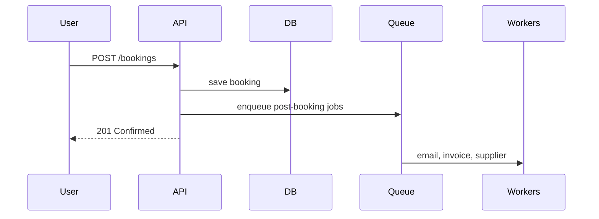

# 104. Law 45: Asynchronous Communication Buys Flexibility

> **Think:** *"Does the user need this answer before we respond — or can it happen after?"*

---

## The 4 Questions

| Question | Answer |
|----------|--------|
| **What problem does it solve?** | Synchronous chains that block users on slow or non-critical work — email, PDF, analytics, supplier notify. |
| **What happens if I ignore it?** | Checkout waits 3 seconds for email API. User timeout. Supplier slowness kills booking UX. |
| **Where would I use it?** | Post-transaction workflows, notifications, report generation, webhook processing, fan-out to many systems. |
| **What companies use it?** | Every ecommerce checkout — confirm order sync, everything else async. |

---

## Mental Movie (60 seconds)

**Synchronous:**
```
User clicks Book
  → charge card     400ms
  → write DB        100ms
  → send email      800ms  ← user waits
  → generate PDF    600ms  ← user waits
  → notify supplier 2000ms ← user waits, may timeout
Total: 3900ms — supplier down = booking fails
```

**Asynchronous:**
```
User clicks Book
  → charge card     400ms
  → write DB        100ms
  → enqueue jobs      5ms
  → return "Confirmed!" 505ms

Background: email, PDF, supplier — over next 60s
```

**Time becomes a resource. Work can be delayed.**

> **Overlaps [Module 12: Law 32](../module-12-laws-of-scale/91-queues-absorb-chaos.md) — scale lens. Here: communication flexibility lens.**

---

## How It Works



### Sync vs Async Decision

| Synchronous | Asynchronous |
|-------------|--------------|
| User needs **answer now** | User can wait minutes |
| **Money/inventory** decision | **Side effects** |
| **Failure = abort** transaction | **Failure = retry** later |
| Payment authorization | Confirmation email |

---

## Real-World Examples

### Your Travel Platform

**Sync critical path:**
- Validate dates, inventory, price
- Charge payment
- Persist booking record
- Return confirmation ID

**Async after response:**
- Email/SMS confirmation
- GST invoice PDF
- Supplier API booking
- Analytics event
- Loyalty points
- Search index update

### Nykaa

Order confirmed in app before warehouse picks item. Customer doesn't wait for warehouse conversation.

### Amazon

"Thank you for your order" before item leaves shelf. Async fulfillment pipeline.

---

## When Async Wins

| Async when... | |
|---------------|---|
| Work **doesn't affect** user's immediate answer | |
| **Downstream may be slow** or down | |
| **Many subscribers** need same event | |
| **Retry** acceptable | |

## When Sync Required

| Sync when... | |
|--------------|---|
| User must know **success/failure now** | |
| **Transactional integrity** across steps | |
| **Inventory/money** committed together | |

---

## Connection To Other Laws & Modules

| Connection | Link |
|------------|------|
| Law 105 | Queues implement async |
| Law 100 | Webhook handler should async |
| Law 44 | Async reduces coupling |
| Module 5: Message Queue | Tactical patterns |

---

## Problem Simulation

Checkout blocks on supplier API (2s avg, 30s timeout). Supplier outage = no bookings.

**Questions:**
1. Law 45 fix?
2. User risk if supplier never confirms?
3. Reconciliation approach?
4. What stays synchronous?

<details>
<summary>Answers</summary>

1. **Confirm booking after payment** → queue `SupplierBookingRequest` → worker calls supplier with retries.
2. **Booking exists, supplier pending** — show "confirming with hotel" status, email when supplier confirms or ops intervenes.
3. **Reconciliation job** — poll supplier for stuck bookings, alert ops, auto-cancel + refund if 24h no confirm.
4. **Payment + DB write + inventory hold** — user must know these succeeded now.

</details>

---

## Key Takeaway

Separate the user's critical conversation (sync) from everything else (async). Time becomes a resource — use it to decouple and survive slow partners.

**Next:** [105 — Queues Absorb Uncertainty](./105-queues-absorb-uncertainty.md)
