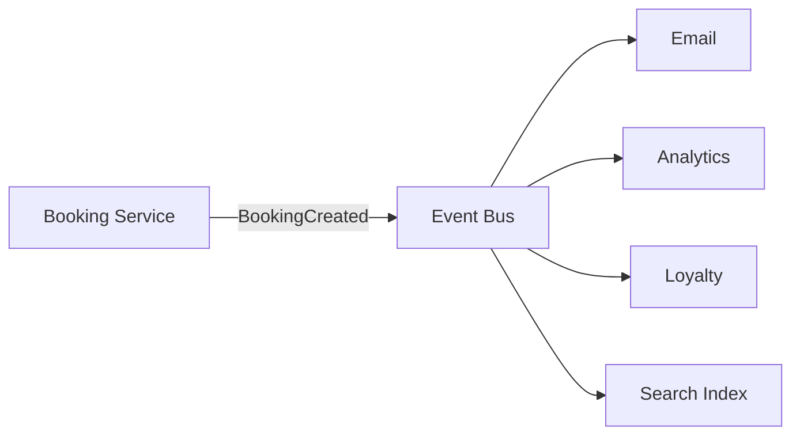

# 106. Law 47: Events Describe Facts

> **Think:** *"Am I giving an order — or announcing what already happened?"*

---

## The 4 Questions

| Question | Answer |
|----------|--------|
| **What problem does it solve?** | Command-heavy coupling — every service telling every other service what to do, creating orchestration spaghetti. |
| **What happens if I ignore it?** | Booking service calls Email, Analytics, Loyalty, Search, Finance synchronously — new subscriber = change booking service. |
| **Where would I use it?** | Event-driven architecture, pub/sub, audit trails, CQRS projections, loose coupling between domains. |
| **What companies use it?** | Uber (trip events), Netflix (event-driven), Amazon (event notifications internal), any pub/sub at scale. |

---

## Mental Movie (60 seconds)

**Commands (tight coupling):**
```
Booking Service ──► Email Service: "SendConfirmationEmail(booking_id)"
Booking Service ──► Analytics: "RecordBooking(booking_id)"
Booking Service ──► Loyalty: "AddPoints(user_id, 500)"
Booking Service ──► Search: "UpdateIndex(hotel_id)"
```
Booking service **knows every subscriber** and **orders them around**.

**Events (loose coupling):**
```
Booking Service ──► Event Bus: BookingCreated {booking_id, user_id, hotel_id, amount}

Email Service    ◄── hears BookingCreated → sends email
Analytics        ◄── hears BookingCreated → records metric
Loyalty          ◄── hears BookingCreated → adds points
Search           ◄── hears BookingCreated → updates index
```
Booking service **announces a fact**. Subscribers **react independently**.

**Commands say: Do something. Events say: Something happened.**

---

## How It Works



### Command vs Event

| | Command | Event |
|---|---------|-------|
| **Intent** | Do this | This happened |
| **Coupling** | Sender knows receiver | Sender may not know subscribers |
| **Tense** | Imperative | Past tense |
| **Example** | `ReserveRoom(hotel_id)` | `RoomReserved(hotel_id)` |
| **Failure** | Caller handles | Subscriber retries |

### Event Properties

| Property | Why |
|----------|-----|
| **Immutable** | Facts don't change — `BookingCreated` not `UpdateBooking` |
| **Named past tense** | `PaymentSucceeded`, `RefundProcessed` |
| **Self-contained payload** | Subscribers don't callback for basics |
| **Versioned schema** | Law 42 — structured contracts |

---

## Real-World Examples

### Your Travel Platform

**Events on booking:**
- `BookingCreated` — email, analytics, loyalty, search
- `PaymentCaptured` — finance, confirmation upgrade
- `BookingCancelled` — refund worker, supplier cancel, inventory release

**New feature "Referral bonus"** — subscribe to `BookingCreated`. **Zero changes** to booking service (Law 44).

### Nykaa

Order lifecycle as event stream. New warehouse integration listens to `OrderPlaced` — doesn't require order service modification.

### Amazon

DynamoDB streams, SNS/SQS — facts propagate. Services react without central orchestrator knowing all consumers.

---

## When Events Win

| Events when... | |
|----------------|---|
| **Multiple systems** react to same fact | |
| **New subscribers** added frequently | |
| **Audit trail** needed | |
| **Temporal decoupling** — react later | |

## When Commands Win

| Commands when... | |
|------------------|---|
| **One receiver** must act | `ReserveInventory` |
| **Success/failure** needed immediately | Payment authorize |
| **Saga orchestration** | Multi-step with compensation |

---

## Connection To Other Laws & Modules

| Connection | Link |
|------------|------|
| Law 44 | Events reduce coupling |
| Law 105 | Events often queued |
| Module 5: Pub/Sub, Event-Driven | Implementation |
| Module 5: Event Sourcing | Events as primary record |

---

## Problem Simulation

Add "carbon offset certificate" feature. Current: booking service calls 6 services sync. Team estimates 3-week change to booking service.

**Questions:**
1. How do events change estimate?
2. Event name and payload?
3. Command vs event for "purchase offset"?
4. Law 44 connection?

<details>
<summary>Answers</summary>

1. **New CarbonOffset worker** subscribes to `BookingCreated` — booking service unchanged. Estimate: days not weeks.
2. **`BookingCreated`** `{booking_id, user_id, nights, hotel_city}` — worker calculates offset, emits `CarbonOffsetPurchased`.
3. **Command** to offset provider API (do something). **Event** `CarbonOffsetPurchased` when done (fact for receipt email).
4. **Decoupled** — no new direct communication path from booking to carbon service.

</details>

---

## Key Takeaway

Publish facts (`BookingCreated`), not orders (`SendEmail`). Events let many systems react independently — flexibility scales better than orchestration.

**Next:** [107 — Different Conversations Need Different Languages](./107-different-conversations-need-different-languages.md)
