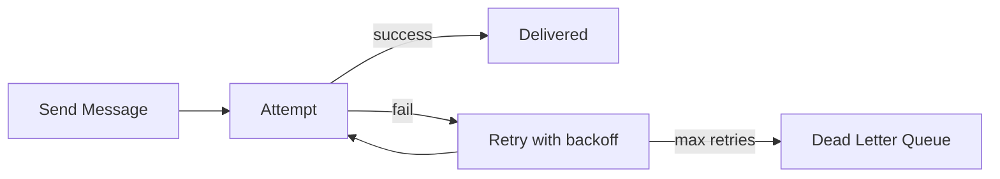

# 108. Law 49: Reliability Is More Valuable Than Speed

> **Think:** *"Would I rather have a fast message that never arrives?"*

---

## The 4 Questions

| Question | Answer |
|----------|--------|
| **What problem does it solve?** | Optimizing for raw throughput/latency while messages get lost — dropped webhooks, fire-and-forget events, no retry. |
| **What happens if I ignore it?** | Fast booking API that loses 0.1% of confirmations = thousands of angry customers. Payment webhook dropped = money without booking. |
| **Where would I use it?** | Message delivery guarantees, webhook retry, idempotent consumers, at-least-once queues, acknowledgment protocols. |
| **What companies use it?** | Stripe (webhook retries for days), Kafka (durable log), SQS (visibility timeout + retry), banks (guaranteed delivery). |

---

## Mental Movie (60 seconds)

**Fast but unreliable:**
```
Fire webhook to client → no retry → 2% network fail → lost forever
Booking confirmed in DB, customer never notified, finance never reconciled
```

**Slightly slower but reliable:**
```
Queue webhook delivery → retry 5× exponential backoff → DLQ alert if still fail
99.99% delivery → 0.01% in DLQ for manual replay
```

A **fast message never delivered has no value.**

A **slightly slower message delivered reliably** enables business.

---

## How It Works

| Guarantee | Meaning | Tradeoff |
|-----------|---------|----------|
| **At-most-once** | May lose, never duplicate | Fast, risky |
| **At-least-once** | Never lose, may duplicate | Retry + idempotency |
| **Exactly-once** | Hard, expensive | Kafka transactions, complex |

**Default for money/bookings: at-least-once + idempotent handlers.**



---

## Real-World Examples

### Your Travel Platform

| Message | Reliability approach |
|---------|---------------------|
| Booking confirmation email | Queue + 3 retries + DLQ |
| Razorpay webhook processing | Idempotent handler + ack after persist |
| `BookingCreated` event | Kafka ack after consumer commit |
| Analytics event | At-most-once OK (loss tolerable) |

**Not all messages equal** — reliability investment matches business cost of loss.

### Nykaa

Order confirmation path: at-least-once. Recommendation click tracking: at-most-once acceptable.

### Amazon

SQS, SNS with DLQ. Payment and order messages: durability non-negotiable.

---

## When Reliability Beats Speed

| Prioritize reliability when... | |
|--------------------------------|---|
| **Money** or booking state involved | |
| **Legal/audit** trail required | |
| **Downstream can't recover** from loss | |
| **Partner webhook** — you must process | |

## When Speed Can Win

| Speed OK when... | |
|------------------|---|
| **Metrics/logging** — loss tolerable | |
| **Recommendations** — stale OK | |
| **Best-effort** notifications (non-critical) | |

---

## Connection To Other Laws & Modules

| Connection | Link |
|------------|------|
| Law 109 | Failures happen — retry them |
| Law 110 | Trust + verify delivery |
| Module 1: Idempotency | At-least-once requires it |
| Module 5: DLQ | Failed message handling |

---

## Problem Simulation

Webhook handler returns 200 before writing to DB. Process crashes. Razorpay doesn't retry (got 200). Booking paid but not confirmed.

**Questions:**
1. Reliability bug?
2. Correct ack timing?
3. Law 49 vs speed tradeoff?
4. Reconciliation backup?

<details>
<summary>Answers</summary>

1. **Ack before durable write** — message considered delivered but work lost.
2. **Persist idempotently first**, then return 200. Or queue + 200 after enqueue (Law 105).
3. **+20ms latency** for DB write beats **lost payment events**.
4. **Nightly reconciliation** — Razorpay settlements vs booking DB (belt and suspenders).

</details>

---

## Key Takeaway

Delivered beats fast. Invest in retries, durable queues, and idempotent handlers for messages that matter — accept loss only where business allows.

**Next:** [109 — Communication Failures Are Normal](./109-communication-failures-are-normal.md)
