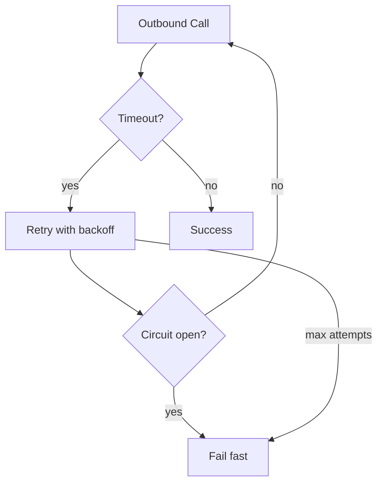

# 109. Law 50: Communication Failures Are Normal

> **Think:** *"What happens when this call times out — not if?"*

---

## The 4 Questions

| Question | Answer |
|----------|--------|
| **What problem does it solve?** | Assuming the network always works — no timeouts, no retries, no circuit breakers, surprised when production fails. |
| **What happens if I ignore it?** | Thread pools exhausted waiting on dead services. Retry storms amplify outages. Users see infinite spinners. |
| **Where would I use it?** | Every outbound HTTP call, DB connection, queue consumer, webhook handler — timeout + retry + circuit breaker by default. |
| **What companies use it?** | Netflix (Hystrix), Google SRE, every mature distributed system — failure is the normal case at scale. |

---

## Mental Movie (60 seconds)

**Beginner assumption:**
```
response = payment_service.charge(amount)
# always returns in 200ms
```

**Production reality:**
```
Timeout after 30s (service hung)
Connection reset (pod restarted mid-request)
503 Service Unavailable (deploy in progress)
429 Too Many Requests (rate limited)
Duplicate response (client retried, idempotency saved you)
```

**Timeouts, dropped packets, retries, service failures, rate limits — inevitable.**

Design for failure. Not perfection.

> **Tactical toolkit:** [Module 1: Reliability](../module-01-reliability/) — Retry, Circuit Breaker, Idempotency.

---

## How It Works



### Failure Toolkit

| Tool | When |
|------|------|
| **Timeout** | Every external call — 200ms–5s based on path |
| **Retry + backoff** | Transient failures (503, timeout) |
| **Idempotency** | Safe retries (Module 1) |
| **Circuit breaker** | Stop calling failing dependency |
| **Fallback** | Cached data, degraded mode |
| **Bulkhead** | Isolate thread pools per dependency |

---

## Real-World Examples

### Your Travel Platform

| Call | Timeout | On failure |
|------|---------|------------|
| Payment charge | 10s | Fail booking, show retry |
| Supplier notify | 5s | Queue retry, don't block user |
| Search index | 2s | Circuit open, DB fallback search |
| Razorpay webhook | 30s handler | Return 500, they retry |

### Nykaa

Circuit breakers on recommendation service — catalog still loads if recommendations down.

### Amazon

"Everything fails all the time" — Werner Vogels. Architecture assumes failure as steady state.

---

## When To Design For Failure

| Always — for every... | |
|-----------------------|---|
| **Network call** | |
| **External partner API** | |
| **Cross-service** RPC | |
| **Database** under load | |
| **Queue consumer** | |

## Failure Anti-Patterns

| Anti-pattern | Fix |
|--------------|-----|
| No timeout | Add timeout |
| Instant retry loop | Exponential backoff |
| Retry without idempotency | Idempotency keys |
| Call broken service forever | Circuit breaker |

---

## Connection To Other Laws & Modules

| Connection | Link |
|------------|------|
| Law 108 | Reliable delivery despite failures |
| Law 44 | Failed dependency coupling |
| Law 28 | Network failures inherent |
| Module 1 | Full reliability patterns |
| Module 12: Law 94 | Predictable degradation |

---

## Problem Simulation

Booking calls Payment, Inventory, Loyalty sequentially. No timeouts. Payment hangs 120s. All booking threads blocked. Site down.

**Questions:**
1. Which laws violated?
2. Immediate fixes?
3. Parallel vs sequential?
4. Payment timeout value?

<details>
<summary>Answers</summary>

1. **Law 50** (no failure design), **Law 28** (network), **Law 44** (coupling), **Law 12:94** (unpredictable).
2. **Timeouts on all calls**, circuit breaker on payment, async loyalty (Law 45).
3. **Parallel** inventory + payment validation where possible; never unbounded serial wait.
4. **5–10s** payment — fail and let user retry with idempotency key.

</details>

---

## Key Takeaway

Networks fail. Services restart. Partners rate-limit. Design every conversation with timeouts, retries, idempotency, and circuit breakers — failure is normal, not exceptional.

**Next:** [110 — Communication Is a Trust Problem](./110-communication-is-a-trust-problem.md)
