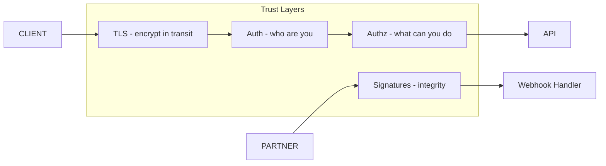

# 110. Law 51: Communication Is a Trust Problem

> **Think:** *"How do I know this message is really from Razorpay — and hasn't been tampered with?"*

---

## The 4 Questions

| Question | Answer |
|----------|--------|
| **What problem does it solve?** | Trusting any HTTP request — spoofed webhooks, man-in-the-middle, unauthorized API access, replay attacks. |
| **What happens if I ignore it?** | Attacker POSTs fake `payment.captured` → free bookings. API keys leak → data breach. Unencrypted traffic → stolen cards. |
| **Where would I use it?** | Webhook signature verification, API authentication, TLS everywhere, OAuth, mTLS between services, PCI compliance. |
| **What companies use it?** | Stripe (webhook signatures), all payment providers, zero-trust internal networks at scale. |

---

## Mental Movie (60 seconds)

**Untrusted communication:**
```
POST /webhooks/razorpay
{ "event": "payment.captured", "amount": 0 }

Your server: "Payment captured! Confirm booking!"
Attacker: free holidays
```

**Trusted communication:**
```
POST /webhooks/razorpay
X-Razorpay-Signature: hmac_sha256(body, secret)

Your server:
  1. Verify signature with shared secret
  2. Reject if invalid → 401
  3. Check idempotency key — reject replay
  4. Process only if trusted
```

Every interaction asks:
- **Who sent this?** (Authentication)
- **Are they allowed?** (Authorization)
- **Was it modified?** (Integrity)
- **Was it encrypted?** (Confidentiality)

**Security exists because communication exists.**

---

## How It Works



### Trust Checklist

| Layer | Mechanism | Example |
|-------|-----------|---------|
| **Transport** | TLS/HTTPS | All public APIs |
| **Authentication** | API keys, OAuth, JWT | `Authorization: Bearer` |
| **Authorization** | RBAC, scopes | User can only see own bookings |
| **Integrity** | HMAC signatures | Razorpay webhook secret |
| **Replay protection** | Idempotency + timestamp | Reject old webhook replays |
| **Internal** | mTLS, service mesh | Service-to-service identity |

---

## Real-World Examples

### Your Travel Platform

| Communication | Trust mechanism |
|---------------|-----------------|
| Mobile → API | JWT + HTTPS |
| Partner API | API key + rate limit |
| Razorpay webhook | HMAC signature verify |
| Internal gRPC | mTLS between services |
| Admin panel | OAuth + RBAC |
| PCI card data | Never touch your server (Razorpay hosted) |

### Nykaa

Payment webhooks signature-verified before order state change. PCI DSS compliance for card flows.

### Amazon

IAM for every internal call. External APIs signed. "Never trust, always verify."

---

## When Trust Mechanisms Required

| Required when... | |
|------------------|---|
| **Money** changes hands | |
| **Inbound webhooks** from internet | |
| **PII** in payload | |
| **Admin/privileged** operations | |
| **Cross-company** integration | |

## Common Failures

| Failure | Attack |
|---------|--------|
| No webhook signature | Spoof payment success |
| HTTP not HTTPS | MITM steal tokens |
| Long-lived API key in mobile app | Extract and abuse |
| No authorization check | IDOR — access others' bookings |

---

## Connection To Other Laws & Modules

| Connection | Link |
|------------|------|
| Law 100 | Webhooks need trust |
| Law 108 | Verify before ack |
| Law 42 | Signed structured contracts |
| Module 6: SSL/TLS | Transport encryption |
| Module 1: Idempotency | Replay protection |

---

## Problem Simulation

`POST /webhooks/payment` accepts any JSON without signature. Attacker sends `payment.captured` for ₹0, gets booking worth ₹45,000.

**Questions:**
1. Which law was ignored?
2. Fix in priority order?
3. After fix, can attacker replay captured webhook?
4. Idempotency role?

<details>
<summary>Answers</summary>

1. **Law 51** — no authentication/integrity on inbound communication.
2. **(1) HMAC signature verification** (2) HTTPS only (3) Idempotency on event_id (4) Audit log.
3. **Replay possible** if only signature checked — need **event_id dedup** + timestamp window.
4. **Idempotency** — same event_id processed once; replay returns 200 but no double booking.

</details>

---

## Key Takeaway

Every communication channel is a trust boundary. Authenticate senders, authorize actions, verify integrity, encrypt in transit — especially webhooks and payment flows.

---

## Module Complete

You've finished **Module 13: The Laws of Communication**.

**The fourteen enduring truths:**
1. Systems are conversations
2. Communication shapes architecture
3. Request-response is the default
4. Simplest conversation wins
5. Real-time has a cost
6. Webhooks reverse direction
7. Machines need structure
8. Contracts outlive implementations
9. Communication creates coupling
10. Async buys flexibility
11. Queues absorb uncertainty
12. Events describe facts
13. Different tools for different conversations
14. Reliability beats speed
15. Failures are normal
16. Communication requires trust

**Previous chapter:** [Module 12 — The Laws of Scale](../module-12-laws-of-scale/)

**Next chapter:** [Module 14 — The Laws of Frontend Systems](../module-14-laws-of-frontend-systems/)

**Full handbook:** [Founder-Architect Handbook](../README.md)
